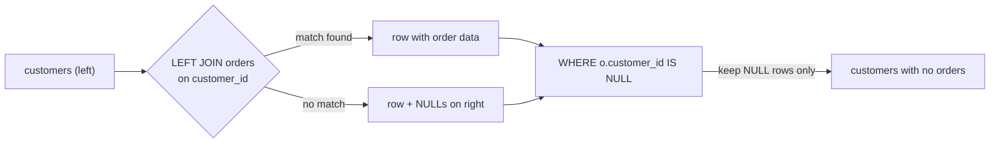

# Anti-Join with LEFT JOIN + IS NULL

> **Practice mode.** This is a *SQL* topic: write queries in the editor against the
> seeded database (its tables are in the **Schema** panel on the left), press **Run
> query**, and see the result table. Missions check that your result matches the
> expected one.

## The problem: rows with nothing on the other side

Sometimes the interesting rows are the ones with **no match** — customers who never
ordered, products nobody bought, employees on no project. This is an **anti-join**.

Think of a party where guests sign a check-in sheet at the door. To find who *didn't*
show up, you don't scan the check-in sheet — you take the full invitation list and
cross off everyone whose name appears on the sheet. Whoever is left never came. An
anti-join is exactly that: start from the full list, remove everyone with a match.

## How LEFT JOIN + IS NULL does it

A plain (inner) `JOIN` keeps only rows that pair up, so the no-shows vanish — the
wrong tool here. A `LEFT JOIN` keeps **every** left-hand row; when there's no match on
the right, it still emits the row but fills the right-hand columns with `NULL`.

It's like the post office trying to deliver a parcel to each address on a list. For a
real resident it writes down the signature; for an empty house it staples an empty
"nobody home" slip. Every address comes back — matched ones with a signature, unmatched
ones with a blank slip. To find the empty houses you just collect the blank slips.

That blank slip is the `NULL`. So the anti-join is: **LEFT JOIN, then `WHERE
<right-hand column> IS NULL`.**

```sql
SELECT c.id, c.name
FROM customers c
LEFT JOIN orders o ON o.customer_id = c.id
WHERE o.customer_id IS NULL;   -- keep only the "nobody home" slips
```



## Which column do you test with IS NULL?

Pick a right-hand column that is **guaranteed non-NULL for a real match** — the join
key or the primary key of the right table. If a matched row had that column blank on
its own, `IS NULL` couldn't tell "no match" from "matched but blank," and you'd get
false positives. It's like choosing to look at the signature line, not some optional
note field the resident might have left empty anyway.

## The ON-vs-WHERE trap

When the anti-join has an extra condition — "customers who never ordered a **Book**" —
where you put that condition changes everything:

```sql
SELECT c.id, c.name
FROM customers c
LEFT JOIN orders o ON o.customer_id = c.id AND o.product_id = 1  -- in ON
WHERE o.id IS NULL;
```

Putting `o.product_id = 1` in the **`ON`** clause narrows *what counts as a match*: a
customer matches only through a Book order. Everyone else keeps their blank slip and
survives the `IS NULL`.

Move the same condition to **`WHERE`** and it runs *after* the join, throwing away the
blank slips (whose `o.product_id` is `NULL`, so `NULL = 1` is not true) — you'd
accidentally delete the very no-shows you were hunting for. In the post-office picture:
the `ON` clause decides which deliveries count as "delivered"; a `WHERE` on those
columns shreds the blank slips before you can read them.

## Alternatives: NOT EXISTS and NOT IN

Two other ways to write an anti-join:

```sql
-- NOT EXISTS: usually as fast as the LEFT JOIN, and NULL-safe
SELECT c.id, c.name FROM customers c
WHERE NOT EXISTS (SELECT 1 FROM orders o WHERE o.customer_id = c.id);

-- NOT IN: reads nicely but has a NULL trap
SELECT c.id, c.name FROM customers c
WHERE c.id NOT IN (SELECT customer_id FROM orders);
```

`NOT IN` is the dangerous one. If the subquery returns even **one** `NULL`, `NOT IN`
yields "unknown" for every row and the whole query returns **zero rows** — a silent,
data-dependent bug. It's like a guard checking your name against a list where one entry
is smudged illegible: unsure, he turns *everyone* away. Prefer `LEFT JOIN … IS NULL` or
`NOT EXISTS`, which don't have this problem. See also [SQL JOIN Types](topic:sql-joins)
and [Many-to-Many in SQL](topic:sql-many-to-many); an index on the join key makes the
anti-join much cheaper — see [Which Indexes to Add](topic:indexes-for-query-optimization).

## 60-second interview answer

> To find rows with no related records, I LEFT JOIN the two tables on the relationship
> key so unmatched left rows survive with NULLs on the right, then keep only those rows
> with `WHERE right.key IS NULL`. I test a column that can't be NULL for a real match —
> the join key or the right table's primary key. If there's an extra condition on the
> right table, it goes in the `ON` clause, not `WHERE`, otherwise it discards the
> unmatched rows. Equivalent alternatives are `NOT EXISTS` (NULL-safe) and `NOT IN`,
> but `NOT IN` returns nothing if the subquery contains a NULL, so I avoid it.

## Common misconceptions

- ❌ "An inner JOIN can do this." — No; an inner `JOIN` drops unmatched rows, which are
  exactly the ones you want. You need `LEFT JOIN`.
- ❌ "Test any right-hand column with IS NULL." — Only one that's non-NULL for real
  matches (the join key / PK); an optional nullable column gives false positives.
- ❌ "Put the extra condition in WHERE." — For an anti-join it must go in `ON`; in
  `WHERE` it removes the unmatched rows you're trying to find.
- ❌ "NOT IN is the same as NOT EXISTS." — `NOT IN` returns zero rows if the subquery
  yields any NULL; `NOT EXISTS` and `LEFT JOIN … IS NULL` are NULL-safe.
