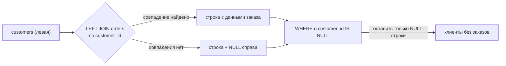

# Anti-Join через LEFT JOIN + IS NULL

> **Режим практики.** Это *SQL*-тема: пишите запросы в редакторе к засеянной базе
> (её таблицы — в панели **Schema** слева), нажимайте **Run query** и смотрите таблицу
> результата. Миссии проверяют, что ваш результат совпадает с ожидаемым.

## Задача: строки, у которых с другой стороны ничего нет

Иногда интересны как раз строки **без совпадения** — клиенты, которые ничего не
заказывали, товары, которые никто не купил, сотрудники без проекта. Это **anti-join**.

Представьте вечеринку, где гости на входе расписываются в листе регистрации. Чтобы
узнать, кто *не* пришёл, вы не листаете лист регистрации — вы берёте полный список
приглашённых и вычёркиваете всех, чьё имя есть в листе. Кто остался — тот не пришёл.
Anti-join — ровно это: начать с полного списка и убрать всех, у кого есть совпадение.

## Как это делает LEFT JOIN + IS NULL

Обычный (внутренний) `JOIN` оставляет только строки, которым нашлась пара, поэтому
«не пришедшие» исчезают — здесь это неверный инструмент. `LEFT JOIN` сохраняет
**каждую** строку левой таблицы; когда справа совпадения нет, он всё равно выдаёт
строку, но заполняет правые столбцы значением `NULL`.

Это как почта, которая пытается доставить посылку по каждому адресу из списка. Для
реального жильца она записывает подпись; для пустого дома прикрепляет пустой бланк
«никого нет дома». Возвращаются все адреса — с совпадением по подписи, без совпадения
по пустому бланку. Чтобы найти пустые дома, вы просто собираете пустые бланки.

Этот пустой бланк и есть `NULL`. Значит, anti-join — это: **LEFT JOIN, затем `WHERE
<правый столбец> IS NULL`.**

```sql
SELECT c.id, c.name
FROM customers c
LEFT JOIN orders o ON o.customer_id = c.id
WHERE o.customer_id IS NULL;   -- оставить только бланки «никого нет дома»
```



## Какой столбец проверять через IS NULL?

Выбирайте правый столбец, который **гарантированно не NULL для реального совпадения** —
ключ соединения или первичный ключ правой таблицы. Если у сопоставленной строки этот
столбец мог бы сам оказаться пустым, `IS NULL` не отличил бы «нет совпадения» от
«совпало, но пусто», и вы получили бы ложные срабатывания. Это как смотреть на строку
подписи, а не на необязательное поле для заметки, которое жилец мог и так оставить
пустым.

## Ловушка ON против WHERE

Когда у anti-join есть дополнительное условие — «клиенты, которые ни разу не заказывали
**Book**» — то, куда вы поставите это условие, меняет всё:

```sql
SELECT c.id, c.name
FROM customers c
LEFT JOIN orders o ON o.customer_id = c.id AND o.product_id = 1  -- в ON
WHERE o.id IS NULL;
```

Условие `o.product_id = 1` в **`ON`** сужает *то, что считается совпадением*: клиент
совпадает только через заказ Book. Все остальные сохраняют пустой бланк и переживают
`IS NULL`.

Перенесите то же условие в **`WHERE`** — и оно выполнится *после* соединения, выбросив
пустые бланки (у которых `o.product_id` равен `NULL`, поэтому `NULL = 1` не истинно) —
вы случайно удалите как раз тех «не пришедших», которых искали. В образе почты: `ON`
решает, какие доставки считать «доставленными»; `WHERE` по этим столбцам рвёт пустые
бланки, прежде чем вы успеете их прочитать.

## Альтернативы: NOT EXISTS и NOT IN

Ещё два способа записать anti-join:

```sql
-- NOT EXISTS: обычно так же быстр, как LEFT JOIN, и безопасен к NULL
SELECT c.id, c.name FROM customers c
WHERE NOT EXISTS (SELECT 1 FROM orders o WHERE o.customer_id = c.id);

-- NOT IN: читается приятно, но есть ловушка с NULL
SELECT c.id, c.name FROM customers c
WHERE c.id NOT IN (SELECT customer_id FROM orders);
```

Опасен именно `NOT IN`. Если подзапрос вернёт хотя бы **один** `NULL`, `NOT IN` даёт
«неизвестно» для каждой строки, и весь запрос вернёт **ноль строк** — тихий баг,
зависящий от данных. Это как охранник, сверяющий ваше имя со списком, где одна запись
смазана и нечитаема: не будучи уверенным, он разворачивает *всех*. Предпочитайте
`LEFT JOIN … IS NULL` или `NOT EXISTS`, у которых этой проблемы нет. Смотрите также
[Типы SQL JOIN](topic:sql-joins) и [Many-to-Many в SQL](topic:sql-many-to-many); индекс
по ключу соединения делает anti-join гораздо дешевле — см.
[Какие индексы добавить](topic:indexes-for-query-optimization).

## Ответ за 60 секунд

> Чтобы найти строки без связанных записей, я делаю LEFT JOIN двух таблиц по ключу
> связи, чтобы несопоставленные левые строки остались с NULL справа, и оставляю только
> их через `WHERE right.key IS NULL`. Проверяю столбец, который не может быть NULL при
> реальном совпадении, — ключ соединения или первичный ключ правой таблицы. Если есть
> дополнительное условие по правой таблице, оно идёт в `ON`, а не в `WHERE`, иначе оно
> отбросит несопоставленные строки. Эквивалентные альтернативы — `NOT EXISTS`
> (безопасен к NULL) и `NOT IN`, но `NOT IN` вернёт пустой результат, если в подзапросе
> есть NULL, поэтому я его избегаю.

## Частые заблуждения

- ❌ «Это можно сделать внутренним JOIN». — Нет; внутренний `JOIN` отбрасывает
  несопоставленные строки, а это как раз те, что вам нужны. Нужен `LEFT JOIN`.
- ❌ «Проверять через IS NULL можно любой правый столбец». — Только тот, что не NULL при
  реальном совпадении (ключ соединения / PK); необязательный nullable-столбец даёт
  ложные срабатывания.
- ❌ «Дополнительное условие ставят в WHERE». — Для anti-join оно должно быть в `ON`; в
  `WHERE` оно удалит несопоставленные строки, которые вы ищете.
- ❌ «NOT IN — то же самое, что NOT EXISTS». — `NOT IN` вернёт ноль строк, если
  подзапрос даёт хоть один NULL; `NOT EXISTS` и `LEFT JOIN … IS NULL` безопасны к NULL.
