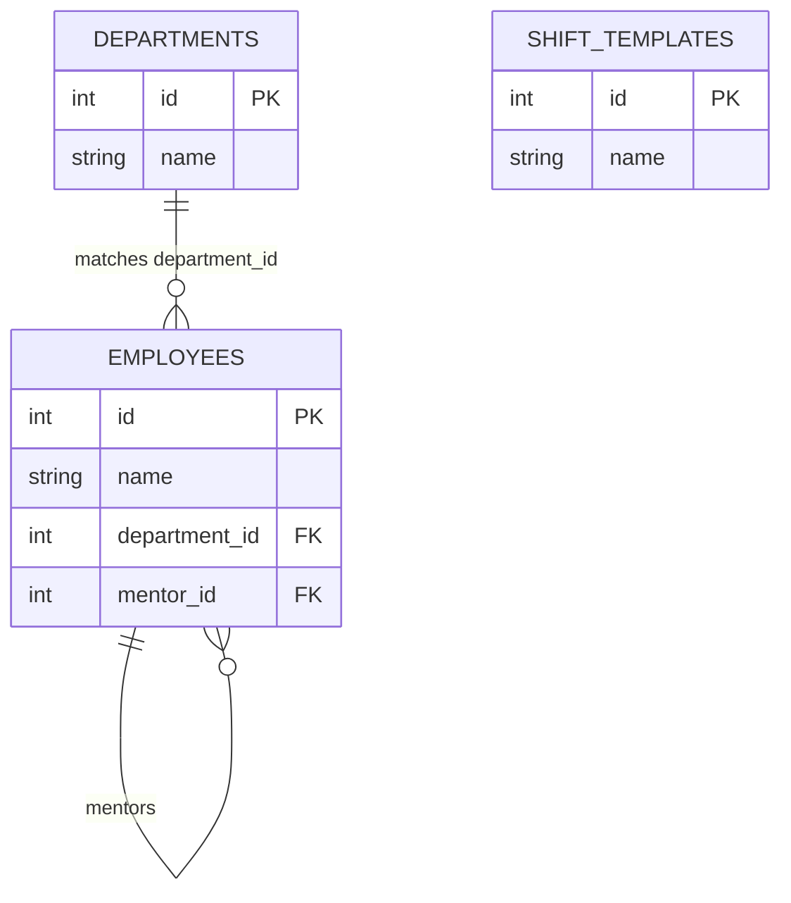
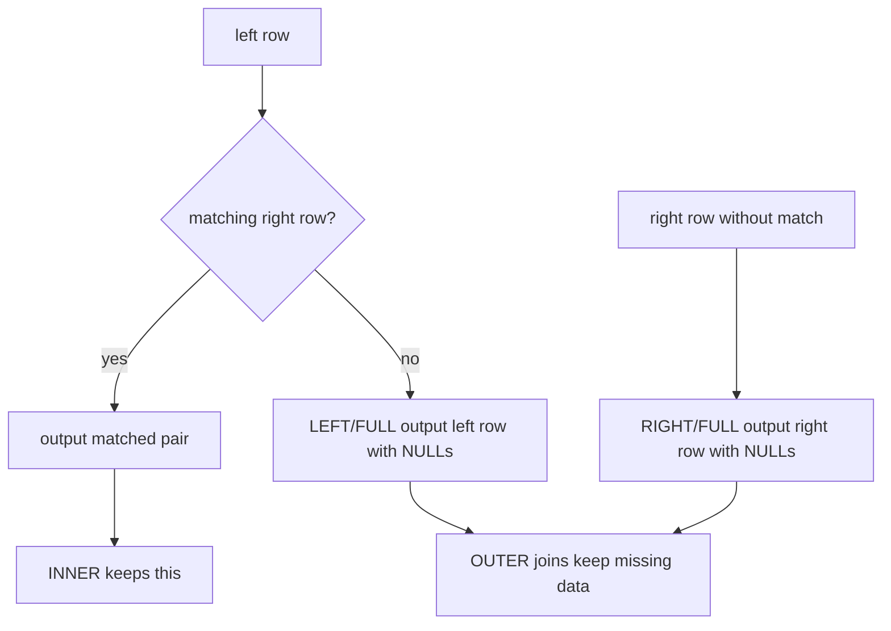

# SQL JOIN Types

## Intuition

`JOIN` combines rows from two table expressions using a condition, most often a foreign-key-like value matching a primary key. In this topic, `employees.department_id` is matched to `departments.id`, like matching a worker's badge to the room number printed on the office door.

The result is not "one row from table A plus one row from table B" in general; it is one output row for every matching pair. If two employees belong to Engineering, Engineering appears twice in an employee-department join. Think of a kitchen order board: the same table number can appear once per dish, because each dish is a separate ticket.



## Main JOIN Types

`INNER JOIN` returns only rows where the join condition finds a match on both sides. It is like a post office counter that prints a receipt only when it has both a parcel and a valid recipient record.

```sql
SELECT e.name, d.name
FROM employees e
JOIN departments d ON d.id = e.department_id;
```

`LEFT JOIN` returns every row from the left side and fills right-side columns with `NULL` when there is no match. It is like a traffic checkpoint that logs every car entering the lane, even if the driver has no registered parking spot.

```sql
SELECT e.name, d.name
FROM employees e
LEFT JOIN departments d ON d.id = e.department_id;
```

`RIGHT JOIN` is the same idea mirrored: keep every row from the right side. In practice, teams often rewrite it as `LEFT JOIN` by swapping table order, like turning the warehouse map around so the "main list" is always on the left.

`FULL OUTER JOIN` keeps unmatched rows from both sides. It is useful for reconciliation reports: like comparing the kitchen's order list with the delivery desk and keeping both missing dishes and unclaimed bags.



`CROSS JOIN` returns every combination from both sides: `rows_left * rows_right`. It is like pairing every courier with every possible delivery time slot; useful intentionally, dangerous accidentally.

`SELF JOIN` joins a table to itself using aliases. It is how an `employees` table can connect an employee to another employee as a mentor, like asking the same office directory once for the worker and once for the supervisor.

## `ON` vs `WHERE`

`ON` defines how rows are matched. `WHERE` filters the result after the join. With an outer join this distinction matters: `LEFT JOIN ... WHERE right_table.column = ...` removes rows where the right side is `NULL`, so the query can behave like an `INNER JOIN`. In kitchen terms, `ON` decides which ticket matches which dish; `WHERE` throws away tickets after the board is built.

To find missing matches, keep the outer join and filter for a right-side `NULL`:

```sql
SELECT d.name
FROM departments d
LEFT JOIN employees e ON e.department_id = d.id
WHERE e.id IS NULL;
```

This pattern is often called an anti-join. It is like a post office report listing addresses that received no parcels today.

## 60-Second Interview Answer

`JOIN` combines rows from tables according to a condition in `ON`, commonly matching a foreign key to a primary key. `INNER JOIN` returns only matching pairs. `LEFT JOIN` keeps all rows from the left table and uses `NULL` for missing right-side data; `RIGHT JOIN` is the mirrored version; `FULL OUTER JOIN` keeps unmatched rows from both sides. `CROSS JOIN` produces every combination, and `SELF JOIN` joins a table to itself through aliases. The big trap is filtering right-side columns in `WHERE` after a `LEFT JOIN`, because that can remove the `NULL` rows and change the meaning. In production, choose the join type by whether missing rows must be preserved, and add useful indexes on join columns; see [Database Indexes](topic:database-indexes).

## Production Relevance

Most application queries are joins: orders with customers, invoices with payments, employees with departments. For many-to-many relationships, the join often goes through a link table; see [Many-to-Many in SQL](topic:sql-many-to-many). This is like a hotel front desk using a reservation sheet between guests and rooms instead of writing many guest names directly on each door.

Joins can multiply rows. A department with five employees produces five department rows in the joined result, so aggregate queries need deliberate `GROUP BY`, `COUNT`, and sometimes `DISTINCT`. In a kitchen inventory sheet, one shelf repeated once per ingredient is correct for a detail report but wrong for "number of shelves".

Join performance depends heavily on data volume, join conditions, and indexes. A nested lookup without a useful index can become slow, like a courier checking every mailbox for every parcel instead of using a sorted address book.

## Common Misconceptions

- `JOIN` does not require a declared foreign key. SQL joins any rows whose `ON` condition is true, though real schemas usually use foreign keys for integrity. Like a post office can match by written address even if the address book is incomplete.
- `LEFT JOIN` does not mean "prefer the left table"; it means "preserve all left rows". Missing right-side columns become `NULL`, like an empty parking-space field on a vehicle log.
- A condition in `WHERE` is not the same as a condition in `ON` for outer joins. Moving the condition can change the result, like sorting mail before delivery versus discarding envelopes after delivery.
- `RIGHT JOIN` is rarely necessary. It is usually a `LEFT JOIN` with tables swapped, like reading the same route map from the opposite end.
- `CROSS JOIN` is not a fallback when you forget an `ON` condition. It intentionally creates every combination, like printing every possible courier/time-slot pairing.
