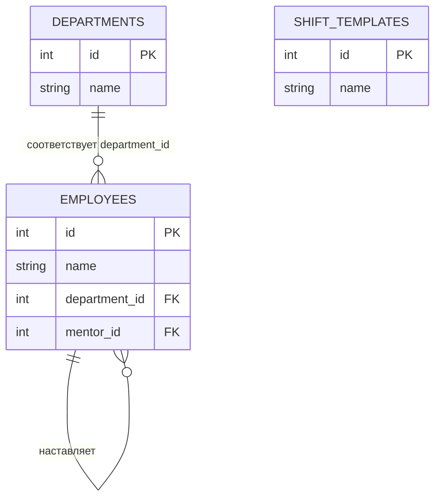
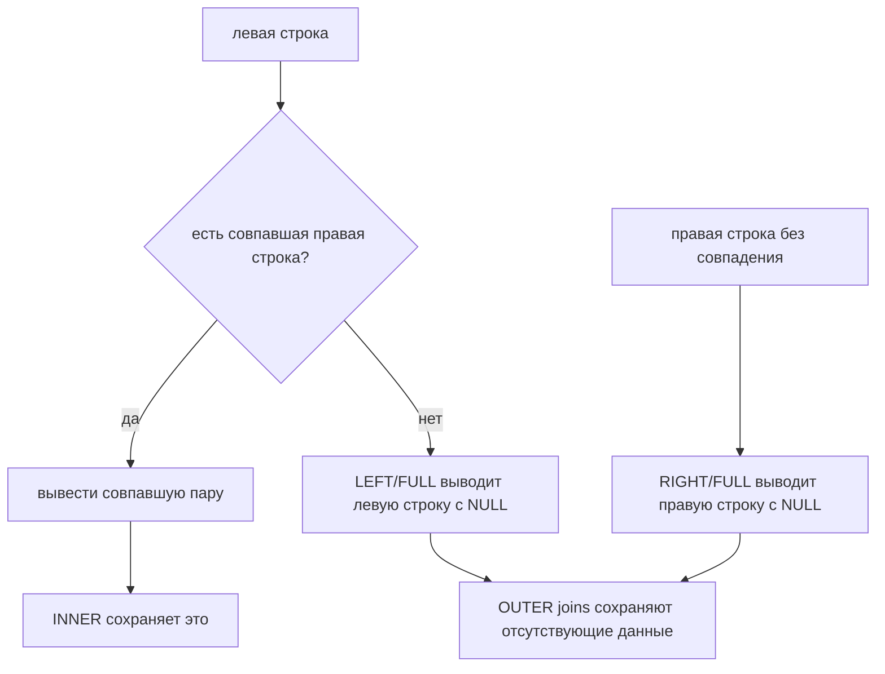

# Виды JOIN в SQL

## Интуиция

`JOIN` объединяет строки из двух табличных выражений по условию, чаще всего когда значение, похожее на внешний ключ, совпадает с первичным ключом. В этой теме `employees.department_id` сопоставляется с `departments.id`, как пропуск сотрудника сопоставляется с номером комнаты на офисной двери.

Результат в общем случае не означает «одна строка из таблицы A плюс одна строка из таблицы B»; это одна выходная строка для каждой совпавшей пары. Если два сотрудника относятся к Engineering, Engineering появится дважды в join сотрудников с отделами. Представьте кухонную доску заказов: один и тот же номер столика может появиться по одному разу на каждое блюдо, потому что каждое блюдо — отдельный чек.



## Основные виды JOIN

`INNER JOIN` возвращает только строки, для которых условие join нашло совпадение с обеих сторон. Это похоже на стойку почты, которая печатает квитанцию только тогда, когда есть и посылка, и запись о получателе.

```sql
SELECT e.name, d.name
FROM employees e
JOIN departments d ON d.id = e.department_id;
```

`LEFT JOIN` возвращает каждую строку из левой стороны и заполняет колонки правой стороны значением `NULL`, если совпадения нет. Это как дорожный пункт контроля, который записывает каждую машину в полосе, даже если у водителя нет зарегистрированного парковочного места.

```sql
SELECT e.name, d.name
FROM employees e
LEFT JOIN departments d ON d.id = e.department_id;
```

`RIGHT JOIN` — та же идея в зеркальном виде: сохранить каждую строку из правой стороны. На практике команды часто переписывают его как `LEFT JOIN`, поменяв таблицы местами, как будто разворачивают карту склада так, чтобы «главный список» всегда был слева.

`FULL OUTER JOIN` сохраняет несовпавшие строки с обеих сторон. Он полезен для сверочных отчётов: как сравнить список заказов на кухне со стойкой выдачи и сохранить и недостающие блюда, и забытые пакеты.



`CROSS JOIN` возвращает каждую комбинацию из обеих сторон: `rows_left * rows_right`. Это как сопоставить каждого курьера с каждым возможным временным окном доставки; полезно намеренно, опасно случайно.

`SELF JOIN` соединяет таблицу с самой собой через aliases. Так таблица `employees` может связать сотрудника с другим сотрудником как с наставником, будто мы спрашиваем один и тот же офисный справочник сначала о работнике, а затем о руководителе.

## `ON` против `WHERE`

`ON` определяет, как строки сопоставляются. `WHERE` фильтрует результат после join. Для outer join это важно: `LEFT JOIN ... WHERE right_table.column = ...` удаляет строки, где правая сторона равна `NULL`, поэтому запрос может вести себя как `INNER JOIN`. В терминах кухни `ON` решает, какой чек соответствует какому блюду; `WHERE` выбрасывает чеки уже после того, как доска собрана.

Чтобы найти отсутствующие совпадения, оставьте outer join и фильтруйте по `NULL` в правой стороне:

```sql
SELECT d.name
FROM departments d
LEFT JOIN employees e ON e.department_id = d.id
WHERE e.id IS NULL;
```

Этот шаблон часто называют anti-join. Это как почтовый отчёт со списком адресов, которым сегодня не пришло ни одной посылки.

## Ответ за 60 секунд

`JOIN` объединяет строки из таблиц по условию в `ON`, обычно сопоставляя внешний ключ с первичным ключом. `INNER JOIN` возвращает только совпавшие пары. `LEFT JOIN` сохраняет все строки из левой таблицы и ставит `NULL` для отсутствующих данных справа; `RIGHT JOIN` — зеркальная версия; `FULL OUTER JOIN` сохраняет несовпавшие строки с обеих сторон. `CROSS JOIN` создаёт все комбинации, а `SELF JOIN` соединяет таблицу с самой собой через aliases. Главная ловушка — фильтрация колонок правой таблицы в `WHERE` после `LEFT JOIN`, потому что это может удалить строки с `NULL` и изменить смысл запроса. В production выбирайте тип join по тому, нужно ли сохранять отсутствующие строки, и добавляйте полезные индексы на колонки соединения; см. [Database Indexes](topic:database-indexes).

## Значение в production

Большинство прикладных запросов — это joins: заказы с клиентами, счета с оплатами, сотрудники с отделами. Для many-to-many связей join часто проходит через промежуточную таблицу; см. [Many-to-Many в SQL](topic:sql-many-to-many). Это как стойка регистрации в отеле, которая использует лист бронирований между гостями и комнатами, а не пишет много имён гостей прямо на каждой двери.

Joins могут размножать строки. Отдел с пятью сотрудниками даст пять строк отдела в результате join, поэтому агрегирующие запросы требуют осознанного `GROUP BY`, `COUNT` и иногда `DISTINCT`. В кухонной инвентарной ведомости полка, повторённая по разу на каждый ингредиент, верна для детального отчёта, но неверна для вопроса «сколько полок».

Производительность join сильно зависит от объёма данных, условий join и индексов. Вложенный поиск без полезного индекса может стать медленным, как курьер, который проверяет каждый почтовый ящик для каждой посылки вместо отсортированной адресной книги.

## Частые заблуждения

- `JOIN` не требует объявленного foreign key. SQL соединяет любые строки, для которых условие `ON` истинно, хотя реальные схемы обычно используют foreign keys для целостности. Как почта может сопоставить по написанному адресу, даже если адресная книга неполная.
- `LEFT JOIN` не означает «предпочесть левую таблицу»; он означает «сохранить все левые строки». Отсутствующие колонки справа становятся `NULL`, как пустое поле парковочного места в журнале автомобилей.
- Условие в `WHERE` не равно условию в `ON` для outer joins. Перенос условия может изменить результат, как сортировка почты до доставки отличается от выбрасывания конвертов после доставки.
- `RIGHT JOIN` редко необходим. Обычно это `LEFT JOIN` с таблицами, поменянными местами, как чтение того же маршрута с противоположного конца.
- `CROSS JOIN` — не запасной вариант, когда вы забыли условие `ON`. Он намеренно создаёт каждую комбинацию, как печать всех возможных пар курьер/временное окно.
