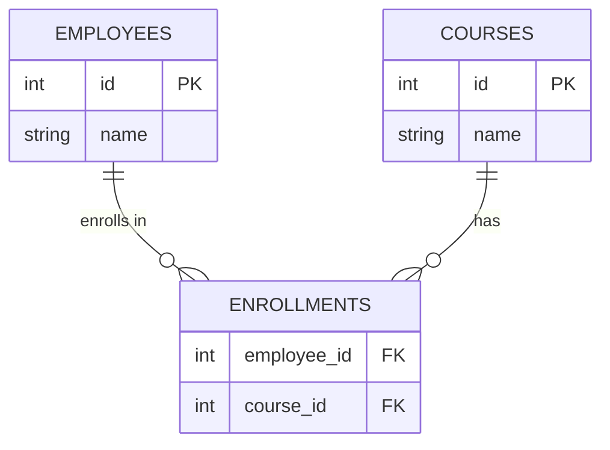

# Many-to-Many in SQL

> **Practice mode.** This is a *SQL* topic: write queries in the editor against the
> seeded database (its tables are in the **Schema** panel on the left), press **Run
> query**, and see the result table. Missions check that your result matches the
> expected one.

## Modelling many-to-many

An employee can take many courses, and a course can have many employees — a
**many-to-many** relationship. A relational table can't hold a list, so you add a
third **join (junction) table** that stores one row per (employee, course) pair:



`enrollments` turns one many-to-many into two one-to-many relationships
(`employees` → `enrollments` ← `courses`).

## Querying across the join table

To answer "which employees are on which courses" you **JOIN** all three tables on
the foreign keys:

```sql
SELECT e.name, c.name
FROM employees e
JOIN enrollments en ON en.employee_id = e.id
JOIN courses    c  ON c.id = en.course_id;
```

## Aggregating: GROUP BY + HAVING

To count enrolments **per course**, group the joined rows by the course and use
`COUNT(*)`:

```sql
SELECT c.name, COUNT(*)
FROM courses c
JOIN enrollments e ON e.course_id = c.id
GROUP BY c.name;
```

To keep only the busy courses, filter **on the aggregate** with `HAVING` (not
`WHERE`, which filters rows *before* grouping):

```sql
SELECT c.id, c.name
FROM courses c
JOIN enrollments e ON e.course_id = c.id
GROUP BY c.id, c.name
HAVING COUNT(*) > 10;
```

- **WHERE** filters individual rows *before* aggregation.
- **HAVING** filters groups *after* aggregation — it's where aggregate conditions
  like `COUNT(*) > 10` belong.
- Every non-aggregated column in the `SELECT` must appear in `GROUP BY`.

## 60-second interview answer

> A many-to-many relationship is modelled with a join table holding one row per
> pair of foreign keys, which decomposes it into two one-to-many relationships. To
> query it I JOIN the three tables on the keys. To aggregate — e.g. count
> enrolments per course — I GROUP BY the course and use COUNT(*); to filter on that
> count I use HAVING, because WHERE runs before grouping and can't see aggregates.

## Common misconceptions

- ❌ "Use WHERE COUNT(*) > 10." — `WHERE` can't reference aggregates; that's what
  `HAVING` is for.
- ❌ "A many-to-many needs a foreign key in one of the two tables." — No; it needs a
  separate join table (otherwise a row could only reference one partner).
- ❌ "You can SELECT any column with GROUP BY." — Only grouped columns or aggregates;
  others are ambiguous.
- ❌ "COUNT(*) and COUNT(col) are the same." — `COUNT(col)` skips NULLs in that
  column; `COUNT(*)` counts every row.
