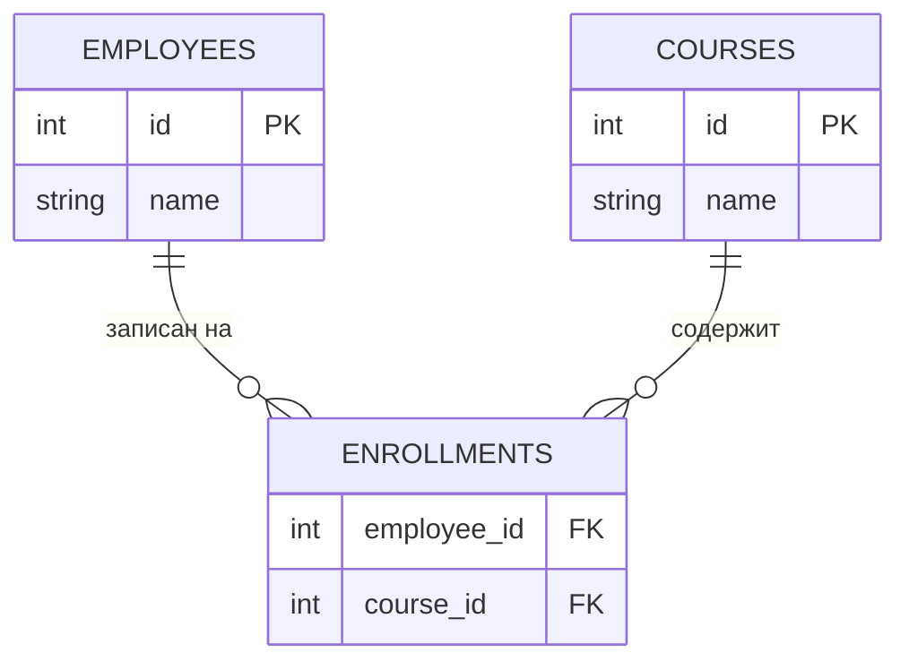

# Many-to-Many в SQL

> **Режим практики.** Это *SQL*-тема: пишите запросы в редакторе к засеянной базе
> (её таблицы — в панели **Схема** слева), жмите **«Выполнить запрос»** и смотрите
> таблицу результата. Миссии проверяют, что ваш результат совпадает с ожидаемым.

## Моделирование many-to-many

Сотрудник может быть на многих курсах, а курс — у многих сотрудников: связь
**many-to-many**. Реляционная таблица не хранит список, поэтому добавляют третью
**промежуточную (join) таблицу** с одной строкой на пару (сотрудник, курс):



`enrollments` превращает одну many-to-many в две one-to-many
(`employees` → `enrollments` ← `courses`).

## Запросы через промежуточную таблицу

Чтобы узнать, «кто на каких курсах», делаем **JOIN** всех трёх таблиц по внешним
ключам:

```sql
SELECT e.name, c.name
FROM employees e
JOIN enrollments en ON en.employee_id = e.id
JOIN courses    c  ON c.id = en.course_id;
```

## Агрегация: GROUP BY + HAVING

Чтобы посчитать записи **по каждому курсу**, группируем соединённые строки по курсу
и используем `COUNT(*)`:

```sql
SELECT c.name, COUNT(*)
FROM courses c
JOIN enrollments e ON e.course_id = c.id
GROUP BY c.name;
```

Чтобы оставить только «загруженные» курсы, фильтруем **по агрегату** через `HAVING`
(а не `WHERE`, который фильтрует строки *до* группировки):

```sql
SELECT c.id, c.name
FROM courses c
JOIN enrollments e ON e.course_id = c.id
GROUP BY c.id, c.name
HAVING COUNT(*) > 10;
```

- **WHERE** фильтрует отдельные строки *до* агрегации.
- **HAVING** фильтрует группы *после* агрегации — здесь и место условиям вроде
  `COUNT(*) > 10`.
- Каждый неагрегированный столбец в `SELECT` должен быть в `GROUP BY`.

## Ответ на собеседовании (за 60 секунд)

> Связь many-to-many моделируется промежуточной таблицей с одной строкой на пару
> внешних ключей, что раскладывает её на две one-to-many. Чтобы запросить — делаю
> JOIN трёх таблиц по ключам. Чтобы агрегировать — например, посчитать записи по
> курсам — делаю GROUP BY по курсу и COUNT(*); чтобы отфильтровать по этому счёту,
> использую HAVING, потому что WHERE выполняется до группировки и не видит агрегаты.

## Частые заблуждения

- ❌ «Используй WHERE COUNT(*) > 10.» — `WHERE` не видит агрегаты; для этого есть
  `HAVING`.
- ❌ «Для many-to-many достаточно внешнего ключа в одной из двух таблиц.» — Нет;
  нужна отдельная join-таблица (иначе строка могла бы ссылаться лишь на одного
  партнёра).
- ❌ «С GROUP BY можно выбрать любой столбец.» — Только сгруппированные столбцы или
  агрегаты; остальные неоднозначны.
- ❌ «COUNT(*) и COUNT(col) — одно и то же.» — `COUNT(col)` пропускает NULL в этом
  столбце; `COUNT(*)` считает все строки.
