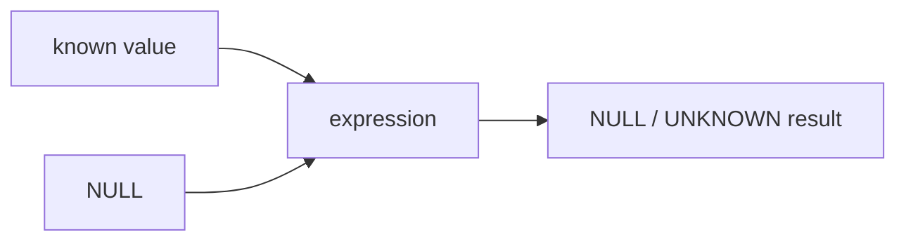
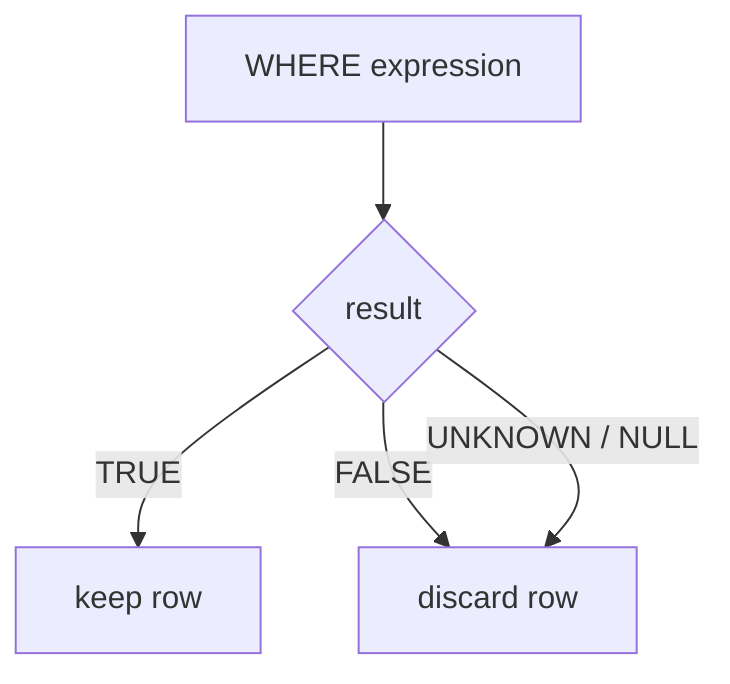

# SQL NULL and Three-Valued Logic

> **Practice mode.** This is a *SQL* topic: write queries in the editor against the
> seeded `parcel_checks` table, press **Run query**, and compare your result table
> with the missions.

## The core idea

`NULL` means "unknown or missing", not `0`, not `''`, and not `FALSE`. If a post
office clerk does not know how many extra items are in a parcel, adding `1 +
unknown` still leaves the total unknown. SQL models that as:

```sql
SELECT 1 + NULL; -- NULL
```

The same rule applies to most expressions: when an operand is unknown, the result
is often unknown too. In the kitchen version, if one ingredient weight is missing,
the final recipe weight cannot be calculated confidently.



## Three truth values

SQL predicates do not have only two answers. They have three:

| value | meaning |
| --- | --- |
| `TRUE` | the condition is confirmed |
| `FALSE` | the condition is disproved |
| `UNKNOWN` / `NULL` | SQL cannot decide from the available data |

Think of a traffic light with a broken bulb: green means go, red means stop, and
"cannot see the light" is not the same as either one.

For `OR`, a known `TRUE` is enough to make the whole expression `TRUE`, but a
known `FALSE` does not resolve an unknown side:

| expression | result |
| --- | --- |
| `NULL OR TRUE` | `TRUE` |
| `NULL OR FALSE` | `UNKNOWN` (`NULL` in result output) |
| `NULL AND FALSE` | `FALSE` |
| `NULL AND TRUE` | `UNKNOWN` |
| `NOT NULL` | `UNKNOWN` |

At the post office desk, "approved by supervisor OR approved by scanner" is
accepted if the supervisor definitely approved it. But if the supervisor did not
approve and the scanner status is unknown, the parcel is still not definitely
approved.

## Why WHERE NULL removes the row

`WHERE` keeps rows only when its condition is exactly `TRUE`. It removes rows when
the condition is `FALSE` or `UNKNOWN`. Therefore `WHERE NULL` filters the row out,
because the condition is unknown, not true.



This is like a warehouse gate that opens only for a clear "approved" stamp. A
clear "rejected" stamp and an unreadable stamp both stay outside.

```sql
SELECT label
FROM parcel_checks
WHERE scan_passed;
```

This returns only rows where `scan_passed` is `TRUE`. Rows where `scan_passed` is
`FALSE` are removed, and rows where `scan_passed` is `NULL` are also removed.

## Comparing with NULL

`column = NULL` does not mean "the column is missing". It asks whether a known
value equals an unknown value, so the result is `UNKNOWN`.

Use `IS NULL` and `IS NOT NULL`:

```sql
SELECT label
FROM parcel_checks
WHERE courier_note IS NULL;
```

In a kitchen inventory, you do not compare a shelf label to a missing note; you
ask directly whether the note is missing.

## Production relevance

NULL bugs are common because the query still runs, just with fewer rows than
expected. An optional column, a missing foreign-key match, or a `LEFT JOIN` can
introduce NULLs; see [SQL JOIN Types](topic:sql-joins) for the join side. Then a
later `WHERE right_table.status = 'ACTIVE'` can silently remove the rows where the
right side is missing.

It is like sorting mail after a rainy delivery: if the address stamp is unreadable,
the sorting rule may reject the envelope even though nobody explicitly marked it
as bad.

Useful habits:

- Use `IS NULL` / `IS NOT NULL` for missing values.
- Decide whether unknown should be kept or rejected before writing `WHERE`.
- Use `COALESCE(value, fallback)` only when a real fallback is correct, not just to
  hide uncertainty.
- Remember that `COUNT(column)` skips NULLs, while `COUNT(*)` counts rows.

## 60-second interview answer

> SQL uses three-valued logic: predicates can be TRUE, FALSE, or UNKNOWN. NULL
> represents unknown or missing data, so expressions like 1 + NULL usually produce
> NULL. For OR, NULL OR TRUE is TRUE because TRUE is already enough; NULL OR FALSE
> is UNKNOWN because the unknown side still matters. WHERE keeps only rows whose
> condition is TRUE, so FALSE and UNKNOWN are both filtered out. That is why WHERE
> NULL returns no rows. To test missing values, use IS NULL or IS NOT NULL, not
> column = NULL.

## Common misconceptions

- "NULL is zero." No. `1 + NULL` is `NULL`, not `1`.
- "NULL is false." No. `NULL OR TRUE` is `TRUE`, which would not happen if NULL
  were simply false.
- "WHERE keeps everything except false." No. `WHERE` keeps only `TRUE`; `UNKNOWN`
  is filtered out.
- "`column = NULL` finds missing values." No. Use `column IS NULL`.
- "`COALESCE` is always safe." No. It is safe only when replacing unknown data with
  a fallback matches the business rule.
