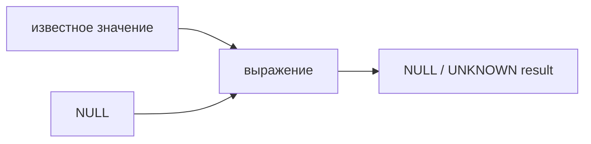
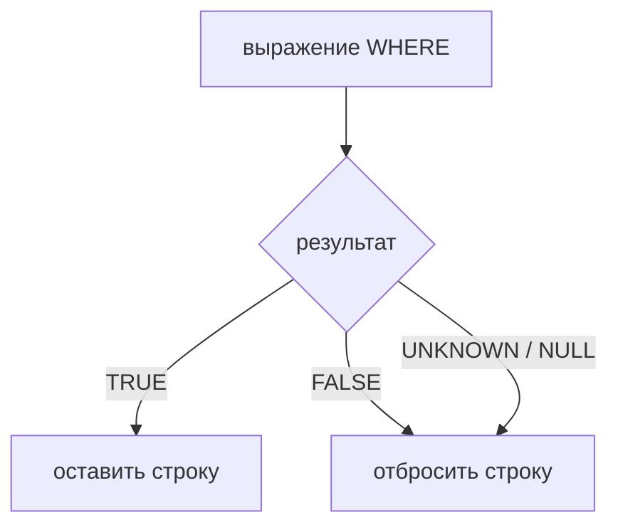

# SQL NULL и трёхзначная логика

> **Режим практики.** Это *SQL*-тема: пишите запросы в редакторе к засеянной
> таблице `parcel_checks`, нажимайте **«Выполнить запрос»** и сравнивайте таблицу
> результата с миссиями.

## Главная идея

`NULL` означает «неизвестно или отсутствует», а не `0`, не `''` и не `FALSE`. Если
сотрудник почты не знает, сколько дополнительных предметов лежит в посылке, то
`1 + неизвестно` всё ещё даёт неизвестный итог. SQL моделирует это так:

```sql
SELECT 1 + NULL; -- NULL
```

То же правило действует для большинства выражений: когда один операнд неизвестен,
результат часто тоже неизвестен. На кухне это похоже на ситуацию, когда вес одного
ингредиента не записали: итоговый вес рецепта нельзя уверенно посчитать.



## Три значения истины

У SQL-предикатов не два возможных ответа, а три:

| значение | смысл |
| --- | --- |
| `TRUE` | условие подтверждено |
| `FALSE` | условие опровергнуто |
| `UNKNOWN` / `NULL` | SQL не может решить по доступным данным |

Представьте светофор с перегоревшей лампой: зелёный означает «ехать», красный —
«стоять», а «лампу не видно» не равно ни одному из этих вариантов.

Для `OR` известного `TRUE` достаточно, чтобы всё выражение стало `TRUE`, но
известный `FALSE` не разрешает неизвестную сторону:

| выражение | результат |
| --- | --- |
| `NULL OR TRUE` | `TRUE` |
| `NULL OR FALSE` | `UNKNOWN` (`NULL` в выводе результата) |
| `NULL AND FALSE` | `FALSE` |
| `NULL AND TRUE` | `UNKNOWN` |
| `NOT NULL` | `UNKNOWN` |

На почтовой стойке правило «одобрено руководителем OR одобрено сканером»
срабатывает, если руководитель точно одобрил посылку. Но если руководитель не
одобрил, а статус сканера неизвестен, посылка всё ещё не считается точно
одобренной.

## Почему WHERE NULL удаляет строку

`WHERE` оставляет строки только тогда, когда его условие равно ровно `TRUE`. Он
удаляет строки, когда условие равно `FALSE` или `UNKNOWN`. Поэтому `WHERE NULL`
отсеивает строку: условие неизвестно, а не истинно.



Это как складские ворота, которые открываются только по чёткой печати «одобрено».
Чёткая печать «отклонено» и нечитаемая печать одинаково остаются снаружи.

```sql
SELECT label
FROM parcel_checks
WHERE scan_passed;
```

Этот запрос возвращает только строки, где `scan_passed` равен `TRUE`. Строки, где
`scan_passed` равен `FALSE`, удаляются, и строки, где `scan_passed` равен `NULL`,
тоже удаляются.

## Сравнение с NULL

`column = NULL` не означает «колонка отсутствует». Такое выражение спрашивает,
равно ли известное значение неизвестному, поэтому результатом будет `UNKNOWN`.

Используйте `IS NULL` и `IS NOT NULL`:

```sql
SELECT label
FROM parcel_checks
WHERE courier_note IS NULL;
```

В кухонном учёте вы не сравниваете ярлык полки с отсутствующей запиской; вы прямо
спрашиваете, отсутствует ли записка.

## Значение в production

Ошибки с NULL часты, потому что запрос всё равно выполняется, просто возвращает
меньше строк, чем ожидалось. Необязательная колонка, отсутствующее совпадение по
внешнему ключу или `LEFT JOIN` могут внести NULL; про сторону JOIN см. тему
[Виды JOIN в SQL](topic:sql-joins). Затем последующее условие
`WHERE right_table.status = 'ACTIVE'` может незаметно удалить строки, где правая
сторона отсутствует.

Это похоже на сортировку почты после дождливой доставки: если штамп адреса
размыло, правило сортировки может отклонить конверт, хотя никто явно не пометил
его как плохой.

Полезные привычки:

- Используйте `IS NULL` / `IS NOT NULL` для отсутствующих значений.
- До написания `WHERE` решите, нужно ли сохранять или отбрасывать неизвестное.
- Используйте `COALESCE(value, fallback)` только когда запасное значение реально
  соответствует бизнес-правилу, а не просто скрывает неопределённость.
- Помните, что `COUNT(column)` пропускает NULL, а `COUNT(*)` считает строки.

## Ответ на собеседовании за 60 секунд

> SQL использует трёхзначную логику: предикаты могут быть TRUE, FALSE или UNKNOWN.
> NULL представляет неизвестные или отсутствующие данные, поэтому выражения вроде
> 1 + NULL обычно дают NULL. Для OR: NULL OR TRUE даёт TRUE, потому что TRUE уже
> достаточно; NULL OR FALSE даёт UNKNOWN, потому что неизвестная сторона всё ещё
> важна. WHERE оставляет только строки, где условие равно TRUE, поэтому FALSE и
> UNKNOWN отфильтровываются. Поэтому WHERE NULL не возвращает строки. Чтобы
> проверять пропуски, используйте IS NULL или IS NOT NULL, а не column = NULL.

## Частые заблуждения

- «NULL — это ноль». Нет. `1 + NULL` даёт `NULL`, а не `1`.
- «NULL — это false». Нет. `NULL OR TRUE` даёт `TRUE`, чего не было бы, если бы
  NULL был просто false.
- «WHERE оставляет всё, кроме false». Нет. `WHERE` оставляет только `TRUE`;
  `UNKNOWN` отсеивается.
- «`column = NULL` находит отсутствующие значения». Нет. Используйте
  `column IS NULL`.
- «`COALESCE` всегда безопасен». Нет. Он безопасен только тогда, когда замена
  неизвестного значения запасным соответствует бизнес-правилу.
