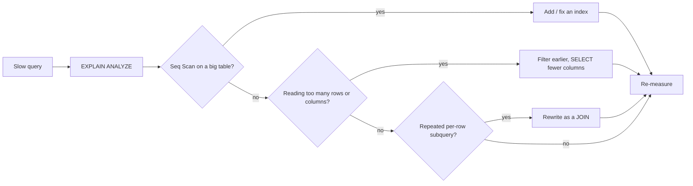
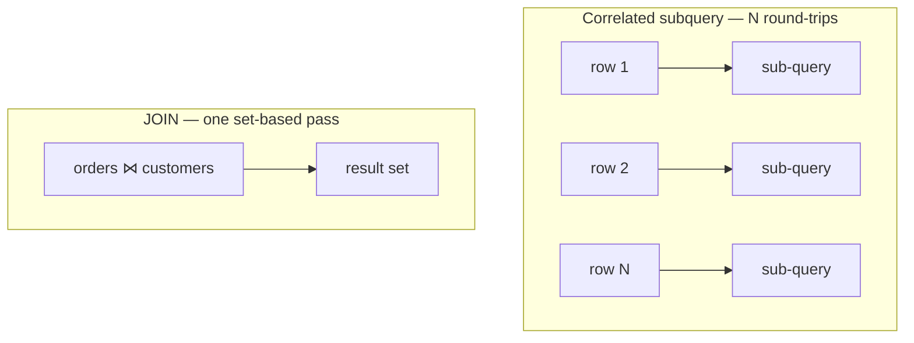

# Ways to Make a SQL Query More Efficient

A slow query is almost always doing **too much work**: reading rows it doesn't
need, scanning a whole table to find a handful of rows, or making the database
ask the same question over and over. Speeding it up is mostly about making the
database touch **less data**.

Real-life picture: imagine a huge warehouse. A fast query is a worker who walks
straight to shelf B-12, grabs three boxes and leaves. A slow query is a worker
who walks every aisle, reads every label, and carries out the whole inventory
just to find those three boxes. Optimization is teaching the worker where to go.

## Step 0: measure before you guess — read the plan

Never optimize by intuition. Ask the database what it actually does by running
`EXPLAIN` (or `EXPLAIN ANALYZE` for real timings) — that is the
[query plan](topic:query-plan), and learning to read it is the whole game. Look
for `Seq Scan` over big tables, huge `rows` estimates, and expensive sort/hash
steps. (How the planner *chooses* that plan is its own topic:
[how a query plan is determined](topic:query-execution-plan).)

Real life: before re-routing a delivery van, you look at the GPS log of where it
actually drove — not where you *assumed* it went.

## 1. Index what you filter and join on

An [index](topic:database-indexes) is the book's index at the back: instead of
reading every page, you jump straight to the right one. Add indexes on the
columns used in `WHERE`, `JOIN ... ON`, and `ORDER BY`. A
[clustered vs non-clustered](topic:clustered-vs-nonclustered-indexes) choice
changes how rows are physically laid out, which matters for range scans.

But an index only helps if your predicate is **sargable** (Search-ARGument-able)
— the column must appear "bare" so the index can be used:

- ❌ `WHERE YEAR(created_at) = 2026` — the function hides the column; the index is
  useless and the engine scans every row.
- ✅ `WHERE created_at >= '2026-01-01' AND created_at < '2027-01-01'` — a clean
  range the index can seek.

Real life: a library index lets you find "Tolstoy" instantly — but only if you
look up the actual name. "Authors whose name, reversed, starts with Y" forces the
librarian to check every card by hand.

Indexes aren't free: each one slows down `INSERT`/`UPDATE`/`DELETE` (the index
must be maintained) and costs storage — so index the columns you query, not every
column. Which columns are worth it is covered in
[fields that matter in queries](topic:database-query-fields).

## 2. Fetch fewer rows and fewer columns

- **Filter early and narrowly.** Push `WHERE` conditions so the database discards
  rows as soon as possible, before joins and sorts. The fewer rows survive each
  step, the less work everything downstream does.
- **`SELECT` only the columns you use**, not `SELECT *`. Extra columns mean more
  bytes off disk and over the wire, and they can stop the database from answering
  entirely from an index (a *covering* index).
- **`LIMIT`/paginate** when you only show a page of results — don't pull 100,000
  rows to display 20.

Real life: at the post office, you don't ask for *every* parcel in the building
and then sort them on the counter — you ask for the three addressed to you.

## 3. Prefer joins to repeated subqueries

A **correlated subquery** runs once per outer row — like phoning the supplier
separately for each of 1,000 line items. A `JOIN` lets the database fetch and
match everything in one organized pass.

Related: also prefer `EXISTS` over `IN (SELECT ...)` for existence checks on big
sets, and `UNION ALL` over `UNION` when you don't need duplicate removal (`UNION`
adds a sort/dedup step). Think in **sets**, not row-by-row loops.

## 4. Reduce round-trips and re-parsing

Every query is a trip to the database server. Sending 1,000 tiny queries in a
loop (the "N+1" problem) is far slower than one query that fetches everything, or
a batched insert. And reusing a [prepared statement](topic:prepared-statements)
lets the database parse and plan the SQL **once** and run it many times with
different parameters — like keeping a form template instead of redrafting the
whole letter for every customer (it also prevents SQL injection).

## 5. Help the planner with fresh statistics

The planner picks a strategy from **statistics** about your data (how many rows,
how many distinct values). If those are stale after a big data load, it can
choose a bad plan — so keep statistics current (e.g. `ANALYZE` in PostgreSQL).

Real life: the GPS routes you around a traffic jam only if its live traffic data
is up to date; with last week's map it sends you straight into the gridlock.

## 60-second interview answer

> First I measure, not guess: I run `EXPLAIN ANALYZE` and look for sequential
> scans on big tables, bad row estimates, and expensive sorts. The biggest win is
> usually an **index** on the columns in `WHERE`, `JOIN` and `ORDER BY` — provided
> the predicate is **sargable** (no functions wrapping the indexed column). Then I
> make the query read less data: filter early, `SELECT` only needed columns
> instead of `*`, and `LIMIT`/paginate. I rewrite correlated subqueries as joins
> to think in sets, use `EXISTS` and `UNION ALL` where appropriate, and avoid the
> N+1 pattern by batching. I reuse prepared statements so the SQL is parsed once,
> and I keep table statistics fresh so the planner chooses a good plan. After each
> change I re-measure.

## Common misconceptions

- ❌ "Just add more indexes." — Indexes speed reads but slow writes and cost
  storage; an unused index is pure overhead. Index deliberately.
- ❌ "An index on the column means it's always used." — A non-sargable predicate
  (`WHERE UPPER(name) = ...`, leading `%` in `LIKE '%abc'`) disables it.
- ❌ "`SELECT *` is harmless." — It moves extra data and defeats covering indexes.
- ❌ "Subqueries are always slower than joins." — Often equivalent; a *correlated*
  subquery run per row is the real trap. Check the plan.
- ❌ "I can eyeball which query is faster." — Cardinality and indexes decide;
  always read the actual `EXPLAIN` plan.
