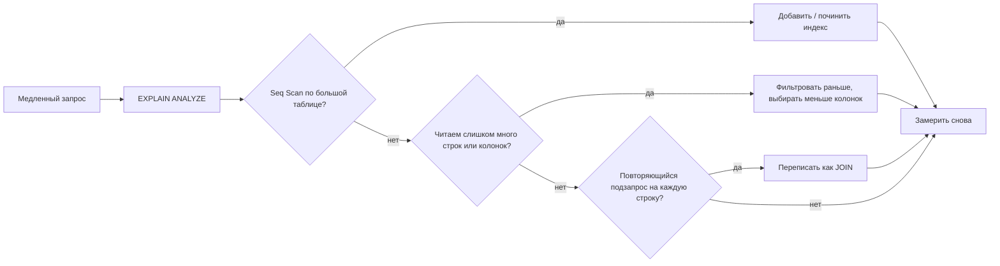
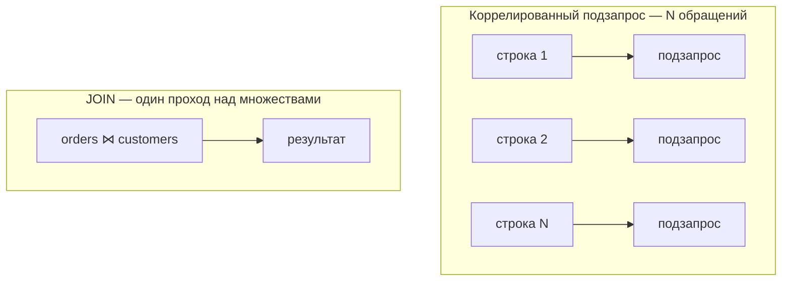

# Способы сделать SQL-запрос эффективнее

Медленный запрос почти всегда делает **слишком много работы**: читает ненужные
строки, сканирует всю таблицу ради горстки строк или заставляет базу отвечать на
один и тот же вопрос снова и снова. Ускорение — это в основном про то, чтобы база
трогала **меньше данных**.

Картинка из жизни: представьте огромный склад. Быстрый запрос — это работник,
который идёт прямо к стеллажу B-12, берёт три коробки и уходит. Медленный запрос —
работник, который обходит все ряды, читает каждую этикетку и выносит всю
инвентаризацию, лишь бы найти эти три коробки. Оптимизация — это научить работника,
куда идти.

## Шаг 0: измеряй, а не гадай — читай план

Никогда не оптимизируй по интуиции. Спроси базу, что она реально делает, выполнив
`EXPLAIN` (или `EXPLAIN ANALYZE` для реальных таймингов) — это
[план запроса](topic:query-plan), и умение его читать решает всё. Ищи `Seq Scan`
по большим таблицам, огромные оценки `rows` и дорогие шаги сортировки/хэширования.
(Как планировщик *выбирает* этот план — отдельная тема:
[как определяется план запроса](topic:query-execution-plan).)

Из жизни: прежде чем перепрокладывать маршрут фургона доставки, ты смотришь GPS-лог
того, где он реально ехал, — а не где ты *предполагал*, что он ехал.

## 1. Индексируй то, по чему фильтруешь и соединяешь

[Индекс](topic:database-indexes) — это указатель в конце книги: вместо чтения всех
страниц ты сразу прыгаешь на нужную. Добавляй индексы на колонки в `WHERE`,
`JOIN ... ON` и `ORDER BY`. Выбор между
[кластерным и некластерным](topic:clustered-vs-nonclustered-indexes) индексом
меняет физическое расположение строк, что важно для сканирования диапазонов.

Но индекс помогает, только если предикат **sargable** (Search-ARGument-able) —
колонка должна стоять «голой», чтобы индекс мог сработать:

- ❌ `WHERE YEAR(created_at) = 2026` — функция прячет колонку; индекс бесполезен, и
  движок сканирует каждую строку.
- ✅ `WHERE created_at >= '2026-01-01' AND created_at < '2027-01-01'` — чистый
  диапазон, по которому индекс умеет искать.

Из жизни: библиотечный каталог позволяет мгновенно найти «Толстого» — но лишь если
ищешь по настоящему имени. «Авторы, чьё имя задом наперёд начинается на Y»
заставляет библиотекаря вручную перебрать все карточки.

Индексы не бесплатны: каждый замедляет `INSERT`/`UPDATE`/`DELETE` (индекс надо
поддерживать) и занимает место — поэтому индексируй колонки, по которым делаешь
запросы, а не все подряд. Какие колонки этого стоят — в теме
[поля, важные для запросов](topic:database-query-fields).

## 2. Бери меньше строк и меньше колонок

- **Фильтруй рано и узко.** Двигай условия `WHERE` так, чтобы база отбрасывала
  строки как можно раньше, до соединений и сортировок. Чем меньше строк проходит
  каждый шаг, тем меньше работы у всего, что идёт дальше.
- **`SELECT` только нужные колонки**, а не `SELECT *`. Лишние колонки — это больше
  байт с диска и по сети, и они могут помешать базе ответить целиком из индекса
  (*покрывающий* индекс).
- **`LIMIT`/пагинация**, когда показываешь лишь страницу результатов, — не тяни
  100 000 строк, чтобы отобразить 20.

Из жизни: на почте ты не просишь *все* посылки в здании, чтобы потом разобрать их
на стойке, — ты просишь три, адресованные тебе.

## 3. Предпочитай JOIN повторяющимся подзапросам

**Коррелированный подзапрос** выполняется по разу на каждую внешнюю строку — как
звонить поставщику отдельно по каждой из 1000 позиций. `JOIN` позволяет базе
достать и сопоставить всё за один организованный проход.

Похожее: для проверки существования на больших множествах предпочитай `EXISTS`
вместо `IN (SELECT ...)`, а `UNION ALL` вместо `UNION`, когда дубликаты убирать не
нужно (`UNION` добавляет шаг сортировки/дедупликации). Мысли **множествами**, а не
циклом по строкам.

## 4. Сокращай число обращений и повторный разбор

Каждый запрос — это поездка на сервер базы. Отправлять 1000 крошечных запросов в
цикле (проблема «N+1») куда медленнее, чем один запрос, достающий всё сразу, или
пакетная вставка. А переиспользование
[prepared statement](topic:prepared-statements) позволяет базе разобрать и
спланировать SQL **один раз** и выполнять его много раз с разными параметрами — как
держать шаблон формы вместо переписывания всего письма для каждого клиента (и это
ещё защищает от SQL-инъекций).

## 5. Помоги планировщику свежей статистикой

Планировщик выбирает стратегию по **статистике** о данных (сколько строк, сколько
различных значений). Если после большой загрузки данных она устарела, он может
выбрать плохой план — поэтому держи статистику актуальной (например, `ANALYZE` в
PostgreSQL).

Из жизни: GPS объедет пробку, только если его данные о трафике свежие; со
вчерашней картой он отправит тебя прямо в затор.

## Ответ за 60 секунд

> Сначала измеряю, а не гадаю: запускаю `EXPLAIN ANALYZE` и ищу последовательные
> сканы по большим таблицам, плохие оценки числа строк и дорогие сортировки. Самый
> большой выигрыш обычно — **индекс** на колонки в `WHERE`, `JOIN` и `ORDER BY`,
> при условии, что предикат **sargable** (без функций, оборачивающих
> индексированную колонку). Затем заставляю запрос читать меньше данных: фильтрую
> рано, `SELECT` только нужных колонок вместо `*`, `LIMIT`/пагинация. Переписываю
> коррелированные подзапросы в JOIN, чтобы мыслить множествами, использую `EXISTS`
> и `UNION ALL` где уместно и избегаю N+1, делая пакетную обработку. Переиспользую
> prepared statements, чтобы SQL разбирался один раз, и держу статистику таблиц
> свежей, чтобы планировщик выбирал хороший план. После каждого изменения замеряю
> снова.

## Частые заблуждения

- ❌ «Просто добавь больше индексов». — Индексы ускоряют чтение, но замедляют запись
  и занимают место; неиспользуемый индекс — чистые накладные расходы. Индексируй
  осознанно.
- ❌ «Если на колонку есть индекс, он всегда используется». — Не-sargable предикат
  (`WHERE UPPER(name) = ...`, ведущий `%` в `LIKE '%abc'`) его отключает.
- ❌ «`SELECT *` безвреден». — Он гоняет лишние данные и убивает покрывающие
  индексы.
- ❌ «Подзапросы всегда медленнее JOIN». — Часто они эквивалентны; настоящая ловушка
  — *коррелированный* подзапрос, выполняемый на каждую строку. Смотри план.
- ❌ «Я на глаз пойму, какой запрос быстрее». — Решают кардинальность и индексы;
  всегда читай реальный план `EXPLAIN`.
