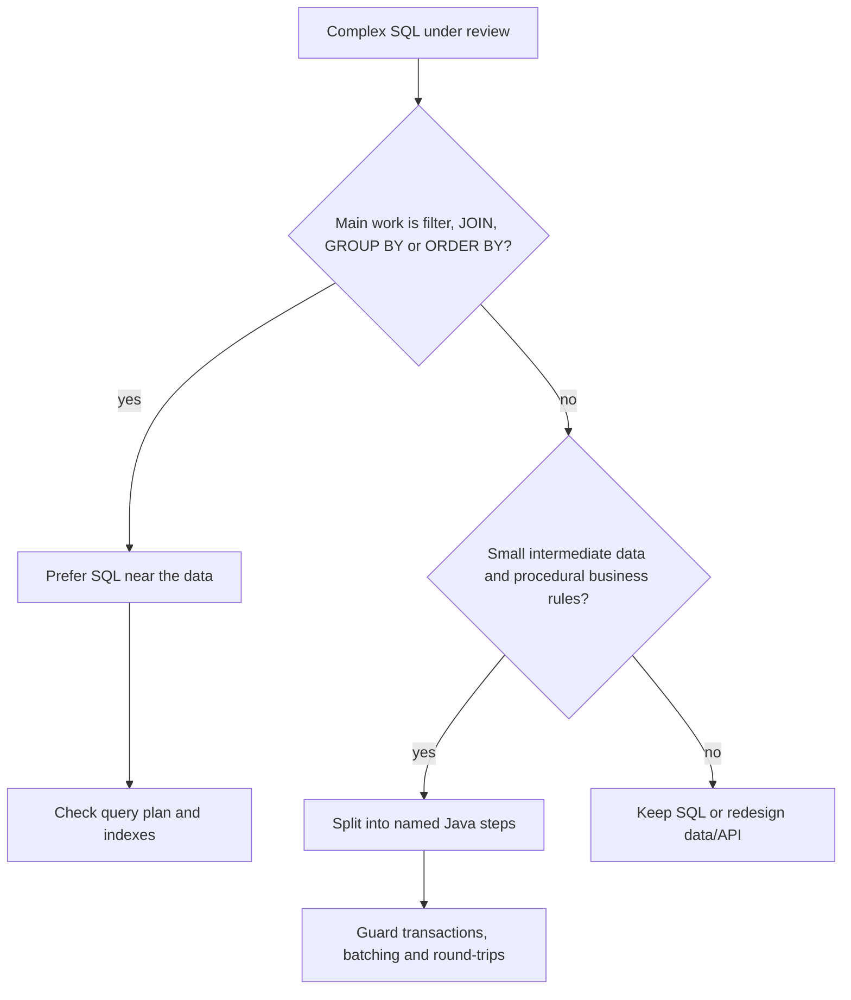
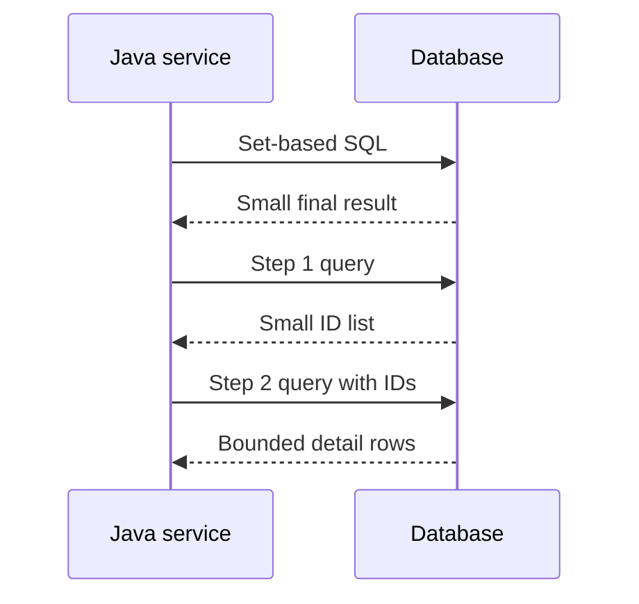

# When to Split Complex SQL into Java Steps

The short rule: keep **set-based data work** in SQL, and split into Java only when the split makes the system clearer or safer without moving too much data across the network. SQL is good at filtering, joining, grouping, sorting and applying indexes near the data. Java is better for procedural business rules, calls to application services, reusable domain logic and workflows that are easier to test as named steps. Think of a busy kitchen: chopping, cooking and plating should happen at the station with the ingredients; the waiter should not carry half-cooked food between rooms unless there is a clear reason.

This topic is not about whether SQL or Java is "better". It is about ownership of work. A database engine has an optimizer, indexes, statistics, joins and transaction semantics. A Java service has clearer control flow, application abstractions, unit tests and horizontal scaling. The right answer is the one that minimizes total cost: database CPU, network traffic, memory in the service, consistency risk and future maintenance. It is like a post office: sorting letters at the central machine is fast, but special customer handling may belong at the service window.

## Prefer one SQL query when the database is doing set work

If the task is mostly selecting rows, joining tables, aggregating, sorting or filtering, the database is usually the right place. It can use [database indexes](topic:database-indexes), choose a [query plan](topic:query-plan), reorder joins and avoid sending unnecessary rows to the application. In traffic terms, it is better to let the road junction route cars locally than to send every car through your office parking lot.

This is especially true when intermediate data is large. A query that returns 50 final rows after joining and grouping a million rows should normally stay in SQL. If Java fetches those million rows and then filters them, you pay for network transfer, heap memory, garbage collection and extra code. That is like asking a post office to deliver every parcel to your desk so you can personally pick the five that matter.

Keep the operation in SQL when consistency depends on one snapshot of the data. One statement usually sees one consistent view under the database isolation rules. Several statements may observe different versions unless you wrap them in the right transaction and isolation level. For the deeper consistency model, connect this to [ACID principles](topic:acid-principles) and [MVCC](topic:mvcc). The kitchen analogy: one chef reads one ticket and cooks one order; if three waiters read the ticket at different times, they can disagree about what changed.

## Split into Java when the query stops being the right tool

Splitting can be correct when the SQL has become an unreadable wall of nested subqueries, conditional business rules, vendor-specific tricks and duplicated expressions. If developers cannot safely review it, test it or explain its failure modes, a few named Java steps may be better. A recipe with every instruction compressed into one sentence is not efficient; it is just hard to follow.

Java is also the better home for rules that are naturally procedural or application-owned: calling a pricing service, checking feature flags, applying policy objects, combining database data with cached configuration, or producing different outputs for different API paths. SQL can express some of this, but forcing domain workflow into SQL often creates logic that is hard to test and easy to duplicate. At a service counter, the sorting machine should not decide whether a customer gets a goodwill discount.

Splitting is also reasonable when each step has a **small, bounded result**. For example, fetch the page of candidate IDs with a selective indexed query, then fetch details for those IDs, then apply a small amount of domain logic. This keeps data movement controlled. It is like a warehouse picker bringing a short list of shelf numbers first, not dumping the whole aisle onto the packing table.

Database CPU pressure can be another reason, but only after measurement. If the database is the bottleneck and the Java tier has spare capacity, moving non-set, CPU-heavy formatting or rule evaluation out of SQL can help. Do not guess: use production metrics, slow-query logs and the [EXPLAIN plan](topic:postgresql-explain-plan-reading). Moving work blindly is like moving a traffic jam to a side street without checking whether the side street is open.

## The traps when you split

The first trap is **N+1 queries**: one query finds 100 orders, then Java runs 100 more queries for the lines. That usually loses to a single [JOIN](topic:sql-joins), a batched `IN (...)` query, or a fetch strategy designed for the use case. It is the post office clerk walking to the warehouse once per parcel instead of taking the whole shelf list.

The second trap is loading too much data. "We will filter in Java" sounds simple until the result contains millions of rows. Use [fields that matter in database queries](topic:database-query-fields): filters, join keys, sort keys, grouping keys and selected columns should stay intentional. A kitchen does not move every ingredient to the dining room just because the waiter can read the recipe.

The third trap is losing atomicity. If one SQL statement becomes five statements, errors can leave partial effects or inconsistent reads unless the Java code controls transactions carefully. If writes are involved, the answer must mention transaction boundaries, rollback and isolation. This is the same reason a kitchen completes one order ticket as a unit instead of sending soup now and maybe the main dish later.

The fourth trap is duplicating database logic in Java. If Java reimplements filtering that the database already guarantees through constraints, indexes or normalized schema design, the system now has two sources of truth. Use [normalization and denormalization](topic:database-normalization) deliberately. A post office should not keep two different address books unless somebody owns synchronization.

The fifth trap is unsafe SQL assembly. Splitting often creates dynamic fragments, lists of IDs and optional filters. Keep parameters bound with [prepared statements](topic:prepared-statements), not string concatenation. It is like using official parcel labels instead of handwritten notes that anyone can alter.

## A practical decision checklist

Start with the current query plan and real production behavior, not taste. If the query is slow, inspect the plan, row counts, indexes and hot predicates before rewriting it; the topics on [query optimization candidates](topic:query-optimization-candidates) and [ways to make SQL efficient](topic:sql-query-optimization) give the broader checklist. In real life, you check the traffic camera before redesigning the road.

Ask how much data crosses the boundary. Splitting is safer when each step returns a small bounded set, such as one page of IDs or a small aggregate. It is dangerous when Java receives a huge intermediate table. A warehouse can hand you one crate; it should not unload the whole truck into your apartment.

Ask whether the workflow needs one consistent database view. If yes, prefer one statement or use an explicit transaction with the right isolation. If each step is independent and stale data is acceptable, Java orchestration becomes safer. This is like reading one finalized order ticket versus checking a status board where small delays are acceptable.

Ask where the rule belongs. Data integrity, joins, filtering and aggregation usually belong close to the data. Domain decisions, feature flags, external calls and API-specific shaping usually belong in Java. In a kitchen, the oven controls temperature; the waiter controls table-specific service.

Ask who will maintain it. A single SQL query is good if the team can read, test and tune it. Multiple Java steps are good if they make names, tests and failure handling clearer. Neither is automatically cleaner. A clear recipe on one page beats ten sticky notes, but ten named steps beat one unreadable paragraph.

## 60-second interview answer

> I would keep the work in SQL when it is set-based: filtering, joining, grouping, sorting and reducing data close to the tables, especially when intermediate row counts are large or consistency should come from one statement. The database has indexes, statistics, an optimizer and transaction semantics, so pulling raw data into Java just to filter it is usually worse.
>
> I would split it into Java steps when the SQL has become unmaintainable, when the logic is procedural or application-owned, when steps return small bounded results, or when measured database CPU pressure makes it useful to move non-set computation to the application tier. Then I would guard against N+1 queries, too many round-trips, huge intermediate transfers and inconsistent reads by using batching, transactions, prepared statements and metrics.

## Common misconceptions

- **"One SQL query is always faster."** Not always. One huge query can be unreadable, hard to tune, vendor-specific or heavy on database CPU. A single mega-order in a kitchen can block every station.
- **"Several simple queries are always easier."** Not if they create N+1 calls, inconsistent snapshots or a lot of network traffic. Five short errands can be worse than one planned delivery route.
- **"Filtering in Java is harmless."** It is harmless only for small bounded data. For large tables, the database should reduce data before the network boundary. Do not move the whole pantry to inspect one jar.
- **"Splitting avoids database complexity."** It often moves complexity into transactions, retries, batching and memory pressure. The mess did not disappear; it moved from the warehouse to the hallway.
- **"The ORM will handle it."** ORMs can generate good SQL, but they can also hide lazy loading and N+1 behavior. Always inspect actual SQL and production metrics. A delivery app may show one button, but someone still drives the route.
