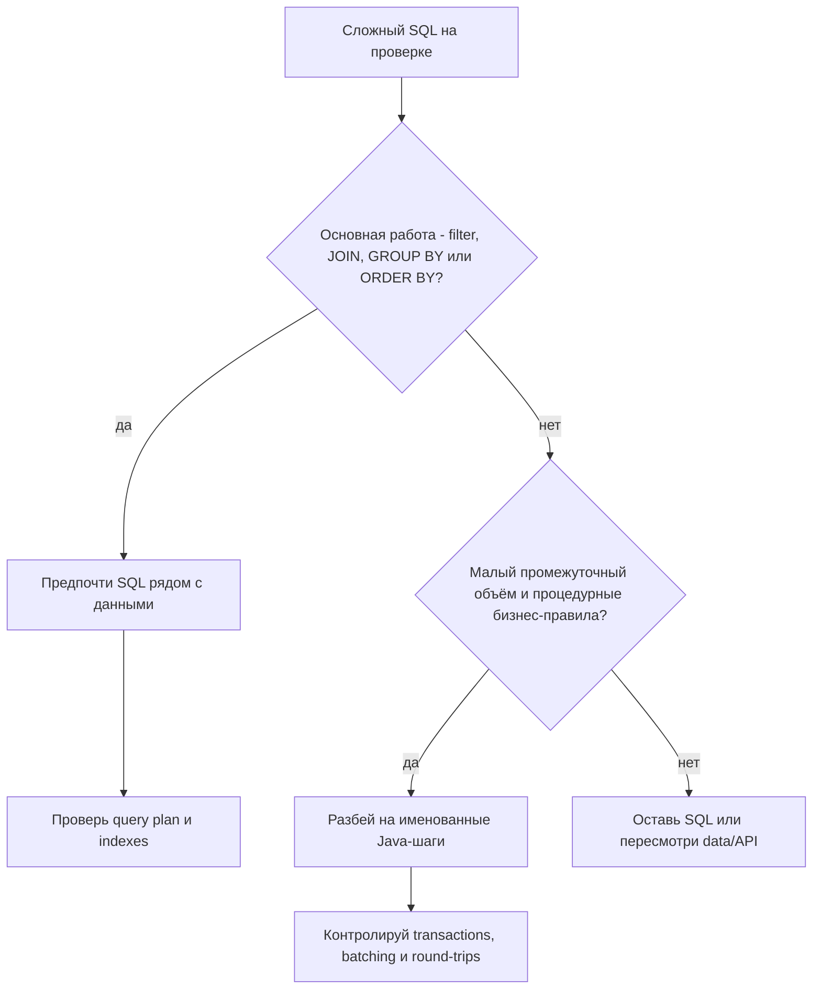
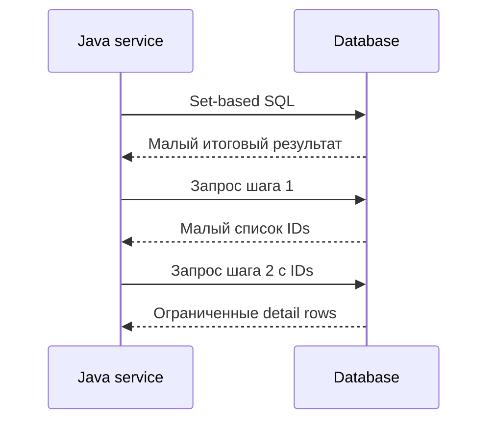

# Когда разбивать сложный SQL на шаги в Java

Короткое правило: оставляйте **set-based работу с данными** в SQL, а разбивайте её на Java-шаги только тогда, когда это делает систему понятнее или безопаснее без переноса слишком большого объёма данных через сеть. SQL хорошо фильтрует, соединяет, группирует, сортирует и применяет индексы рядом с данными. Java лучше подходит для процедурных бизнес-правил, вызовов application services, переиспользуемой доменной логики и workflows, которые проще тестировать как именованные шаги. Представьте загруженную кухню: резать, готовить и выкладывать блюдо лучше там, где лежат продукты; официант не должен носить полуготовую еду между комнатами без ясной причины.

Эта тема не про то, что SQL или Java "лучше". Она про владение работой. У database engine есть optimizer, indexes, statistics, joins и transaction semantics. У Java service есть более явный control flow, application abstractions, unit tests и horizontal scaling. Правильный ответ минимизирует общую стоимость: database CPU, network traffic, память в сервисе, риск консистентности и будущую поддержку. Это как почта: центральная сортировочная машина быстро распределяет письма, но особая работа с клиентом может относиться к окну обслуживания.

## Предпочитайте один SQL-запрос, когда база делает set work

Если задача в основном выбирает строки, соединяет таблицы, агрегирует, сортирует или фильтрует, база обычно является правильным местом. Она может использовать [database indexes](topic:database-indexes), выбирать [query plan](topic:query-plan), переупорядочивать joins и не отправлять лишние строки приложению. В дорожной аналогии лучше дать перекрёстку направлять машины на месте, чем прогонять каждую машину через парковку вашего офиса.

Это особенно важно, когда промежуточные данные большие. Запрос, который возвращает 50 итоговых строк после соединения и группировки миллиона строк, обычно должен оставаться в SQL. Если Java заберёт этот миллион строк и потом отфильтрует их, вы заплатите за network transfer, heap memory, garbage collection и дополнительный код. Это как попросить почту доставить все посылки на ваш стол, чтобы вы лично выбрали пять нужных.

Оставляйте операцию в SQL, когда консистентность зависит от одного snapshot данных. Один statement обычно видит одно согласованное представление по правилам isolation в базе. Несколько statements могут увидеть разные версии, если не обернуть их в правильную transaction и isolation level. Для более глубокой модели консистентности свяжите это с [ACID principles](topic:acid-principles) и [MVCC](topic:mvcc). Кухонная аналогия: один повар читает один ticket и готовит один заказ; если три официанта читают ticket в разное время, они могут спорить, что изменилось.

## Разбивайте на Java, когда запрос перестаёт быть правильным инструментом

Разбиение может быть корректным, когда SQL превратился в нечитаемую стену из вложенных subqueries, условных бизнес-правил, vendor-specific трюков и дублированных выражений. Если разработчики не могут безопасно его ревьюить, тестировать или объяснять его failure modes, несколько именованных Java-шагов могут быть лучше. Рецепт, где все инструкции сжаты в одно предложение, не становится эффективным; он просто становится трудным для чтения.

Java также лучше подходит для правил, которые естественно являются процедурными или принадлежат приложению: вызов pricing service, проверка feature flags, применение policy objects, объединение данных из базы с cached configuration или подготовка разных outputs для разных API paths. SQL может выразить часть этого, но принудительное помещение domain workflow в SQL часто создаёт логику, которую трудно тестировать и легко продублировать. У окна обслуживания сортировочная машина не должна решать, положена ли клиенту скидка за лояльность.

Разбиение также разумно, когда каждый шаг имеет **малый, ограниченный результат**. Например, сначала получить страницу candidate IDs через selective indexed query, затем получить details для этих IDs, затем применить небольшой объём domain logic. Так перенос данных остаётся контролируемым. Это как сборщик на складе сначала приносит короткий список номеров полок, а не вываливает весь проход на упаковочный стол.

Database CPU pressure может быть ещё одной причиной, но только после измерений. Если база является bottleneck, а у Java tier есть свободная capacity, перенос non-set, CPU-heavy formatting или rule evaluation из SQL может помочь. Не угадывайте: используйте production metrics, slow-query logs и [EXPLAIN plan](topic:postgresql-explain-plan-reading). Перенос работы вслепую похож на перенос пробки на боковую улицу без проверки, открыта ли она.

## Ловушки при разбиении

Первая ловушка - **N+1 queries**: один запрос находит 100 orders, а затем Java выполняет ещё 100 запросов за lines. Обычно это проигрывает одному [JOIN](topic:sql-joins), batched `IN (...)` query или fetch strategy, спроектированной под use case. Это как почтовый сотрудник ходит на склад по одной посылке вместо того, чтобы взять весь список полок.

Вторая ловушка - загрузить слишком много данных. "Отфильтруем в Java" звучит просто, пока результат не содержит миллионы строк. Используйте [fields that matter in database queries](topic:database-query-fields): filters, join keys, sort keys, grouping keys и selected columns должны оставаться осознанными. Кухня не переносит все продукты в зал только потому, что официант умеет читать рецепт.

Третья ловушка - потерять atomicity. Если один SQL statement превращается в пять statements, ошибки могут оставить частичные effects или inconsistent reads, если Java-код аккуратно не управляет transactions. Если есть writes, в ответе нужно упомянуть transaction boundaries, rollback и isolation. Поэтому кухня завершает один order ticket как единое целое, а не отправляет суп сейчас и основное блюдо когда-нибудь потом.

Четвёртая ловушка - продублировать database logic в Java. Если Java повторно реализует фильтрацию, которую база уже гарантирует через constraints, indexes или normalized schema design, у системы теперь два источника правды. Используйте [normalization and denormalization](topic:database-normalization) осознанно. Почте не стоит держать две разные адресные книги, если никто не отвечает за синхронизацию.

Пятая ловушка - небезопасная сборка SQL. Разбиение часто создаёт dynamic fragments, списки IDs и optional filters. Держите параметры связанными через [prepared statements](topic:prepared-statements), а не через string concatenation. Это как использовать официальные почтовые ярлыки вместо рукописных записок, которые любой может изменить.

## Практический checklist решения

Начинайте с текущего query plan и реального поведения в продакшене, а не со вкуса. Если запрос медленный, изучите plan, row counts, indexes и hot predicates до переписывания; темы про [query optimization candidates](topic:query-optimization-candidates) и [ways to make SQL efficient](topic:sql-query-optimization) дают более широкий checklist. В жизни вы смотрите камеру на дороге до того, как перестраивать развязку.

Спросите, сколько данных пересекает границу. Разбиение безопаснее, когда каждый шаг возвращает небольшой ограниченный набор, например одну страницу IDs или малую aggregate. Оно опасно, когда Java получает огромную промежуточную таблицу. Склад может выдать один ящик; он не должен разгружать весь грузовик в вашу квартиру.

Спросите, нужен ли workflow один согласованный database view. Если да, предпочитайте один statement или используйте явную transaction с правильной isolation. Если каждый шаг независим и stale data допустима, Java orchestration становится безопаснее. Это как читать один финальный order ticket или смотреть на табло статусов, где небольшая задержка допустима.

Спросите, где правилу место. Data integrity, joins, filtering и aggregation обычно должны быть рядом с данными. Domain decisions, feature flags, external calls и API-specific shaping обычно должны быть в Java. На кухне oven контролирует температуру; официант контролирует обслуживание конкретного столика.

Спросите, кто будет это поддерживать. Один SQL-запрос хорош, если команда может читать, тестировать и настраивать его. Несколько Java-шагов хороши, если они делают names, tests и failure handling понятнее. Ни один вариант не является автоматически чище. Понятный рецепт на одной странице лучше десяти стикеров, но десять названных шагов лучше одного нечитаемого абзаца.

## Ответ на интервью за 60 секунд

> Я бы оставил работу в SQL, когда она set-based: фильтрация, joins, grouping, sorting и сокращение данных рядом с таблицами, особенно если промежуточных строк много или консистентность должна обеспечиваться одним statement. У базы есть indexes, statistics, optimizer и transaction semantics, поэтому тащить сырые данные в Java только ради фильтрации обычно хуже.
>
> Я бы разбил работу на Java-шаги, когда SQL стал неподдерживаемым, когда логика процедурная или принадлежит приложению, когда шаги возвращают малые ограниченные результаты, или когда измеренная нагрузка на database CPU показывает, что non-set computation полезно перенести в application tier. Затем я бы защитился от N+1 queries, лишних round-trips, огромных промежуточных transfers и inconsistent reads через batching, transactions, prepared statements и metrics.

## Частые заблуждения

- **"Один SQL-запрос всегда быстрее."** Не всегда. Один огромный запрос может быть нечитаемым, трудным для настройки, vendor-specific или тяжёлым для database CPU. Один мега-заказ на кухне может заблокировать все станции.
- **"Несколько простых запросов всегда понятнее."** Нет, если они создают N+1 calls, inconsistent snapshots или много network traffic. Пять коротких поездок могут быть хуже одного спланированного маршрута доставки.
- **"Фильтровать в Java безвредно."** Это безвредно только для малых ограниченных данных. Для больших таблиц база должна уменьшить данные до сетевой границы. Не переносите всю кладовую, чтобы проверить одну банку.
- **"Разбиение убирает сложность базы."** Часто оно переносит сложность в transactions, retries, batching и memory pressure. Беспорядок не исчез; он переехал со склада в коридор.
- **"ORM сам всё решит."** ORM может генерировать хороший SQL, но может и скрывать lazy loading и N+1 behavior. Всегда смотрите на фактический SQL и production metrics. В приложении доставки может быть одна кнопка, но маршрут всё равно кто-то проезжает.
