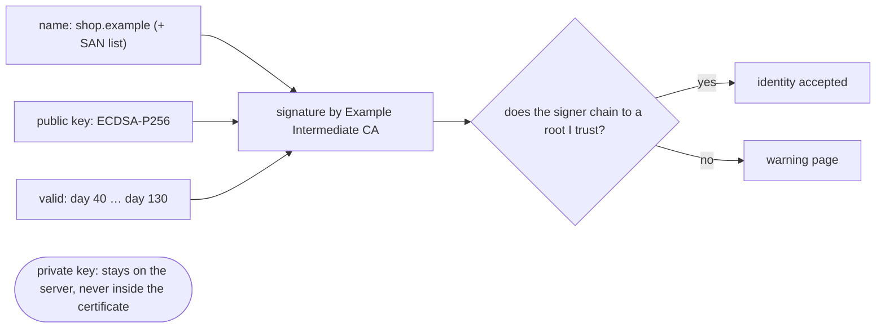
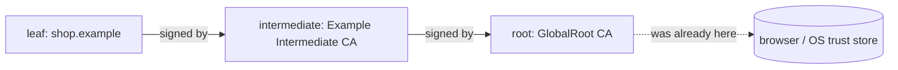
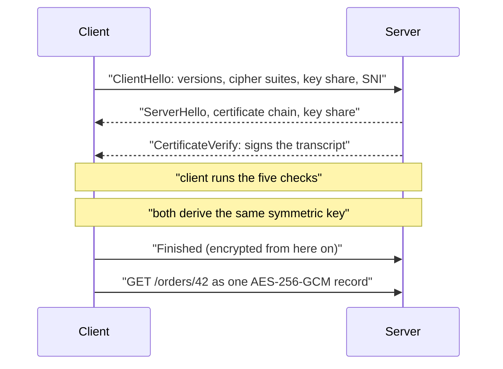

# SSL/TLS Certificates and How HTTPS Encrypts

A certificate is **not** a key, and it does **not** encrypt anything. It is a public
document that says one thing:

> *the public key printed below belongs to the name printed above* — signed, **Example
> Intermediate CA**

That is the whole idea. Everything else — the handshake, the ciphers, the padlock — is
built on top of that one claim, and the claim is only worth as much as the signature at
the bottom.

The server sends this document to **every** client that connects, which tells you it
contains no secrets. The secret is the **private key**, which never leaves the server and
appears nowhere in the certificate. The certificate is the lock; the private key is the
key that fits it.

## Why anybody believes it: the chain of trust

Anyone can generate a key pair and write "shop.example" next to it — that is a
self-signed certificate, and it takes ten seconds. What you cannot do is get a
**certificate authority** to sign that statement for a domain you do not control.

The client walks that chain upward, checking each signature with the **issuer's public
key**, and stops as soon as it reaches a name in its own **trust store** — a list of a
few hundred root CAs shipped with the browser or the operating system. Three consequences
worth stating in an interview:

- **The root is never sent.** It was on your machine before you opened the site. Trust
  does not travel with the certificate; it is pre-installed.
- **Intermediates must be sent.** A root CA key is kept offline, so day-to-day signing is
  done by an intermediate. If the server forgets to serve it, some clients cannot build a
  path — the classic "works in Chrome, fails in curl and on the phone", because the
  browser cached that intermediate from another site.
- **Whoever controls a trusted root controls everything.** Adding one root to a machine
  is enough to mint a valid certificate for any hostname on earth, for that machine. That
  is exactly how corporate TLS inspection and debugging proxies work, and it is why "just
  install our certificate" is a serious request.

## What the client checks before sending one byte

| Check | Question | Typical failure |
|---|---|---|
| **Chain** | Does it lead to a root in my trust store? | self-signed, unknown CA, missing intermediate |
| **Hostname** | Does the SAN list contain the name in the address bar? | certificate for the apex used on `www`, wrong wildcard depth |
| **Validity** | Is today inside `notBefore … notAfter`? | expiry — one of the top causes of self-inflicted outages |
| **Revocation** | Has the CA withdrawn it? | leaked key; checked via CRL/OCSP, in practice via OCSP stapling |
| **Possession** | Can the other side sign with the matching private key? | an impostor replaying a copied certificate |

The last one is the one people forget, and it is the answer to *"the certificate is
public — why can't an attacker just copy it?"*. In the handshake the server signs the
transcript of everything said so far with its private key (`CertificateVerify`), and the
client verifies that signature using the public key in the certificate. A copy without
the private key dies at this step, which is precisely why publishing the certificate to
the whole internet is safe.

Note also what the hostname check buys: without it, one valid certificate for one throw-
away domain would let its holder impersonate every site in the world.

## What encryption HTTPS actually uses

Both kinds, for different jobs. This is the part interviewers push on.

- **Asymmetric (public-key) cryptography** appears only in the handshake, and it does two
  things: the certificate's key pair **signs** (proving identity), and an **ephemeral
  Diffie-Hellman** exchange (X25519 or P-256 in TLS 1.3) lets both sides arrive at the
  same secret without that secret ever crossing the wire.
- **Symmetric cryptography** carries the data: the shared secret is expanded into session
  keys and every record is encrypted with an **AEAD** cipher — AES-128/256-GCM, or
  ChaCha20-Poly1305 where AES hardware is absent. AEAD means one operation gives
  confidentiality *and* integrity: each record carries an authentication tag, and a
  flipped byte fails the tag check and kills the connection instead of decrypting to
  garbage.

Why not just use the certificate's key for everything? Because asymmetric operations are
orders of magnitude slower and work on small fixed-size blocks — they are for
establishing trust, not for moving megabytes. The hybrid is what makes HTTPS cost a
handshake rather than throughput. That handshake is one extra round trip in TLS 1.3, zero
on a resumed session, which is why the "HTTPS is slow" folklore is a decade out of date.

Inside the encrypted records is the *entire* HTTP message: method, path, query string,
headers, cookies, body — the details are in [HTTP vs HTTPS](topic:http-vs-https). What
still leaks is the destination IP and port, the size and timing of traffic, the DNS
lookup, and the hostname in **SNI**, which is sent in the ClientHello before any tunnel
exists.

## Forward secrecy

TLS 1.2 also allowed **RSA key transport**: the client picked the session secret and
encrypted it with the public key from the certificate. It works — and it ties every
session that ever used that certificate to one long-lived private key. An eavesdropper
who stored the ciphertext for a year and then obtained that key could decrypt all of it,
retroactively and in bulk. "Harvest now, decrypt later" is a real strategy.

An ephemeral exchange removes the target: the private values existed only in memory, for
one connection, and were discarded. The certificate's long-lived key only ever *signed*,
so stealing it lets an attacker impersonate the server from that moment on, but does
nothing for traffic recorded earlier. That property is **forward secrecy**, and TLS 1.3
made it mandatory by deleting every key-exchange mode that lacked it.

## The 60-second interview answer

> A TLS certificate is a signed public document binding a hostname to a public key. The
> server sends it during the handshake; the client verifies it chains to a root CA in its
> trust store, that the name matches the address bar, that the dates are current and that
> it is not revoked — and then challenges the server to sign the handshake transcript,
> which only the holder of the matching private key can do. That last step is why copying
> a public certificate is useless. Then the two sides do an ephemeral Diffie-Hellman
> exchange to agree a shared secret and switch to symmetric AES-GCM for the actual data.
> So HTTPS is hybrid: asymmetric crypto authenticates and agrees on a key, symmetric AEAD
> crypto provides confidentiality and integrity for every record. Because the key
> agreement is ephemeral, a later leak of the server's private key does not decrypt
> traffic recorded earlier — that is forward secrecy. The two things I would flag: the
> whole system reduces to the trust store, so anyone who can install a root CA can read
> everything; and TLS secures the channel only — authorization, XSS and CSRF are
> untouched.

## Why it matters in production

- **Expiry is a leading cause of self-inflicted outages.** Lifetimes keep shrinking (90
  days is normal, shorter is coming), so renewal must be automated with ACME and alerted
  on days-remaining. "Someone renews it every year" is not a process.
- **Serve the full chain.** Test with `openssl s_client -connect host:443` or SSL Labs,
  not with the browser you have been using all week, which has cached the intermediate.
- **TLS usually terminates at the edge** — a load balancer, CDN or
  [API gateway](topic:api-gateway) — so anything behind it sees plain HTTP, and anything
  that terminates TLS reads everything. Encrypting service-to-service traffic is a
  separate decision; see [options for inter-service
  communication](topic:inter-service-communication-options).
- **Mutual TLS** turns the checks around: the client also presents a certificate and
  proves possession, so the server authenticates the caller cryptographically instead of
  by a bearer token. Common between services and for high-value APIs — compare with how
  [authentication normally works](topic:authentication-flow) and with
  [JWT versus session tokens](topic:jwt-vs-session-token), where the signature proves
  who issued a claim rather than who holds a connection.
- **Certificate pinning** is a mobile-app answer to the "trusted root" problem — pin the
  expected key so an installed root is not enough — and it will brick your app if you
  rotate keys without shipping a new build. Pin the CA or use short-lived backup pins.
- **Protect the private key.** If it leaks, revoke and reissue immediately; the old
  certificate stays valid-looking until revocation reaches clients, which is slow. What
  forward secrecy protects is the *recorded past*, not the future.
- **DV, OV and EV** differ only in what the CA verified — control of the domain, the
  organisation's existence, or a deeper legal check. Browsers stopped giving EV special
  treatment in the address bar, so the padlock means the same thing for all three.

## Common misconceptions

- **"The certificate encrypts the traffic."** It authenticates. The data is encrypted
  with a symmetric key both sides derived during the handshake, and that key is not in
  the certificate.
- **"A self-signed certificate gives the same encryption."** The same cipher and the same
  strength — and no identity, which is the guarantee that makes the encryption worth
  anything. Encrypting a conversation with an attacker only stops third parties watching
  you get robbed. Also, training users to click through warnings is its own vulnerability.
- **"The certificate is public, so it can be stolen and reused."** Only together with the
  private key. Without it the impostor cannot sign the handshake transcript.
- **"The padlock means the site is safe."** It means private, unmodified, and really this
  domain. Phishing sites get free DV certificates too. See
  [XSS](topic:xss) and [CSRF](topic:csrf) for what an encrypted channel does nothing
  about.
- **"SSL and TLS are two things."** SSL is the dead ancestor — every version is broken and
  disabled; the protocol is TLS 1.2 or 1.3. "SSL certificate" survives as a product name.
- **"HTTPS everywhere means end-to-end encryption."** It is encrypted to whatever
  terminates TLS, which is usually not your application process.
- **"A wildcard certificate covers everything under the domain."** `*.example.com` covers
  exactly one label: `api.example.com` yes, `eu.api.example.com` no, and `example.com`
  itself no unless it is listed separately in the SAN.
- **"The CN field is the hostname."** It has been ignored for years; hostname matching
  uses the **SAN** list. A certificate with only a CN is rejected by modern clients.
- **"Revocation protects me."** It is the weakest of the five checks: CRLs are huge, OCSP
  costs latency and leaks browsing history, and clients frequently fail open. Short
  lifetimes are the real mitigation, and they are why lifetimes keep shrinking.
- **"A stronger key means stronger encryption of my data."** The certificate's key size
  affects the signature, not the record cipher. The data is protected by the negotiated
  symmetric cipher regardless.
- **"Certificate errors in tests are noise — disable verification."** Turning off
  verification in an HTTP client removes the only thing standing between you and a
  man-in-the-middle, and that flag has a way of reaching production. Trust the specific
  test CA instead.
