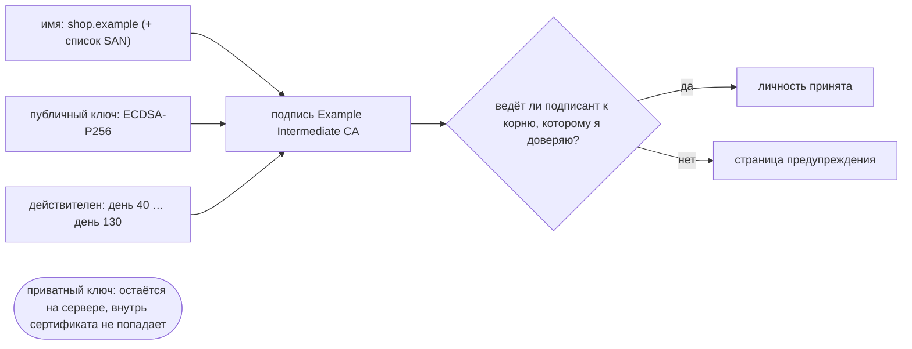
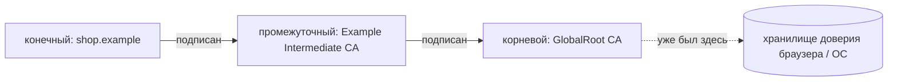
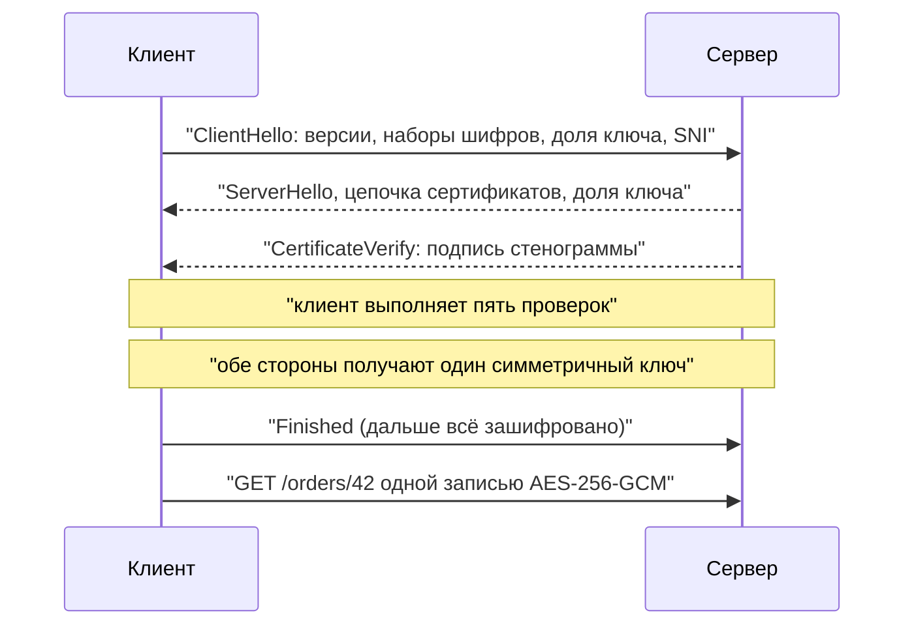

# SSL/TLS-сертификаты и шифрование в HTTPS

Сертификат — это **не** ключ, и он **ничего** не шифрует. Это публичный документ, который
говорит одну вещь:

> *публичный ключ, напечатанный ниже, принадлежит имени, напечатанному выше* — подпись:
> **Example Intermediate CA**

В этом вся идея. Всё остальное — рукопожатие, шифры, замочек — построено поверх этого
единственного утверждения, а стоит утверждение ровно столько, сколько стоит подпись внизу.

Сервер отправляет этот документ **каждому** подключившемуся клиенту — уже отсюда видно,
что секретов в нём нет. Секрет — это **приватный ключ**, который никогда не покидает
сервер и в сертификате не встречается. Сертификат — это замок, приватный ключ — ключ к
нему.

## Почему ему вообще верят: цепочка доверия

Сгенерировать ключевую пару и написать рядом «shop.example» может кто угодно — это и есть
самоподписанный сертификат, дело десяти секунд. Чего сделать нельзя — это заставить
**центр сертификации** (CA) подписать такое утверждение для домена, которым вы не
владеете.

Клиент идёт по цепочке вверх, проверяя каждую подпись **публичным ключом издателя**, и
останавливается, как только доходит до имени из собственного **хранилища доверия** —
списка из нескольких сотен корневых CA, поставляемого с браузером или операционной
системой. Три следствия, которые стоит проговорить на собеседовании:

- **Корень никто не присылает.** Он был на вашей машине ещё до того, как вы открыли сайт.
  Доверие не путешествует вместе с сертификатом — оно предустановлено.
- **Промежуточные присылать обязательно.** Ключ корневого CA держат офлайн, поэтому
  повседневной подписью занимается промежуточный. Если сервер забыл его отдать, часть
  клиентов не сможет построить путь — классическое «в Chrome работает, в curl и на
  телефоне нет», потому что браузер закешировал этот промежуточный с другого сайта.
- **Кто владеет доверенным корнем — владеет всем.** Одного добавленного на машину корня
  достаточно, чтобы выписать корректный сертификат на любое имя хоста в мире — для этой
  машины. Ровно так работают корпоративная инспекция TLS и отладочные прокси, и поэтому
  «просто установите наш сертификат» — серьёзная просьба.

## Что клиент проверяет до отправки первого байта

| Проверка | Вопрос | Типичный отказ |
|---|---|---|
| **Цепочка** | Ведёт ли она к корню из моего хранилища доверия? | самоподписанный, неизвестный CA, отсутствует промежуточный |
| **Имя хоста** | Есть ли имя из адресной строки в списке SAN? | сертификат на apex-домен используется на `www`, не та глубина wildcard |
| **Даты** | Находится ли сегодня внутри `notBefore … notAfter`? | истечение срока — одна из главных причин падений «своими руками» |
| **Отзыв** | Не отозвал ли его CA? | утёкший ключ; проверяется через CRL/OCSP, на практике через OCSP stapling |
| **Владение ключом** | Умеет ли другая сторона подписывать парным приватным ключом? | самозванец, предъявляющий скопированный сертификат |

Последнюю чаще всего забывают, а именно она отвечает на вопрос *«сертификат публичный —
почему злоумышленник не может просто его скопировать?»*. В рукопожатии сервер подписывает
своим приватным ключом стенограмму всего сказанного до этого момента
(`CertificateVerify`), а клиент проверяет эту подпись публичным ключом из сертификата.
Копия без приватного ключа умирает на этом шаге — именно поэтому публиковать сертификат
всему интернету безопасно.

Заметьте и то, что даёт проверка имени: без неё один корректный сертификат на один
одноразовый домен позволил бы его владельцу выдавать себя за любой сайт в мире.

## Какое шифрование реально использует HTTPS

Оба вида, для разных задач. Именно на эту часть давят на собеседовании.

- **Асимметричная криптография** (с публичным ключом) появляется только в рукопожатии и
  делает две вещи: ключевая пара из сертификата **подписывает** (доказывая личность), а
  **эфемерный обмен Диффи-Хеллмана** (X25519 или P-256 в TLS 1.3) позволяет обеим
  сторонам прийти к одному секрету, который при этом по проводу не передаётся.
- **Симметричная криптография** везёт данные: общий секрет разворачивается в ключи сессии,
  и каждая запись шифруется **AEAD**-шифром — AES-128/256-GCM или ChaCha20-Poly1305 там,
  где нет аппаратного AES. AEAD означает, что одна операция даёт и конфиденциальность,
  *и* целостность: каждая запись несёт тег аутентичности, и перевёрнутый байт не
  расшифровывается в мусор, а проваливает проверку тега и рвёт соединение.

Почему бы не использовать ключ из сертификата для всего? Потому что асимметричные операции
на порядки медленнее и работают с небольшими блоками фиксированного размера — они нужны,
чтобы установить доверие, а не чтобы перевозить мегабайты. Именно гибрид делает так, что
HTTPS стоит рукопожатия, а не пропускной способности. Само рукопожатие в TLS 1.3 — это
один дополнительный round trip, а на возобновлённой сессии ноль, поэтому фольклор «HTTPS
медленный» опоздал лет на десять.

Внутри зашифрованных записей лежит HTTP-сообщение *целиком*: метод, путь, query-строка,
заголовки, куки, тело — подробности в [HTTP против HTTPS](topic:http-vs-https). Утекают
по-прежнему IP и порт назначения, размер и тайминг трафика, DNS-запрос и имя хоста в
**SNI**, которое отправляется в ClientHello, когда туннеля ещё нет.

## Прямая секретность

В TLS 1.2 была разрешена и **передача ключа по RSA**: клиент выбирал секрет сессии и
шифровал его публичным ключом из сертификата. Это работает — и привязывает все сессии,
когда-либо использовавшие этот сертификат, к одному долгоживущему приватному ключу.
Прослушивающий, который год хранил шифротекст, а затем добыл этот ключ, расшифровал бы всё
разом, задним числом. «Собрать сейчас, расшифровать потом» — вполне реальная стратегия.

Эфемерный обмен убирает саму мишень: приватные значения существовали только в памяти, ради
одного соединения, и были выброшены. Долгоживущий ключ из сертификата только *подписывал*,
поэтому его кража позволяет злоумышленнику выдавать себя за сервер с этого момента, но
ничего не даёт для трафика, записанного раньше. Это свойство называется **прямой
секретностью** (forward secrecy), и TLS 1.3 сделал его обязательным, просто удалив все
режимы обмена ключами, где его не было.

## Ответ на собеседовании за 60 секунд

> TLS-сертификат — это подписанный публичный документ, связывающий имя хоста с публичным
> ключом. Сервер отправляет его в рукопожатии; клиент проверяет, что цепочка ведёт к
> корневому CA из его хранилища доверия, что имя совпадает с адресной строкой, что даты
> актуальны и сертификат не отозван, — а затем требует от сервера подписать стенограмму
> рукопожатия, что может сделать только владелец парного приватного ключа. Из-за этого
> последнего шага копировать публичный сертификат бессмысленно. Дальше стороны выполняют
> эфемерный обмен Диффи-Хеллмана, договариваются об общем секрете и переходят на
> симметричный AES-GCM для самих данных. То есть HTTPS гибриден: асимметричная
> криптография аутентифицирует и согласует ключ, симметричная AEAD-криптография даёт
> конфиденциальность и целостность каждой записи. Поскольку согласование ключа эфемерное,
> более поздняя утечка приватного ключа сервера не расшифрует записанный ранее трафик —
> это и есть прямая секретность. Отметил бы две вещи: вся система сводится к хранилищу
> доверия, поэтому тот, кто может установить корневой CA, читает всё; и TLS защищает
> только канал — авторизация, XSS и CSRF остаются нетронутыми.

## Почему это важно в продакшене

- **Истечение срока — одна из главных причин падений «своими руками».** Сроки жизни
  сокращаются (90 дней уже норма, дальше меньше), поэтому обновление должно быть
  автоматизировано через ACME и обвешано алертами по оставшимся дням. «Кто-нибудь продлит
  раз в год» — это не процесс.
- **Отдавайте цепочку целиком.** Проверяйте через `openssl s_client -connect host:443` или
  SSL Labs, а не через браузер, которым вы пользовались всю неделю и который уже
  закешировал промежуточный сертификат.
- **TLS обычно терминируется на периметре** — балансировщик, CDN или
  [API-шлюз](topic:api-gateway), — поэтому всё, что за ним, видит обычный HTTP, а всё, что
  терминирует TLS, читает всё. Шифрование трафика между сервисами — отдельное решение; см.
  [варианты организации межсервисного взаимодействия](topic:inter-service-communication-options).
- **Mutual TLS** разворачивает проверки в обе стороны: клиент тоже предъявляет сертификат
  и доказывает владение ключом, поэтому сервер аутентифицирует вызывающего
  криптографически, а не по предъявительскому токену. Обычное дело между сервисами и для
  ценных API — сравните с тем, как [аутентификация работает
  обычно](topic:authentication-flow), и с [JWT против токена
  сессии](topic:jwt-vs-session-token), где подпись доказывает, кто выпустил утверждение, а
  не кто держит соединение.
- **Пиннинг сертификатов** — это ответ мобильных приложений на проблему «доверенного
  корня»: закрепить ожидаемый ключ, чтобы установленного корня было недостаточно. И он же
  превратит приложение в кирпич, если поменять ключи, не выпустив новую сборку. Пиньте CA
  или держите короткоживущие резервные пины.
- **Берегите приватный ключ.** Если он утёк — немедленно отзывайте и перевыпускайте; старый
  сертификат будет выглядеть валидным, пока отзыв не дойдёт до клиентов, а это медленно.
  Прямая секретность защищает *записанное прошлое*, а не будущее.
- **DV, OV и EV** отличаются только тем, что проверил CA: контроль над доменом,
  существование организации или более глубокую юридическую проверку. Браузеры перестали
  выделять EV в адресной строке, так что замочек для всех трёх означает одно и то же.

## Частые заблуждения

- **«Сертификат шифрует трафик».** Он аутентифицирует. Данные шифруются симметричным
  ключом, который обе стороны вывели во время рукопожатия, и этого ключа в сертификате нет.
- **«Самоподписанный сертификат даёт такое же шифрование».** Тот же шифр и та же стойкость
  — и никакой личности, а именно она делает шифрование осмысленным. Шифровать разговор с
  злоумышленником — значит всего лишь не дать посторонним смотреть, как вас грабят. К тому
  же приучать пользователей прокликивать предупреждения — уязвимость сама по себе.
- **«Сертификат публичный, значит, его можно украсть и использовать».** Только вместе с
  приватным ключом. Без него самозванец не подпишет стенограмму рукопожатия.
- **«Замочек означает, что сайт безопасен».** Он означает: приватно, не изменено и это
  действительно данный домен. Фишинговые сайты тоже получают бесплатные DV-сертификаты.
  См. [XSS](topic:xss) и [CSRF](topic:csrf) — с ними зашифрованный канал не делает ничего.
- **«SSL и TLS — это две разные вещи».** SSL — мёртвый предок: все его версии сломаны и
  отключены, протокол называется TLS 1.2 или 1.3. «SSL-сертификат» выжил как название
  товара.
- **«HTTPS везде — значит, сквозное шифрование».** Зашифровано до того, кто терминирует
  TLS, а это обычно не процесс вашего приложения.
- **«Wildcard-сертификат покрывает всё внутри домена».** `*.example.com` покрывает ровно
  одну метку: `api.example.com` да, `eu.api.example.com` нет, и сам `example.com` тоже
  нет, если он не указан в SAN отдельно.
- **«Имя хоста — это поле CN».** Его игнорируют уже много лет; сопоставление имени идёт по
  списку **SAN**. Сертификат с одним лишь CN современные клиенты отвергают.
- **«Отзыв меня защищает».** Это самая слабая из пяти проверок: CRL огромны, OCSP стоит
  задержки и утекает историю посещений, а клиенты часто пропускают ошибку. Реальная мера —
  короткий срок жизни, и именно поэтому сроки сокращают.
- **«Ключ длиннее — значит, мои данные зашифрованы крепче».** Размер ключа в сертификате
  влияет на подпись, а не на шифр записей. Данные в любом случае защищены согласованным
  симметричным шифром.
- **«Ошибки сертификата в тестах — это шум, отключите проверку».** Отключение проверки в
  HTTP-клиенте убирает единственное, что стоит между вами и человеком посередине, а такой
  флаг имеет свойство доезжать до продакшена. Лучше добавить в доверие конкретный тестовый
  CA.
