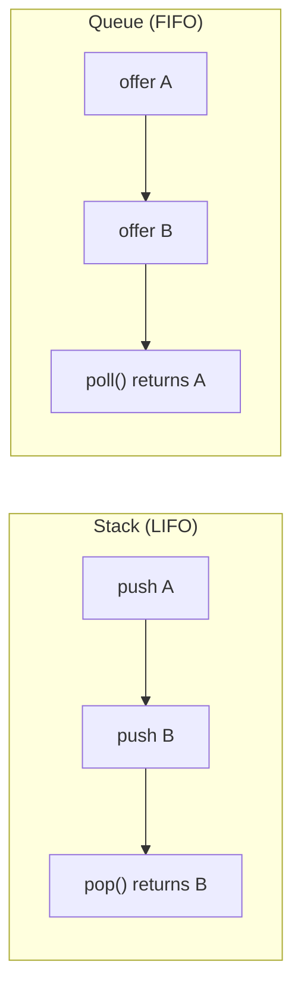
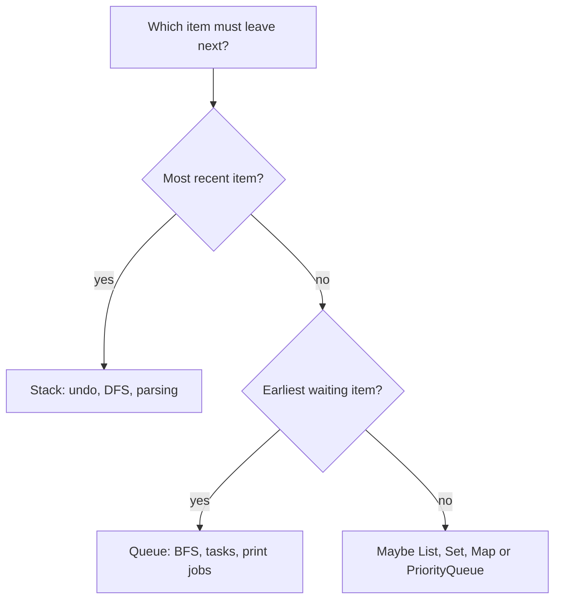

# Stack and Queue: LIFO vs FIFO

## Core idea

A **stack** returns the newest item first. You add with `push`, read the top with `peek`, and remove with `pop`; all three operations use the same end called `top`. Picture plates in a kitchen: the last clean plate placed on the pile is the easiest one to take back.

A **queue** returns the oldest item first. You add with `offer` at the `back`, read the next item with `peek` at the `front`, and remove with `poll` from the `front`. Picture a post office line: a new person joins the back, and the clerk serves the person who has waited longest.

Both are about **order of removal**, not about what the elements contain. A stack answers "what arrived most recently?", while a queue answers "what arrived earliest?" This is like choosing whether a cook takes the top plate from a pile or the clerk calls the next ticket number.



## Java API

In modern Java, prefer `Deque` with `ArrayDeque` for both stack-like and queue-like work. For a stack, call `push`, `pop`, and `peek`; for a queue, call `offer`, `poll`, and `peek`. Think of `Deque` as a service counter with two usable ends: you decide whether your rule is "top plate first" or "oldest ticket first". See the [Java Collections overview](topic:java-collections-overview) for the wider collection map.

```java
Deque<String> stack = new ArrayDeque<>();
stack.push("A");
stack.pop();

Queue<String> queue = new ArrayDeque<>();
queue.offer("A");
queue.poll();
```

Avoid the old `java.util.Stack` class in new code. It is legacy, extends `Vector`, and carries synchronization/design baggage that is rarely what you want. It is like using an old locked filing cabinet when a simple kitchen tray would do the job.

`ArrayDeque` is usually faster than `LinkedList` for stack and queue operations because it stores elements in a resizable circular array with good locality. `LinkedList` has node allocation and pointer chasing, so it is not automatically the best queue. This connects to [ArrayList vs LinkedList](topic:arraylist-vs-linkedlist) and [ArrayList internals](topic:arraylist-internals): layout matters like shelves in a pantry.

## Choosing between them

Use a stack when the next thing to process should be the most recent thing you saw. Common examples are undo history, parser state, depth-first search, browser back behavior, and explicit stacks used to replace recursion. A chef dealing with the newest plate on top is the memory hook.

Use a queue when the next thing to process should be the earliest thing waiting. Common examples are print jobs, breadth-first search, producer-consumer work, thread-pool task queues, and message delivery. A post office line is the memory hook: first ticket in, first ticket served. For related production queues, see [Java Thread Pool](topic:java-thread-pool) and [Kafka vs RabbitMQ](topic:kafka-vs-rabbitmq).



## Complexity

For the normal end operations on `ArrayDeque`, `push`, `pop`, `offer`, `poll`, and `peek` are O(1) amortized. Search is not O(1): if you ask "does this value exist anywhere?", you may scan O(n). The kitchen version is simple: grabbing the top plate is quick, but finding a blue plate somewhere in the pile can take time.

Memory is O(n), because every stored element must be kept until removed. A queue can grow if producers add faster than consumers remove, just like a post office line grows when more people arrive than clerks can serve. In production, queues often need bounds, backpressure, or monitoring.

## 60-second interview answer

> A stack is LIFO: last in, first out. It has `push`, `pop`, and `peek`, all working at one end, the top. It fits undo, DFS, parser state, and explicit recursion replacement. A queue is FIFO: first in, first out. It usually has `offer`, `poll`, and `peek`; items are added at the back and removed from the front. It fits BFS, task scheduling, print jobs, producer-consumer work, and message processing. In Java I usually use `ArrayDeque` through `Deque` or `Queue`, not legacy `Stack`. End operations are normally O(1) amortized, while searching inside either structure is O(n).

## Production relevance

Stacks often appear when a system needs to roll back or unwind in reverse order. Undo stacks, nested parser calls, and explicit graph traversal all depend on "newest first". It is the same as unpacking a delivery box: the item packed last is on top.

Queues appear anywhere fairness or arrival order matters. Thread pools, worker pipelines, print systems, and message consumers all need predictable waiting order or a deliberate alternative such as priority. It is the same as traffic merging through a toll booth: the order rule decides who goes next.

The JVM call stack is also LIFO, but it is not the same thing as a collection stack you create with `Deque`. Learn the memory model separately in [method calls and stack frames](topic:method-call-stack-frames), [JVM memory areas](topic:jvm-memory-areas), and [recursion vs iteration](topic:recursion-vs-iteration). It is like the kitchen's internal ticket rail versus a stack of plates you manage yourself: both are ordered, but they serve different jobs.

## Common misconceptions

- "Stack means the JVM stack." Not always. A stack is a data-structure rule; the JVM stack is one specific runtime use of that rule.
- "Queue means thread-safe." No. `Queue` is an interface. Use concurrent queues or blocking queues when threads share it, just like a busy post office needs a ticket machine, not only a painted line.
- "FIFO means priority." No. A normal queue serves by arrival order; `PriorityQueue` serves by priority order. That is a regular line versus an emergency counter.
- "`peek` removes the item." No. `peek` only reads. `pop` or `poll` removes.
- "`LinkedList` is the best queue." Usually no. `ArrayDeque` is normally the first choice for in-memory stack/queue behavior.
- "`ArrayDeque` accepts null." It does not. `null` would make `poll()` ambiguous because `poll()` uses `null` to mean "empty".
