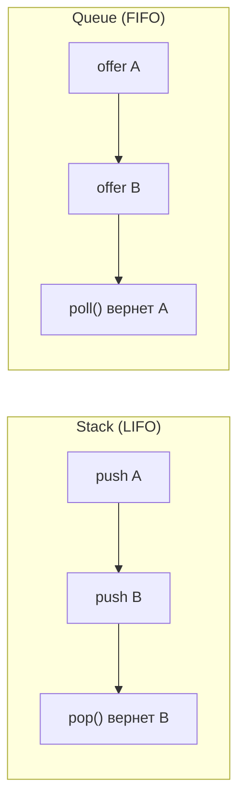
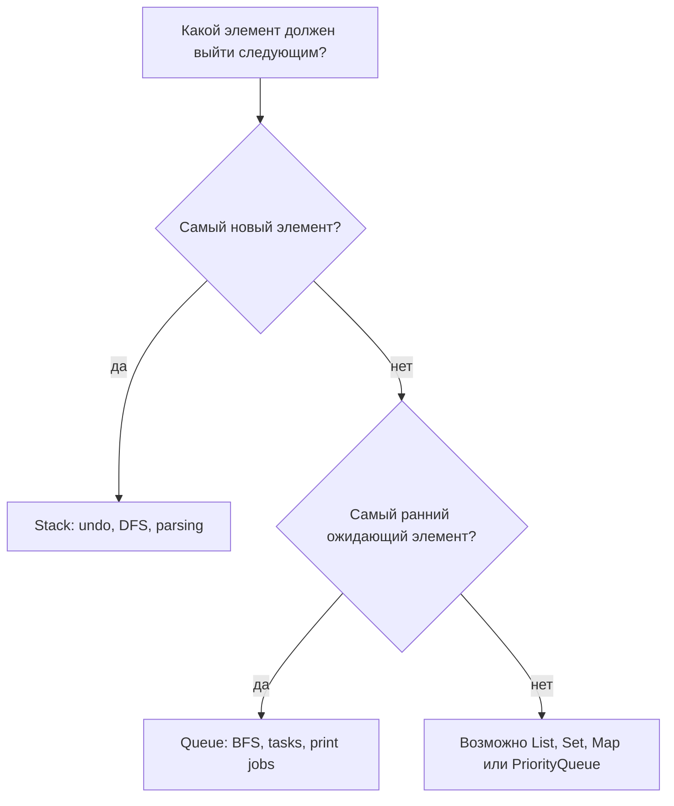

# Стек и очередь: LIFO vs FIFO

## Главная идея

**Stack** возвращает самый новый элемент первым. Ты добавляешь через `push`, читаешь верх через `peek` и удаляешь через `pop`; все три операции работают с одним концом `top`. Представь стопку тарелок на кухне: последнюю чистую тарелку положили сверху, и ее проще всего взять обратно.

**Queue** возвращает самый старый элемент первым. Ты добавляешь через `offer` в `back`, читаешь следующий элемент через `peek` у `front` и удаляешь через `poll` из `front`. Представь очередь на почте: новый человек встает в конец, а оператор обслуживает того, кто ждет дольше всех.

Обе структуры описывают **порядок удаления**, а не содержимое элементов. Stack отвечает "что пришло самым последним?", а queue отвечает "что пришло самым ранним?" Это как выбор между поваром, который берет верхнюю тарелку из стопки, и оператором, который вызывает следующий номер талона.



## Java API

В современной Java для поведения stack и queue обычно выбирают `Deque` с реализацией `ArrayDeque`. Для stack вызывают `push`, `pop` и `peek`; для queue - `offer`, `poll` и `peek`. Считай `Deque` стойкой обслуживания с двумя доступными концами: ты сам выбираешь правило "верхняя тарелка первой" или "самый старый талон первым". Общую карту коллекций смотри в [обзоре Java Collections](topic:java-collections-overview).

```java
Deque<String> stack = new ArrayDeque<>();
stack.push("A");
stack.pop();

Queue<String> queue = new ArrayDeque<>();
queue.offer("A");
queue.poll();
```

Не используй старый `java.util.Stack` в новом коде без причины. Это legacy-класс, он наследуется от `Vector` и несет синхронизацию и дизайн, которые редко нужны. Это как взять старый запертый шкаф для документов, когда достаточно простой кухонной полки.

`ArrayDeque` обычно быстрее, чем `LinkedList`, для операций stack и queue, потому что хранит элементы в расширяемом кольцевом массиве с хорошей локальностью. `LinkedList` создает узлы и прыгает по ссылкам, поэтому он не становится лучшей queue автоматически. Это связано с темами [ArrayList vs LinkedList](topic:arraylist-vs-linkedlist) и [ArrayList internals](topic:arraylist-internals): расположение данных важно, как расположение полок в кладовой.

## Как выбирать

Используй stack, когда следующим нужно обработать то, что появилось недавно. Типичные примеры: undo history, состояние парсера, depth-first search, поведение "назад" в браузере и явный stack вместо рекурсии. Для запоминания держи образ повара с верхней тарелкой.

Используй queue, когда следующим нужно обработать то, что ждет дольше всего. Типичные примеры: задания печати, breadth-first search, producer-consumer work, task queues в thread pool и доставка сообщений. Для запоминания держи образ почтовой очереди: первый талон вошел, первый талон обслужили. Для production-очередей смотри [Java Thread Pool](topic:java-thread-pool) и [Kafka vs RabbitMQ](topic:kafka-vs-rabbitmq).



## Сложность

Для обычных операций по краям у `ArrayDeque` операции `push`, `pop`, `offer`, `poll` и `peek` имеют амортизированную сложность O(1). Поиск не O(1): если спросить "есть ли такое значение где-нибудь внутри?", можно просканировать O(n). Кухонная версия простая: взять верхнюю тарелку быстро, а найти синюю тарелку где-то в стопке может занять время.

Память - O(n), потому что каждый сохраненный элемент должен жить до удаления. Queue может расти, если producers добавляют быстрее, чем consumers удаляют, как очередь на почте растет, когда людей приходит больше, чем операторы успевают обслужить. В production у queues часто нужны лимиты, backpressure или мониторинг.

## Ответ за 60 секунд

> Stack - это LIFO: last in, first out. У него есть `push`, `pop` и `peek`, и все они работают с одним концом, `top`. Он подходит для undo, DFS, состояния парсера и явной замены рекурсии. Queue - это FIFO: first in, first out. У нее обычно есть `offer`, `poll` и `peek`; элементы добавляют в `back`, а удаляют из `front`. Она подходит для BFS, планирования задач, печати, producer-consumer work и обработки сообщений. В Java я обычно использую `ArrayDeque` через `Deque` или `Queue`, а не legacy `Stack`. Операции по краям обычно O(1) амортизированно, а поиск внутри любой из структур - O(n).

## Практическая важность

Stacks часто появляются там, где системе нужно откатываться или раскручивать работу в обратном порядке. Undo stacks, вложенные вызовы парсера и явный обход графа зависят от "самое новое первым". Это как распаковывать коробку доставки: предмет, который положили последним, лежит сверху.

Queues появляются там, где важны справедливость или порядок прихода. Thread pools, worker pipelines, системы печати и message consumers нуждаются в понятном порядке ожидания или в осознанной альтернативе вроде priority. Это как поток машин через пункт оплаты: правило очереди решает, кто едет следующим.

JVM call stack тоже работает по LIFO, но это не то же самое, что collection stack, который ты создаешь через `Deque`. Разбери модель памяти отдельно в темах [method calls and stack frames](topic:method-call-stack-frames), [JVM memory areas](topic:jvm-memory-areas) и [recursion vs iteration](topic:recursion-vs-iteration). Это как внутренняя рейка с заказами на кухне и стопка тарелок, которой ты управляешь сам: обе упорядочены, но задачи разные.

## Частые заблуждения

- "Stack - это всегда JVM stack." Не всегда. Stack - это правило структуры данных; JVM stack - один конкретный runtime-пример этого правила.
- "Queue автоматически thread-safe." Нет. `Queue` - это interface. Когда ее делят threads, нужны concurrent queues или blocking queues, как оживленной почте нужен автомат с талонами, а не просто нарисованная линия.
- "FIFO означает priority." Нет. Обычная queue обслуживает по порядку прихода; `PriorityQueue` обслуживает по приоритету. Это обычная очередь против экстренного окна.
- "`peek` удаляет элемент." Нет. `peek` только читает. Удаляют `pop` или `poll`.
- "`LinkedList` - лучшая queue." Обычно нет. `ArrayDeque` чаще является первым выбором для in-memory поведения stack/queue.
- "`ArrayDeque` принимает null." Нет. `null` сделал бы `poll()` неоднозначным, потому что `poll()` использует `null` как сигнал "пусто".
