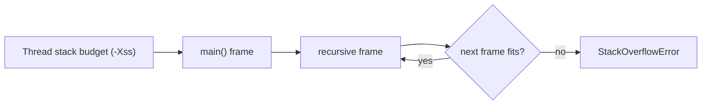
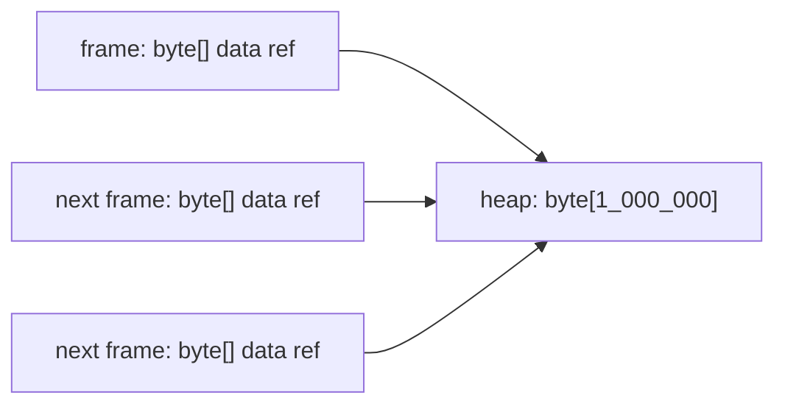

# StackOverflowError in fewer calls

## Intuition

Every Java thread has its own call stack. Each active method call occupies one stack frame, and returning from the method removes that frame. If recursion keeps calling without returning, frames pile up until the thread cannot create the next one. This builds on [method calls and stack frames](topic:method-call-stack-frames) and the basic [StackOverflowError](topic:stackoverflow-error) topic. Think of a post office counter where every unfinished customer form stays on the same tray; if nobody finishes, the tray fills.

The important detail is that the stack limit is a byte budget, not a fixed number like "10,000 calls". The budget is influenced by JVM settings such as `-Xss`, platform details, and how the JVM executes the method. Each frame has its own size: parameters, local primitive slots, operand stack needs, return information, and runtime bookkeeping all matter. Like a kitchen shelf, the number of boxes you can place depends both on shelf width and on box size.

So yes, you can reduce the number of calls needed to reach `StackOverflowError`: use a smaller stack budget or make each recursive frame larger. For a demo, a small `-Xss` value or a method with many primitive locals can overflow after fewer calls. In production, that is usually not the fix; it is just a way to reproduce the failure faster. It is like narrowing a traffic lane to see a jam sooner, not to improve traffic.

Large objects are a common trap. Passing a `byte[]` or a large object into recursion does not copy the whole object into every frame; frames normally hold references, while the object lives in heap. See [JVM memory areas](topic:jvm-memory-areas) for the stack-versus-heap split. That is like putting one parcel in a warehouse and handing several clerks the same claim ticket; the ticket is small, the parcel is not copied onto every desk.

## 60-second interview answer

`StackOverflowError` is thrown when a thread cannot allocate the next stack frame. The number of recursive calls before that happens is not fixed. It depends mainly on the thread stack size, for example `-Xss`, and on the size of each frame. A method with many parameters, many primitive locals, or heavier execution state can overflow after fewer calls than a tiny method. Reducing `-Xss` also makes the overflow appear sooner. Passing a huge object does not copy it into every frame; usually only a reference is stored on the stack and the object stays in heap. In real code I would fix the recursion or change it to iteration rather than tune the stack just to hide the problem.

## Production relevance

When a service crashes with `StackOverflowError`, the stack trace often repeats the same method or a small cycle of methods. That points to runaway recursion, broken graph traversal, recursive `toString` / `equals`, or framework callbacks calling each other. The production task is to stop the unbounded call chain, add a base case, track visited nodes, or convert the algorithm to a loop. It is like a delivery route that keeps sending the driver around the same block; widening the road may delay the queue, but the route is still wrong.

Changing `-Xss` can be valid, but it is a capacity decision. A larger stack allows deeper legitimate recursion but increases per-thread memory reservation; many threads then cost more memory. A smaller stack can make failures reproduce faster in a test, but it can also break code that previously fit. It is like giving every worker a bigger desk: one worker has more room, but the office fits fewer desks.

The exact call count is not a stable contract. Interpreter mode, JIT compilation, inlining decisions, debug flags, OS, architecture, and JVM version can all move the number. Java also does not guarantee tail-call optimization, so tail-recursive code should not be assumed to become a loop. Treat the count like the number of cars that fit on a road before a jam: useful for testing, not a portable API.

## Common misconceptions

- "StackOverflowError always happens after the same number of calls." No. The count changes with stack size and frame size. Same shelf, different boxes, different count.
- "A huge object argument makes every recursive frame huge." Usually no. The frame stores a reference; the object stays in heap. Same warehouse parcel, many small tickets.
- "Catching StackOverflowError is a normal recovery strategy." Usually no. It is an `Error`, and the thread is already in a dangerous state. Learn the difference in [exceptions in Java](topic:exception-basics). That is like catching a falling stack of trays after it has already hit the floor.
- "Increasing `-Xss` fixes the bug." It may delay the failure, but unbounded recursion is still unbounded. A bigger kitchen bin delays overflow; it does not stop the faucet.
- "Tail recursion is safe in Java." Not guaranteed. If you need loop-like behavior, write a loop. Do not count on the kitchen robot to silently rewrite the recipe.
