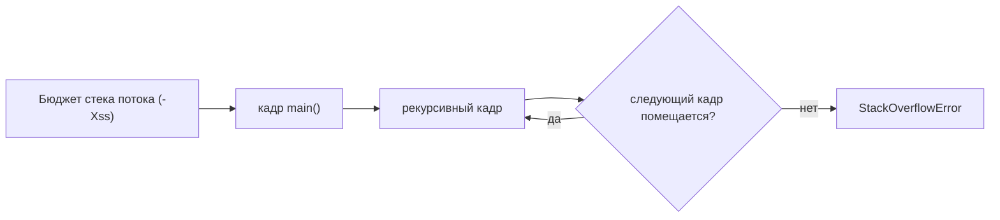
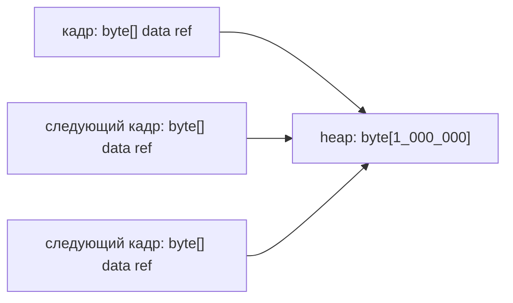

# StackOverflowError за меньшее число вызовов

## Интуиция

У каждого Java-потока есть свой call stack. Каждый активный вызов метода занимает один stack frame, а возврат из метода удаляет этот кадр. Если рекурсия продолжает вызывать метод и не возвращается, кадры накапливаются, пока поток не сможет создать следующий. Это продолжает темы [вызовов методов и кадров стека](topic:method-call-stack-frames) и базового [StackOverflowError](topic:stackoverflow-error). Представь стойку на почте: каждая незавершённая анкета остаётся в одном лотке; если никто не заканчивает оформление, лоток заполняется.

Важная деталь: предел стека — это бюджет в байтах, а не фиксированное число вроде «10 000 вызовов». На бюджет влияют настройки JVM, например `-Xss`, особенности платформы и то, как JVM исполняет метод. У каждого кадра свой размер: параметры, локальные primitive slots, потребности operand stack, информация для возврата и служебные данные runtime тоже важны. Как на кухонной полке: сколько коробок поместится, зависит и от ширины полки, и от размера коробок.

Поэтому да, можно уменьшить число вызовов до `StackOverflowError`: уменьшить бюджет стека или сделать каждый рекурсивный кадр крупнее. Для демонстрации маленький `-Xss` или метод с большим числом primitive locals может переполнить стек после меньшего числа вызовов. В production это обычно не исправление, а только способ быстрее воспроизвести сбой. Это как сузить полосу движения, чтобы раньше увидеть пробку, а не чтобы улучшить трафик.

Большие объекты — частая ловушка. Передача `byte[]` или большого объекта в рекурсию не копирует весь объект в каждый кадр; кадры обычно хранят ссылки, а объект живёт в heap. Разделение stack и heap разобрано в теме [областей памяти JVM](topic:jvm-memory-areas). Это как положить посылку на склад и раздать нескольким сотрудникам один и тот же талон: талон маленький, посылка не копируется на каждый стол.

## Ответ за 60 секунд

`StackOverflowError` выбрасывается, когда поток не может выделить следующий stack frame. Число рекурсивных вызовов до этого момента не фиксировано. Оно зависит в основном от размера стека потока, например `-Xss`, и от размера каждого кадра. Метод с большим числом параметров, большим числом primitive locals или более тяжёлым состоянием исполнения может переполнить стек после меньшего числа вызовов, чем крошечный метод. Уменьшение `-Xss` тоже ускоряет появление переполнения. Передача огромного объекта не копирует его в каждый кадр; обычно в стеке хранится только ссылка, а объект остаётся в heap. В реальном коде я бы исправлял рекурсию или заменял её итерацией, а не настраивал стек, чтобы спрятать проблему.

## Значение в production

Когда сервис падает с `StackOverflowError`, stack trace часто повторяет один и тот же метод или маленький цикл методов. Это указывает на runaway recursion, сломанный обход графа, рекурсивные `toString` / `equals` или framework callbacks, вызывающие друг друга. Production-задача — остановить бесконечную цепочку вызовов, добавить base case, отслеживать visited nodes или заменить алгоритм циклом. Это как маршрут доставки, который снова и снова отправляет водителя вокруг одного квартала; расширение дороги отложит очередь, но маршрут всё равно неверный.

Изменение `-Xss` может быть допустимым, но это решение о ёмкости. Больший стек позволяет более глубокую легитимную рекурсию, но увеличивает резерв памяти на поток; множество потоков тогда стоит дороже по памяти. Меньший стек помогает быстрее воспроизвести сбой в тесте, но может сломать код, который раньше помещался. Это как дать каждому сотруднику стол побольше: одному сотруднику удобнее, но в офисе помещается меньше столов.

Точное число вызовов не является стабильным контрактом. Interpreter mode, JIT compilation, решения об inlining, debug flags, OS, architecture и версия JVM могут сдвинуть это число. Java также не гарантирует tail-call optimization, поэтому нельзя предполагать, что tail-recursive код превратится в цикл. Относись к числу как к количеству машин, которое помещается на дороге до пробки: полезно для теста, но это не переносимый API.

## Частые заблуждения

- «StackOverflowError всегда случается после одного и того же числа вызовов». Нет. Число меняется из-за размера стека и размера кадра. Та же полка, разные коробки, разное количество.
- «Огромный объект-аргумент делает каждый рекурсивный кадр огромным». Обычно нет. Кадр хранит ссылку; объект остаётся в heap. Одна посылка на складе, много маленьких талонов.
- «Ловить StackOverflowError — нормальная стратегия восстановления». Обычно нет. Это `Error`, и поток уже в опасном состоянии. Разницу смотри в теме [исключений в Java](topic:exception-basics). Это как пытаться поймать стопку лотков после того, как она уже упала на пол.
- «Увеличение `-Xss` исправляет bug». Оно может отложить падение, но unbounded recursion остаётся unbounded. Большая кухонная ёмкость позже переполнится; она не закрывает кран.
- «Tail recursion безопасна в Java». Гарантии нет. Если нужно поведение цикла, пиши цикл. Не рассчитывай, что кухонный робот незаметно перепишет рецепт.
