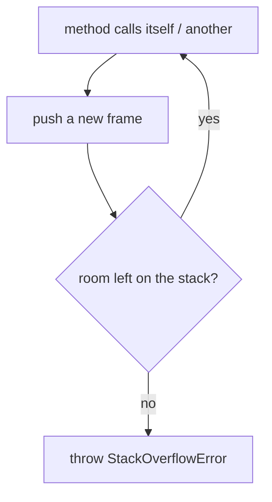
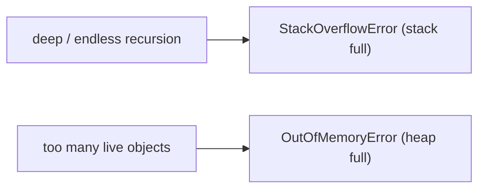

# StackOverflowError and the Simplest Way to Cause It

## The intuition

Every thread in Java has its own **call stack** — a pile of *stack frames*, one per
method call in progress. When `a()` calls `b()`, a frame for `b()` is pushed on top;
when `b()` returns, its frame is popped off. The frame holds that call's parameters,
local variables and the return address.

Think of a cafeteria tray dispenser: a spring-loaded tube that holds a fixed number of
trays. Each method call drops one more tray on top; each `return` lifts one off. The
tube is only so tall.

The catch is that the stack has a **fixed maximum size** (set by the JVM `-Xss` flag).
If calls keep stacking up and never return, the pile grows until it hits the top of the
tube — and the JVM throws **`StackOverflowError`**. That is what StackOverflowError
means: *too many nested method calls; the call stack ran out of room.*



## The simplest method that causes it

The classic one-liner is a method that **calls itself with no base case** — it never
stops, so it never returns, so frames pile up forever:

```java
static void overflow() {
    overflow(); // calls itself; nothing ever returns
}
```

Call `overflow()` once and within a few thousand frames you get
`java.lang.StackOverflowError`. It's the tray dispenser where every cook keeps adding a
tray and nobody ever takes one — the tube fills and jams.

Recursion is the usual culprit, but it does not have to be a *single* self-call. Two
methods that call each other forever (`ping()` → `pong()` → `ping()` …) overflow just
the same — like two cooks each handing the next tray to the other, on and on.

## Why a base case matters

A correct recursion always makes progress toward a **base case** it actually reaches,
so every call eventually returns and its frame is popped:

```java
static long factorial(int n) {
    if (n <= 1) return 1;        // base case — reached every time
    return n * factorial(n - 1); // n shrinks toward the base case
}
```

`factorial(3)` pushes three frames, then pops all three. The tube fills a little, then
empties — no overflow. Two recursion bugs break this:

- **No base case** (or one that's never reached — e.g. decrementing by 2 from an odd
  number so you skip `0` forever). The pile only grows.
- **A correct base case, but the recursion is simply too deep** for the stack —
  `sum(1_000_000)` recurses a million times and overflows long before it finishes. Here
  nothing is buggy; the depth just exceeds the tube's height. The fix is an **iterative
  loop**, not a bigger stack.

## StackOverflowError vs OutOfMemoryError

Both signal "we ran out of memory", but in different areas. `StackOverflowError` is the
**thread stack** filling from too-deep call nesting. `OutOfMemoryError` is the **heap**
filling because you allocated more live objects than fit. Different shelves in the same
kitchen: the narrow tray tube (stack) versus the big pantry (heap). See
[Stack vs Heap](topic:jvm-memory-areas) for how the two areas are organised, and
[Method Calls and Stack Frames](topic:method-call-stack-frames) for what one frame holds.



## 60-second interview answer

> A `StackOverflowError` happens when a thread's call stack runs out of room because too
> many method calls are nested without returning. Each call pushes a frame; the stack has
> a fixed size (`-Xss`), so if calls keep stacking up and never pop, it overflows. The
> simplest method that causes one is a method that calls itself with no base case:
> `void overflow() { overflow(); }`. The usual real cause is recursion that never reaches
> its base case, or a correct recursion that's simply too deep for the stack. It's an
> `Error`, not an `Exception` — a sign of a programming bug — so you normally fix the
> recursion (add/repair the base case, or switch to an iterative loop) rather than catch
> it. It differs from `OutOfMemoryError`, which is the heap filling up, not the stack.

## Common traps and misconceptions

- **"It's an Exception you should catch."** It's an `Error` (`StackOverflowError extends
  Error`). You *can* catch it, but catching it hides a bug — fix the recursion instead.
  See [Exceptions in Java](topic:exception-basics) for where `Error` sits in the hierarchy.
- **"Only recursion causes it."** Any unbounded chain of calls does — mutual recursion,
  or even very deep non-recursive call chains. Recursion is just the common case.
- **"Bigger `-Xss` is the fix."** Raising the stack size only postpones the overflow for
  genuinely too-deep recursion; an *infinite* recursion overflows any size. Prefer a base
  case or an iterative loop.
- **"It's the same as OutOfMemoryError."** No — different memory area. Stack depth vs heap
  allocation.
- **"The whole JVM crashes."** By default it kills only the offending thread's call (an
  uncaught `Error` unwinds that thread); other threads keep running unless that thread was
  essential.
- **"`main` is special."** No — `main()` is just the bottom frame. Overflow is about total
  depth above it, on whichever thread is recursing.
