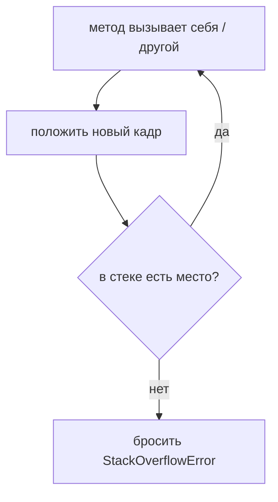
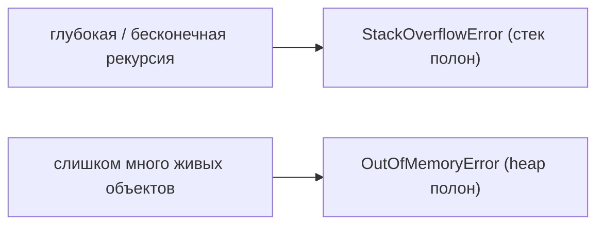

# StackOverflowError и простейший способ его получить

## Интуиция

У каждого потока в Java есть свой **стек вызовов** — стопка *кадров стека*, по одному на
каждый выполняющийся вызов метода. Когда `a()` вызывает `b()`, кадр для `b()` кладётся
сверху; когда `b()` возвращается, его кадр снимается. Кадр хранит параметры этого вызова,
локальные переменные и адрес возврата.

Представьте раздатчик подносов в столовой: подпружиненную трубу, в которую помещается
фиксированное число подносов. Каждый вызов метода кладёт сверху ещё один поднос; каждый
`return` снимает один. Труба лишь определённой высоты.

Загвоздка в том, что стек имеет **фиксированный максимальный размер** (задаётся флагом JVM
`-Xss`). Если вызовы продолжают накапливаться и не возвращаются, стопка растёт, пока не
упрётся в верх трубы — и JVM бросает **`StackOverflowError`**. Вот что означает
StackOverflowError: *слишком много вложенных вызовов методов; в стеке вызовов кончилось
место.*



## Простейший метод, который его вызывает

Классический однострочник — метод, который **вызывает сам себя без базового случая**: он
никогда не останавливается, поэтому никогда не возвращается, поэтому кадры копятся вечно:

```java
static void overflow() {
    overflow(); // вызывает сам себя; ничто никогда не возвращается
}
```

Вызовите `overflow()` один раз — и через несколько тысяч кадров вы получите
`java.lang.StackOverflowError`. Это раздатчик подносов, где каждый повар добавляет поднос,
а никто его не снимает: труба наполняется и заклинивает.

Рекурсия — обычный виновник, но это не обязан быть *одиночный* самовызов. Два метода,
бесконечно вызывающие друг друга (`ping()` → `pong()` → `ping()` …), переполняют стек так
же — как два повара, передающие следующий поднос друг другу, снова и снова.

## Зачем нужен базовый случай

Корректная рекурсия всегда движется к **базовому случаю**, которого реально достигает,
поэтому каждый вызов в итоге возвращается и его кадр снимается:

```java
static long factorial(int n) {
    if (n <= 1) return 1;        // базовый случай — достигается каждый раз
    return n * factorial(n - 1); // n уменьшается к базовому случаю
}
```

`factorial(3)` кладёт три кадра, затем снимает все три. Труба немного наполняется, потом
пустеет — переполнения нет. Эту схему ломают две ошибки рекурсии:

- **Нет базового случая** (или он недостижим — например, уменьшение на 2 от нечётного
  числа, так что `0` пропускается навсегда). Стопка только растёт.
- **Базовый случай корректен, но рекурсия просто слишком глубока** для стека —
  `sum(1_000_000)` рекурсирует миллион раз и переполняет стек задолго до конца. Здесь нет
  бага; глубина просто превышает высоту трубы. Лечится **итеративным циклом**, а не
  увеличением стека.

## StackOverflowError против OutOfMemoryError

Оба сигнализируют «кончилась память», но в разных областях. `StackOverflowError` — это
переполнение **стека потока** из-за слишком глубокой вложенности вызовов.
`OutOfMemoryError` — это переполнение **кучи (heap)**, потому что вы выделили больше живых
объектов, чем помещается. Разные полки одной кухни: узкая труба для подносов (стек) против
большой кладовой (heap). См. [Стек против Heap](topic:jvm-memory-areas) о том, как
устроены эти области, и [Вызовы методов и кадры стека](topic:method-call-stack-frames) о
том, что хранит один кадр.



## Ответ за 60 секунд

> `StackOverflowError` возникает, когда в стеке вызовов потока кончается место из-за
> слишком большого числа вложенных вызовов методов без возврата. Каждый вызов кладёт кадр;
> стек имеет фиксированный размер (`-Xss`), поэтому если вызовы копятся и не снимаются,
> стек переполняется. Простейший метод, вызывающий это, — метод, который вызывает сам себя
> без базового случая: `void overflow() { overflow(); }`. Обычная реальная причина —
> рекурсия, которая не доходит до базового случая, или корректная рекурсия, просто слишком
> глубокая для стека. Это `Error`, а не `Exception` — признак ошибки в коде — поэтому
> обычно чинят рекурсию (добавляют/исправляют базовый случай или переходят на итеративный
> цикл), а не ловят его. Он отличается от `OutOfMemoryError`, который означает переполнение
> кучи, а не стека.

## Частые ловушки и заблуждения

- **«Это Exception, который надо ловить».** Это `Error` (`StackOverflowError extends
  Error`). Поймать его *можно*, но это скрывает баг — лучше починить рекурсию. См.
  [Исключения в Java](topic:exception-basics) о месте `Error` в иерархии.
- **«Вызывает только рекурсия».** Любая неограниченная цепочка вызовов — взаимная рекурсия
  или даже очень глубокая нерекурсивная цепочка вызовов. Рекурсия — просто частый случай.
- **«Лечится увеличением `-Xss`».** Увеличение размера стека лишь откладывает переполнение
  для действительно слишком глубокой рекурсии; *бесконечная* рекурсия переполнит любой
  размер. Лучше базовый случай или итеративный цикл.
- **«Это то же, что OutOfMemoryError».** Нет — другая область памяти. Глубина стека против
  выделения в куче.
- **«Падает вся JVM».** По умолчанию завершается только вызов в проблемном потоке
  (непойманный `Error` раскручивает этот поток); остальные потоки продолжают работать,
  если этот поток не был критичным.
- **«`main` особенный».** Нет — `main()` это просто нижний кадр. Переполнение зависит от
  суммарной глубины над ним, на том потоке, который рекурсирует.
