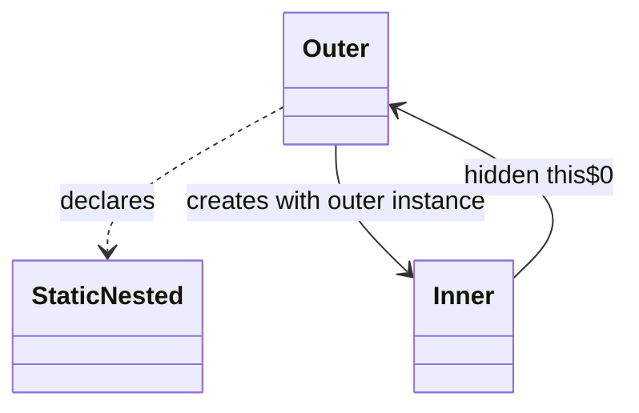
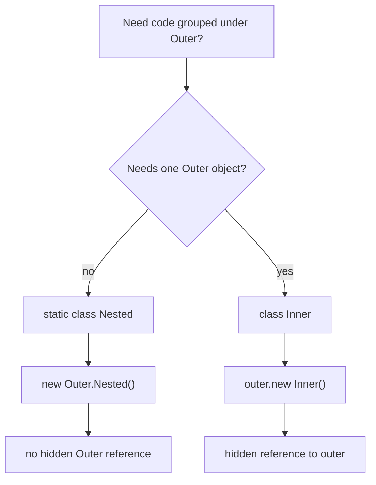

# Static nested class in Java

In Java, a "static class" almost always means a **static nested class**: a class declared inside another class with the `static` modifier. A top-level class cannot be `static`. Think of a post office: the building can contain a printed form template, but the template belongs to the building's rules, not to one specific visitor standing inside.

```java
class Order {
    static class ReceiptPrinter {
    }
}

Order.ReceiptPrinter printer = new Order.ReceiptPrinter();
```

`ReceiptPrinter` is still a normal class. It has constructors, fields, methods, inheritance, and objects. The special part is placement and ownership: its full name is qualified by `Order`, and Java does **not** attach each `ReceiptPrinter` object to an `Order` object. This is like keeping a recipe card in the kitchen folder: the card is organized under "Kitchen", but it is not glued to one pot.



## What `static` changes

A non-static inner class has an implicit reference to the enclosing object. That is why you create it as `outer.new Inner()`, and inside it you can use `Outer.this`. It is like a mailbox key that always points back to one exact apartment.

A static nested class has no such hidden reference. You create it as `new Outer.Nested()`. It can access `static` members of `Outer` directly, and it can access instance members only through an explicit `Outer` object reference. That is like a delivery form that can read the public office schedule on the wall, but needs a specific customer's envelope to read that customer's address.



Static nested classes can be `private`, package-private, `protected`, or `public`, because they are members of the enclosing class. Top-level classes only have top-level access rules. If you need a refresher on access levels, see [default vs protected Access](topic:default-vs-protected). The kitchen analogy: a drawer inside a cabinet can be private to that cabinet, but a cabinet standing in the hallway follows building-level rules.

## 60-second interview answer

Java has no standalone top-level `static class`. When people say "static class", they usually mean a `static` nested class: `class Outer { static class Nested { ... } }`. It belongs to the namespace of `Outer`, so you refer to it as `Outer.Nested`, but its instances are independent from `Outer` instances. Unlike a non-static inner class, it has no hidden reference to an enclosing `Outer` object and is created as `new Outer.Nested()`, not `outer.new Nested()`. It can access outer `static` members directly. For outer instance fields, it needs an explicit `Outer` object. Use it when a helper, DTO, builder, key, or result type makes sense only near the outer class but does not need the outer object's state.

## Why it matters in production

Static nested classes are common for small helper types, builders, command objects, DTOs, and keys. A `Builder` inside a class is a typical example, and the [Builder Pattern](topic:builder) uses that idea often. It is like keeping order forms next to the cashier: the forms belong with checkout logic, but each form should not secretly hold a whole cash register.

They also avoid accidental memory retention. A non-static inner object can keep its outer object reachable through the hidden reference, which matters when objects live longer than expected. The idea connects to how reference objects keep other objects alive; see [Where Reference Types Are Stored](topic:reference-types-storage). It is like giving someone a spare key to the warehouse: as long as they carry it, the warehouse cannot be treated as unrelated.

Static nested classes also make APIs clearer. `Map.Entry` tells you "this type belongs with `Map`". It does not mean `Entry` extends `Map`, and it does not mean every `Entry` contains a `Map`. It is like a post office label saying "parcel form": the label tells you where the form belongs, not that the form is a post office building.

## Common misconceptions

**"A static class is a class with only static methods."** Not in Java. A static nested class can have instance fields and objects. A utility class with only static methods is a different design choice. It is like confusing a shared kitchen noticeboard with a recipe card stored in a kitchen folder.

**"A top-level class can be static."** It cannot. Only nested classes can use the `static` modifier. A top-level class may be `public` or package-private, but not `static`. In the post office analogy, the whole building cannot be "inside itself" as a static member.

**"A static nested class cannot access private members of the outer class."** It can access private `static` members directly, and private instance members through an explicit outer object. The important point is not privacy; it is whether there is an object reference. Like a clerk with permission: they may read a private form, but they still need the actual folder.

**"`static` means `final` or singleton."** No. `static` controls association with a class rather than an object. It does not prevent inheritance by itself and does not create one instance by itself. Compare this with [final vs finally vs finalize](topic:final-finally-finalize) and with a real [Thread-Safe Singleton](topic:singleton-thread-safe). It is like a common shelf in the kitchen: shared location does not mean the cups are unbreakable or that there is only one cup.
