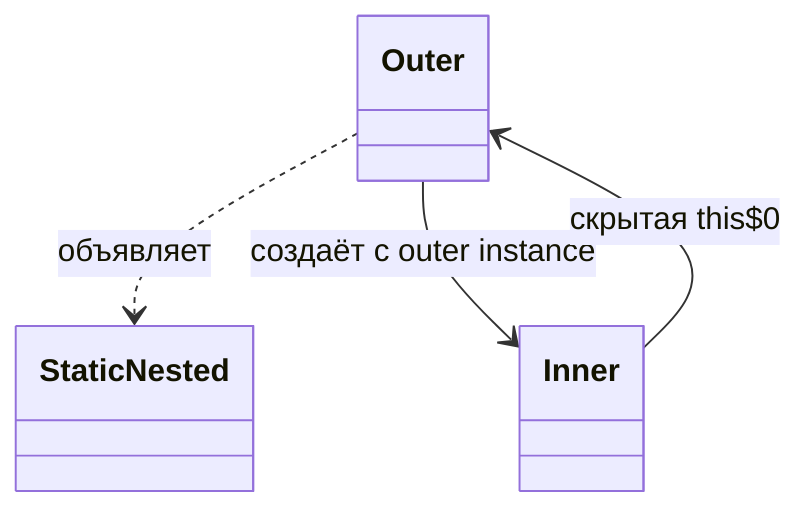
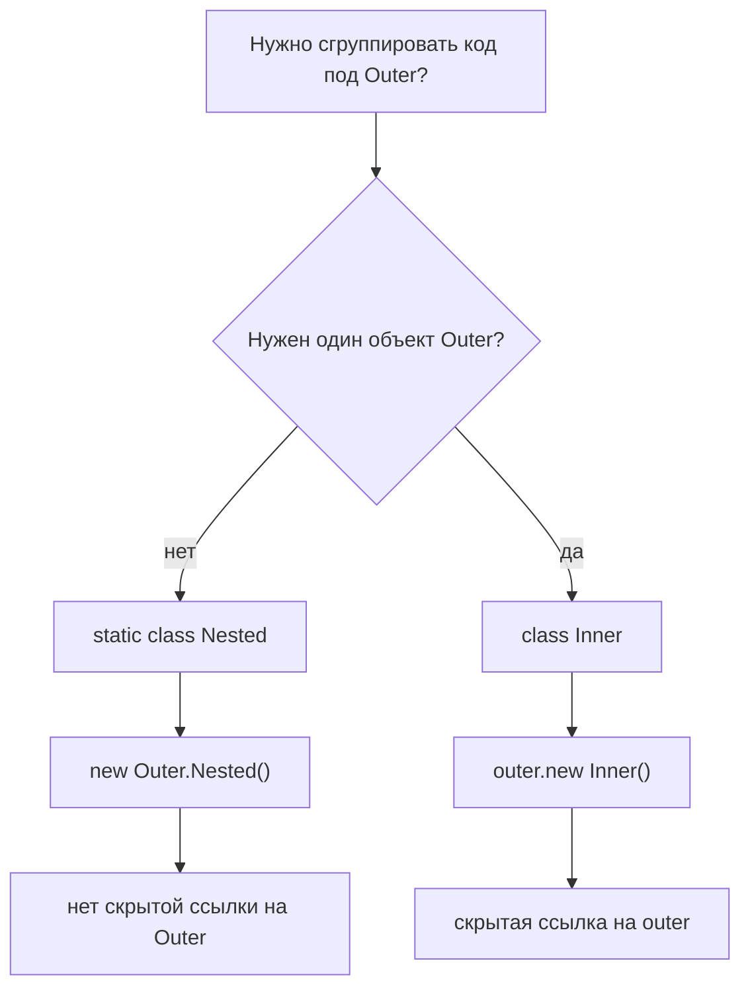

# Static nested class в Java

В Java под «static-классом» почти всегда имеют в виду **static nested class**: класс, объявленный внутри другого класса с модификатором `static`. Top-level class не может быть `static`. Представь почтовое отделение: внутри здания может лежать шаблон бланка, но шаблон относится к правилам здания, а не к одному конкретному посетителю внутри.

```java
class Order {
    static class ReceiptPrinter {
    }
}

Order.ReceiptPrinter printer = new Order.ReceiptPrinter();
```

`ReceiptPrinter` остаётся обычным классом. У него есть конструкторы, поля, методы, наследование и объекты. Особенность в размещении и владении: полное имя квалифицируется через `Order`, и Java **не** привязывает каждый объект `ReceiptPrinter` к объекту `Order`. Это как карточка с рецептом в папке кухни: карточка организована под «Kitchen», но не приклеена к одной кастрюле.



## Что меняет `static`

У non-static inner class есть неявная ссылка на внешний объект. Поэтому он создаётся как `outer.new Inner()`, и внутри него можно использовать `Outer.this`. Это как ключ от почтового ящика, который всегда указывает на одну конкретную квартиру.

У static nested class такой скрытой ссылки нет. Он создаётся как `new Outer.Nested()`. Он может напрямую обращаться к `static` members класса `Outer`, а к instance members только через явную ссылку на объект `Outer`. Это как бланк доставки: он может читать расписание отделения на стене, но для адреса конкретного клиента нужен конкретный конверт.



Static nested classes могут быть `private`, package-private, `protected` или `public`, потому что они являются членами внешнего класса. Top-level classes подчиняются только правилам верхнего уровня. Если нужно освежить уровни доступа, смотри [default vs protected Access](topic:default-vs-protected). Аналогия с кухней: ящик внутри шкафа может быть private для этого шкафа, а шкаф в коридоре живёт по правилам всего здания.

## Ответ за 60 секунд

В Java нет самостоятельного top-level `static class`. Когда говорят «static-класс», обычно имеют в виду `static` nested class: `class Outer { static class Nested { ... } }`. Он принадлежит пространству имён `Outer`, поэтому к нему обращаются как `Outer.Nested`, но его объекты независимы от объектов `Outer`. В отличие от non-static inner class, у него нет скрытой ссылки на enclosing `Outer` object, и он создаётся как `new Outer.Nested()`, а не `outer.new Nested()`. Он может напрямую обращаться к outer `static` members. Для outer instance fields ему нужен явный объект `Outer`. Используй его, когда helper, DTO, builder, key или result type логически живёт рядом с внешним классом, но не нуждается в состоянии внешнего объекта.

## Почему это важно в production

Static nested classes часто используют для небольших helper types, builders, command objects, DTO и keys. `Builder` внутри класса - типичный пример, и [Builder Pattern](topic:builder) часто использует эту идею. Это как хранить бланки заказов рядом с кассой: бланки относятся к checkout logic, но каждый бланк не должен тайно держать всю кассу.

Они также помогают избежать случайного удержания памяти. Объект non-static inner class может сохранять внешний объект достижимым через скрытую ссылку, и это важно, когда объекты живут дольше ожидаемого. Идея связана с тем, как reference objects удерживают другие объекты живыми; смотри [Where Reference Types Are Stored](topic:reference-types-storage). Это как дать человеку запасной ключ от склада: пока он носит ключ, склад нельзя считать несвязанным.

Static nested classes также делают API понятнее. `Map.Entry` говорит: «этот тип относится к `Map`». Это не значит, что `Entry` extends `Map`, и не значит, что каждый `Entry` содержит `Map`. Это как надпись в почтовом отделении «бланк посылки»: надпись показывает, где бланк находится, а не что бланк является зданием почты.

## Частые заблуждения

**«Static class - это класс только со static methods».** В Java нет. Static nested class может иметь instance fields и объекты. Utility class только со static methods - это другой дизайнерский выбор. Это как спутать общую доску объявлений на кухне с карточкой рецепта в кухонной папке.

**«Top-level class может быть static».** Не может. Только nested classes могут использовать модификатор `static`. Top-level class может быть `public` или package-private, но не `static`. В аналогии с почтой всё здание не может быть «внутри самого себя» как static member.

**«Static nested class не может обращаться к private members внешнего класса».** Может обращаться к private `static` members напрямую, а к private instance members через явный внешний объект. Важен не privacy, а наличие object reference. Как у сотрудника с разрешением: он может читать private form, но всё равно нужна конкретная папка.

**«`static` означает `final` или singleton».** Нет. `static` управляет связью с классом, а не с объектом. Сам по себе он не запрещает наследование и не создаёт один экземпляр. Сравни это с [final vs finally vs finalize](topic:final-finally-finalize) и с настоящим [Thread-Safe Singleton](topic:singleton-thread-safe). Это как общая полка на кухне: общее место не означает, что чашки небьющиеся или что чашка всего одна.
