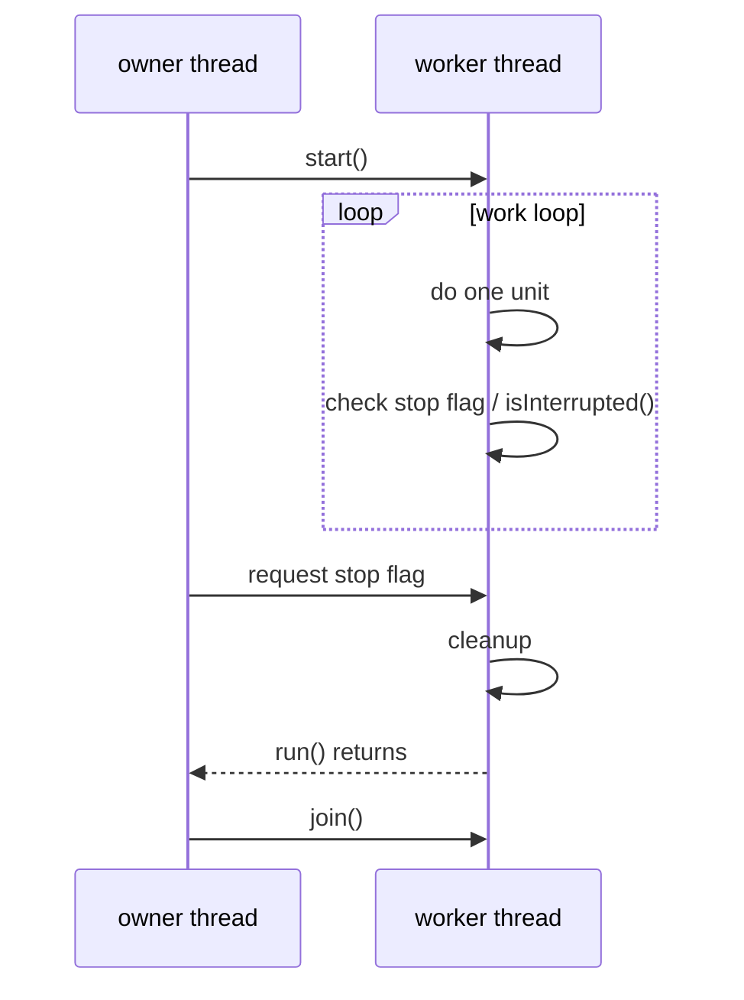
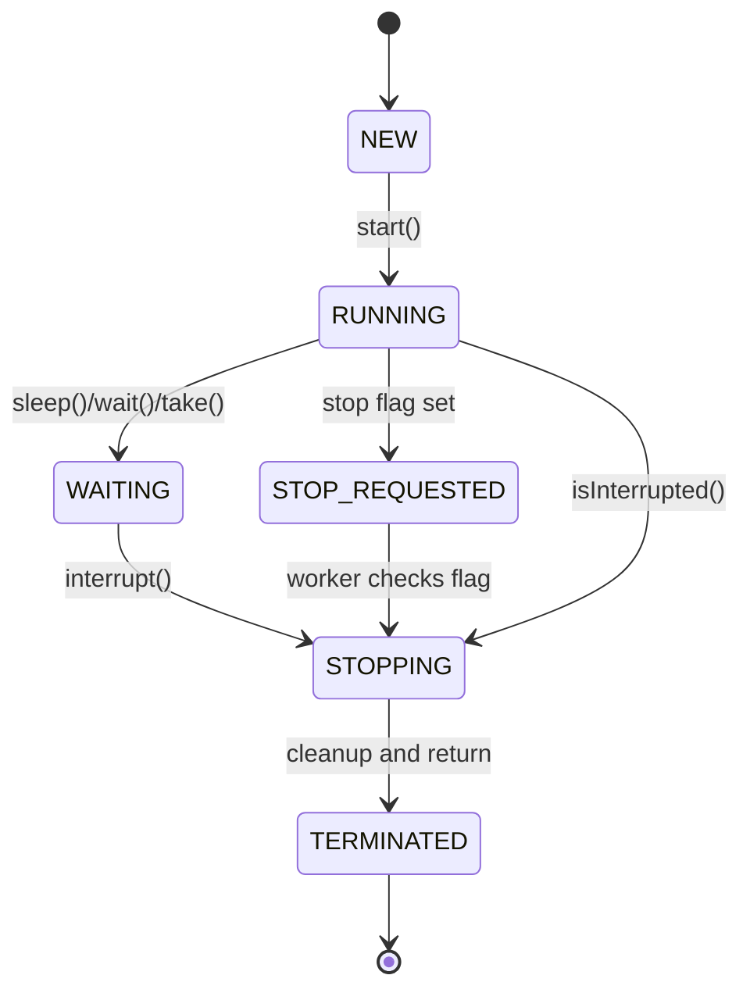

# Stopping a Started Thread

A Java thread is not stopped safely by yanking it from the outside. The usual answer is **cooperative cancellation**: one thread requests a stop, and the worker thread reaches a safe point, cleans up, and returns from `run()`. Kitchen analogy: the manager does not grab a cook's knife mid-cut; they put up a closing signal, let the cook finish the safe step, clean the station, and clock out.

This builds on the basics from [Java Multithreading](topic:java-multithreading) and [Thread vs Runnable](topic:thread-vs-runnable). The key extra idea is that stopping is a protocol, not a single magic method.

## The Mental Model

The owner asks; the worker decides when it is safe to stop. In code, that usually means a `volatile boolean`, `AtomicBoolean`, or another synchronized signal that the worker checks inside its loop. Post office analogy: the front desk flips the "closing" sign, but each clerk finishes the current customer before leaving the counter.

The flag must be visible across threads. A plain non-volatile boolean can be cached or reordered so the worker may never see the update in time. Kitchen analogy: a closing note locked inside the manager's drawer does not help the cook on the line.

`interrupt()` is the second tool. It does not kill the thread. If the worker is blocked in `sleep()`, `wait()`, `join()`, or many interruptible queue/IO-style waits, interruption wakes it by causing `InterruptedException`. If the worker is running CPU code, the interrupt status is only a signal, so the loop must check `Thread.currentThread().isInterrupted()`. Traffic analogy: a flashing detour sign does not teleport a car; the driver must notice it and take the exit.

When code catches `InterruptedException`, Java clears the interrupt status. If your method cannot fully handle cancellation, restore it with `Thread.currentThread().interrupt()` before returning or throwing. Post office analogy: if a clerk reads the cancellation note but passes the package to another counter, they pin the note back on the package.

`join()` is not a stop command. It only lets the owner wait until the worker has actually reached `TERMINATED`. Kitchen analogy: standing by the exit door does not close the kitchen; it only confirms that the cook has left.

`Thread.stop()` is deprecated and unsafe because it can throw an asynchronous error at an arbitrary bytecode point and release locks while invariants are half-updated. That can corrupt shared state and create the same kind of hazards covered in [Avoiding Race Conditions](topic:race-condition-avoidance). Kitchen analogy: freezing the cook in the middle of moving a hot pan can leave the whole station dangerous.

## 60-Second Interview Answer

> You normally stop a started Java thread cooperatively. Do not use `Thread.stop()`. For a loop, expose a visible cancellation signal such as `volatile boolean` or `AtomicBoolean`, check it regularly, clean up, and return from `run()`. If the thread may be blocked in an interruptible call, call `interrupt()` so it can wake up, catch `InterruptedException`, clean up, and usually restore interrupt status if the method is not the final cancellation boundary. The owner can call `join()` afterward to wait for termination. With `ExecutorService`, prefer `shutdown()` for graceful stop and `shutdownNow()` for interrupt-based cancellation attempts.

## Production Relevance

Service shutdowns, scheduled jobs, message consumers, and background refreshers all need this pattern. A Spring or server shutdown hook may ask a worker to stop, interrupt a blocking wait, and then wait for a bounded time. Warehouse analogy: closing time works because every station has the same closing signal, not because someone unplugs random machines.

With [ThreadPool](topic:java-thread-pool), you usually do not stop individual worker threads directly. You shut down the pool: `shutdown()` stops accepting new work and lets accepted tasks finish, while `shutdownNow()` attempts to interrupt running tasks and returns queued tasks. Restaurant analogy: closing reservations is different from asking cooks to stop the dishes already on the stove.

Cancellation also interacts with [Context Switch](topic:context-switch): a stopped thread has to return from `run()` and become `TERMINATED`; until then the scheduler may still run it. Traffic analogy: a car is not gone from the road until it actually exits, even if the sign told it to leave.

## Common Misconceptions

- **"`interrupt()` kills the thread."** No. It sets interrupt status or wakes certain blocking calls. The code must cooperate. Traffic analogy: a red sign works only if the driver obeys it.
- **"A boolean flag is enough."** Only if it has proper visibility, such as `volatile`, `AtomicBoolean`, or synchronization. Kitchen analogy: the closing sign must be where every cook can see it.
- **"Catching `InterruptedException` and doing nothing is harmless."** It often loses the cancellation request. Post office analogy: throwing away the cancellation note makes the next clerk continue as if nothing happened.
- **"`join()` stops the thread."** `join()` waits; it does not request cancellation. Kitchen analogy: waiting at the exit does not tell anyone to leave.
- **"`Thread.stop()` is fine for emergencies."** It can break invariants and release locks unexpectedly. Kitchen analogy: grabbing tools out of workers' hands may stop motion, but it can leave a dangerous mess.
