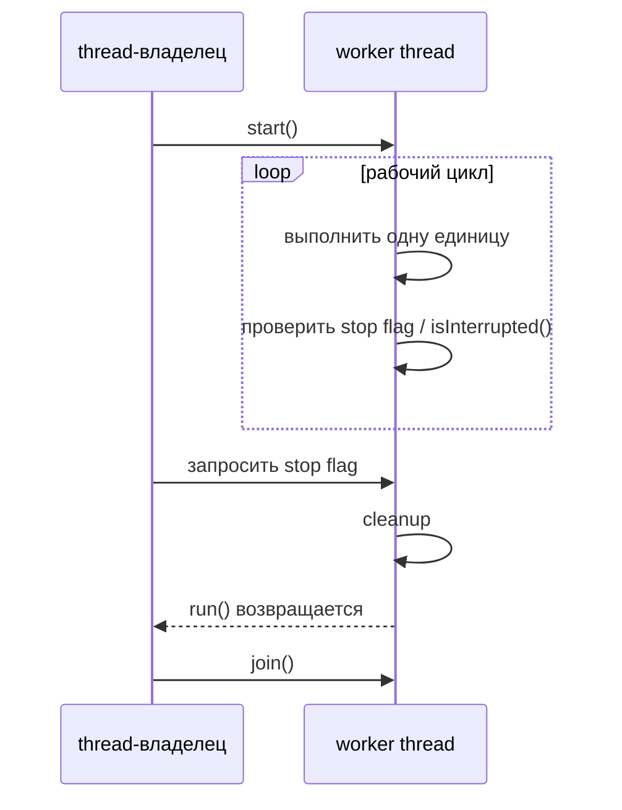
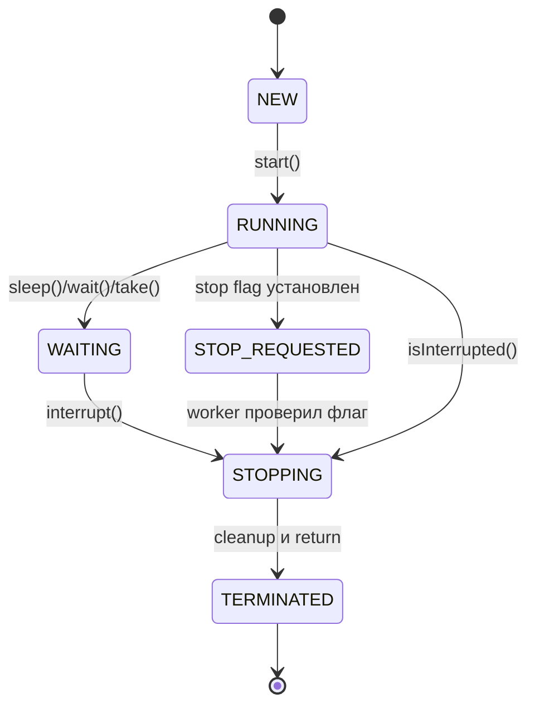

# Остановка запущенного потока

Java thread нельзя безопасно остановить, просто выдёрнув его снаружи. Обычный ответ - **кооперативная отмена**: один thread запрашивает остановку, а worker thread доходит до безопасной точки, освобождает ресурсы и возвращается из `run()`. Аналогия с кухней: менеджер не выхватывает нож у повара посреди нарезки; он включает сигнал закрытия, даёт повару закончить безопасный шаг, убрать рабочее место и уйти.

Это продолжает основы из [Java Multithreading](topic:java-multithreading) и [Thread vs Runnable](topic:thread-vs-runnable). Дополнительная идея в том, что остановка - это протокол, а не один магический метод.

## Ментальная Модель

Владелец просит, а worker решает, когда остановиться безопасно. В коде это обычно `volatile boolean`, `AtomicBoolean` или другой синхронизированный сигнал, который worker проверяет внутри цикла. Аналогия с почтой: на стойке включают табличку «закрываемся», но каждый сотрудник сначала заканчивает текущего клиента.

Флаг должен быть видим между потоками. Обычный non-volatile boolean может быть закэширован или переупорядочен, и worker может не увидеть обновление вовремя. Аналогия с кухней: записка о закрытии, запертая в ящике менеджера, не помогает повару на линии.

`interrupt()` - второй инструмент. Он не убивает thread. Если worker заблокирован в `sleep()`, `wait()`, `join()` или во многих interruptible ожиданиях очереди/IO-стиля, interruption будит его через `InterruptedException`. Если worker выполняет CPU-код, interrupt status является только сигналом, поэтому цикл должен проверять `Thread.currentThread().isInterrupted()`. Дорожная аналогия: мигающий знак объезда не телепортирует машину; водитель должен заметить его и съехать.

Когда код ловит `InterruptedException`, Java очищает interrupt status. Если метод не может полностью обработать отмену, восстанови его через `Thread.currentThread().interrupt()` перед возвратом или выбрасыванием исключения. Аналогия с почтой: если сотрудник прочитал записку об отмене, но передаёт посылку на другую стойку, он прикрепляет записку обратно к посылке.

`join()` не является командой остановки. Он только позволяет владельцу дождаться, что worker действительно дошёл до `TERMINATED`. Аналогия с кухней: стоять у выхода не закрывает кухню; это лишь подтверждает, что повар уже вышел.

`Thread.stop()` deprecated и небезопасен, потому что может выбросить асинхронную ошибку в произвольной точке bytecode и освободить locks, пока invariants обновлены наполовину. Это может повредить shared state и создать риски того же класса, что разбираются в [Avoiding Race Conditions](topic:race-condition-avoidance). Аналогия с кухней: заморозить повара посреди переноса горячей сковороды может сделать всю станцию опасной.

## Ответ За 60 Секунд

> Запущенный Java thread обычно останавливают кооперативно. Не используй `Thread.stop()`. Для цикла нужен видимый сигнал отмены, например `volatile boolean` или `AtomicBoolean`; worker регулярно проверяет его, освобождает ресурсы и возвращается из `run()`. Если thread может быть заблокирован в interruptible вызове, вызывают `interrupt()`, чтобы он проснулся, ловят `InterruptedException`, делают cleanup и обычно восстанавливают interrupt status, если метод не является финальной границей отмены. После этого владелец может вызвать `join()`, чтобы дождаться termination. С `ExecutorService` обычно используют `shutdown()` для graceful stop и `shutdownNow()` для попытки interrupt-based cancellation.

## Значение В Production

Shutdown сервисов, scheduled jobs, message consumers и background refreshers нуждаются именно в этом паттерне. Spring или server shutdown hook может попросить worker остановиться, прервать блокирующее ожидание и затем ждать ограниченное время. Складская аналогия: закрытие смены работает потому, что у каждой станции один понятный сигнал закрытия, а не потому, что кто-то случайно выдёргивает машины из розетки.

С [ThreadPool](topic:java-thread-pool) обычно не останавливают отдельные worker threads напрямую. Останавливают pool: `shutdown()` прекращает принимать новую работу и даёт принятым задачам завершиться, а `shutdownNow()` пытается interrupt running tasks и возвращает queued tasks. Ресторанная аналогия: закрыть бронирования - не то же самое, что приказать поварам бросить блюда, которые уже стоят на плите.

Cancellation также связана с [Context Switch](topic:context-switch): остановленный thread должен вернуться из `run()` и перейти в `TERMINATED`; до этого scheduler всё ещё может его запускать. Дорожная аналогия: машина не исчезла с дороги, пока реально не съехала, даже если знак сказал ей уйти.

## Частые Заблуждения

- **"`interrupt()` убивает thread."** Нет. Он устанавливает interrupt status или будит некоторые blocking calls. Код должен сотрудничать. Дорожная аналогия: красный знак работает только если водитель ему подчиняется.
- **"Boolean flag достаточно."** Только если у него есть корректная visibility, например `volatile`, `AtomicBoolean` или synchronization. Аналогия с кухней: табличка закрытия должна быть там, где её видит каждый повар.
- **"Поймать `InterruptedException` и ничего не сделать нормально."** Часто это теряет запрос отмены. Аналогия с почтой: если выбросить записку об отмене, следующий сотрудник продолжит как будто ничего не случилось.
- **"`join()` останавливает thread."** `join()` ждёт; он не запрашивает cancellation. Аналогия с кухней: ожидание у выхода никому не говорит уходить.
- **"`Thread.stop()` подходит для экстренных случаев."** Он может сломать invariants и неожиданно освободить locks. Аналогия с кухней: выхватить инструменты из рук работников может остановить движение, но оставить опасный беспорядок.
