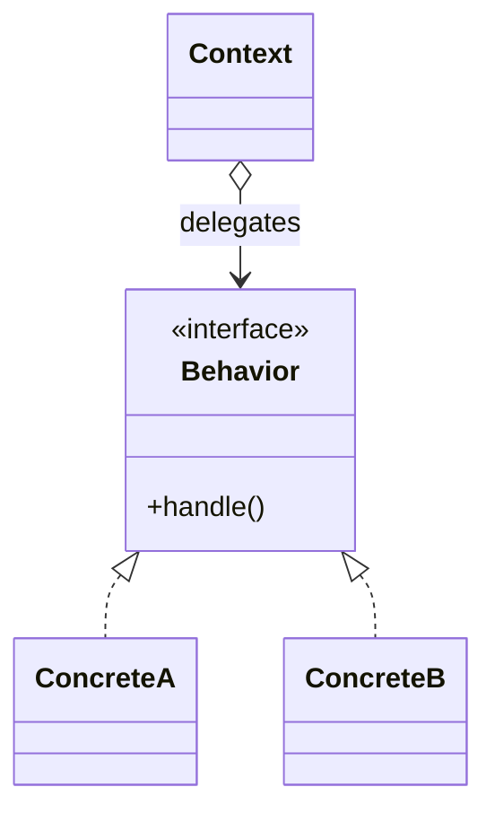
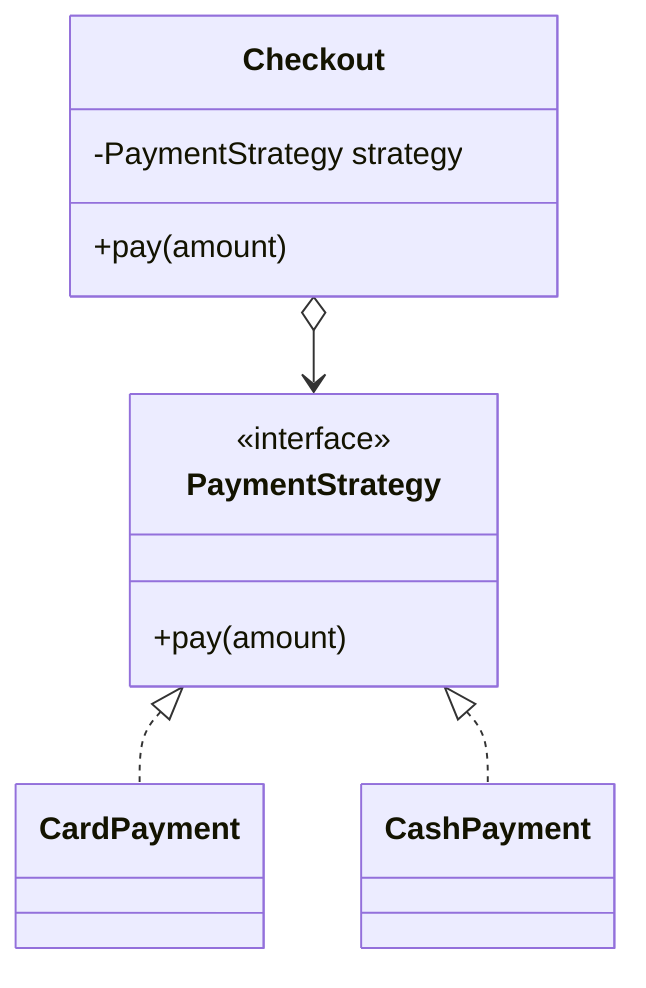
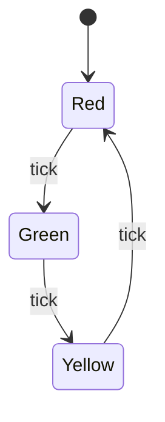
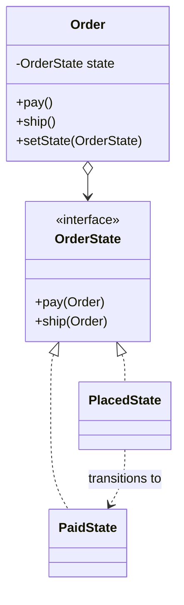

# Strategy vs State

[Strategy](topic:strategy) and **State** are the classic "twins" of the behavioral
patterns: their class diagrams look almost identical — a *context* holds a
reference to an object behind an interface and delegates work to it. The exam
question is never "draw the UML"; it's "if the shape is the same, what's actually
different?" The answer is **intent**, not structure.

Real life: think of a car. **Strategy** is the *driving mode* you select —
Eco, Sport, Comfort. You pick one with a switch; the car keeps driving the way you
chose until *you* change it. **State** is the *gearbox*: as speed rises the
transmission shifts 1→2→3 by itself, and each gear decides when to hand off to the
next. Same "pluggable behaviour" wiring, completely different story about *who
decides* and *when it changes*.

## The shared shape

Both patterns are *composition over inheritance*: instead of one class with a big
`switch`, you push each variant into its own class behind a common interface, and
the context delegates. This is the [Open/Closed](topic:solid-principles) idea —
add a new variant by adding a class, not by editing the context.

## Strategy: interchangeable algorithms, chosen from outside

In **Strategy** each implementation is a *different way to do the same job* — sort
this, compress that, price this cart. The client picks one and hands it to the
context; the strategies **don't know about each other** and they **don't switch
themselves**. Usually the choice is made once and stays put.

Real life: choosing your **route to work** — walk, drive, or take the train. You
weigh the options and commit to one for the trip; the walking route has no opinion
about the train, and it never spontaneously turns into a car.

Key traits:

- **One axis of variation** — all strategies are alternatives for the *same*
  decision.
- **Set from the outside** — the client injects the strategy.
- **Stateless about transitions** — a strategy doesn't say "next, use that other
  strategy."

## State: behaviour that changes with internal state

In **State** the implementations are the *stages of a lifecycle*, and the object's
behaviour changes because its **internal state changed**. The same method
(`next()`, `pay()`, `ship()`) does different things depending on which state is
active — and the states **drive the transitions**: the current state decides which
state comes next.

Real life: a **traffic light**. The same "tick" makes it go Red→Green, then
Green→Yellow, then Yellow→Red. Each colour knows its successor; the light doesn't
ask a driver which colour to show next — it transitions itself.

Another everyday one: an **order's lifecycle** — `Placed → Paid → Shipped →
Delivered`. Calling `cancel()` is allowed while `Placed` but rejected once
`Shipped`; calling `pay()` only makes sense in `Placed`. The behaviour of each
method depends on the current state, and paying *moves* the order to the next
state.

Notice the extra edge a State diagram has and Strategy never does:
`PlacedState ..> PaidState`. States **reference each other** (or call
`context.setState(...)`) to advance the machine. That self-transition is the
fingerprint of State.

## The differences that actually matter

| | Strategy | State |
|---|---|---|
| **Intent** | swap *how* a job is done | model *what* the object is right now |
| **Variants are** | alternative algorithms | stages of a lifecycle |
| **Who switches** | the client, from outside | the states/context, internally |
| **How often** | usually once, then stable | repeatedly, over the object's life |
| **Do variants know each other?** | no | yes — they define transitions |
| **Mental model** | a plug-in | a finite state machine |

Real life one-liner: **Strategy is the dial you set; State is the machine that
turns the dial on its own.**

## 60-second interview answer

> Strategy and State have nearly the same structure — a context delegating to an
> object behind a common interface — but different intent. **Strategy** makes a
> family of algorithms interchangeable: the client chooses one from the outside, the
> strategies are independent alternatives for the same task, and the choice is
> usually fixed for the object's life. **State** implements a finite state machine:
> the object's behaviour changes because its internal state changed, and the states
> themselves drive the transitions to the next state. So the tells are *who switches*
> (client vs. the object itself), *whether the variants reference each other*
> (Strategy no, State yes), and *how often it changes* (Strategy rarely, State
> constantly). Strategy is "pick an algorithm"; State is "I behave differently
> depending on what I am right now."

## Common misconceptions

- ❌ "Same UML, so they're the same pattern." — The structure overlaps; the
  *intent* and the *transitions* differ. State has self-transitions; Strategy
  doesn't.
- ❌ "State is just a Strategy you change a lot." — Changing a strategy often
  doesn't make it State. What makes it State is that the **object's behaviour is
  defined by its state** and the states **encapsulate the transition rules**.
- ❌ "The client always sets the behaviour." — True for Strategy, not for State. In
  State, the current state (or the context) decides the next state; the client just
  triggers events.
- ❌ "You must use polymorphic state objects." — A small state machine is often fine
  as an `enum` + a `switch`; reach for the full State pattern when the per-state
  behaviour is rich and the transitions are worth encapsulating. Same judgement call
  as any [pattern](topic:design-patterns-overview) — don't add indirection it
  doesn't earn.
