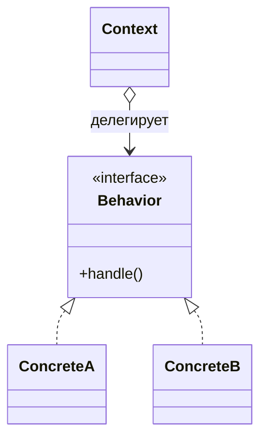
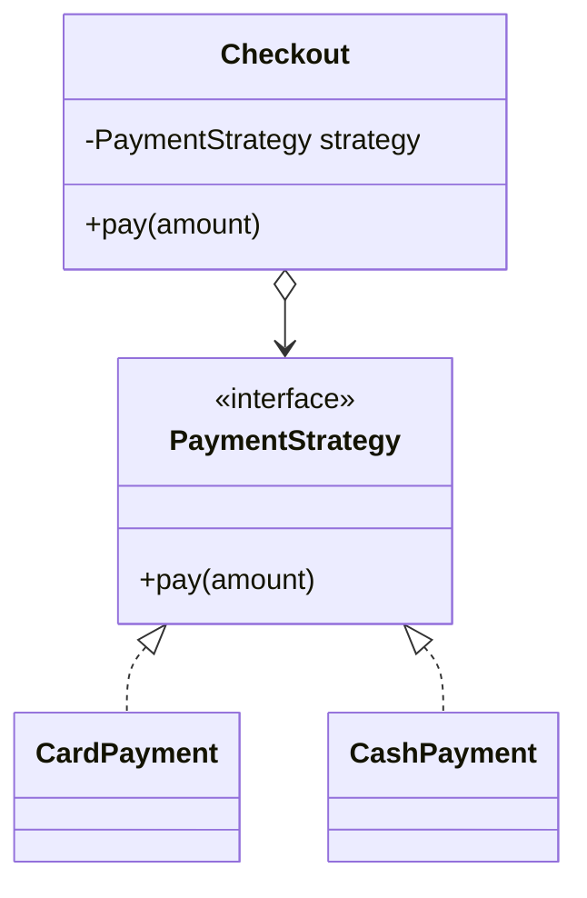
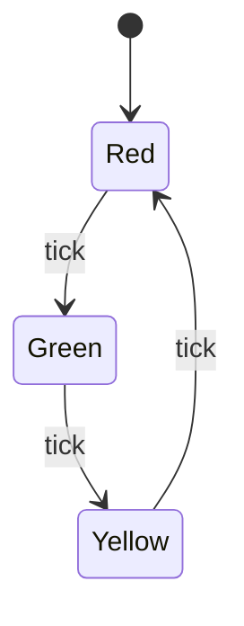
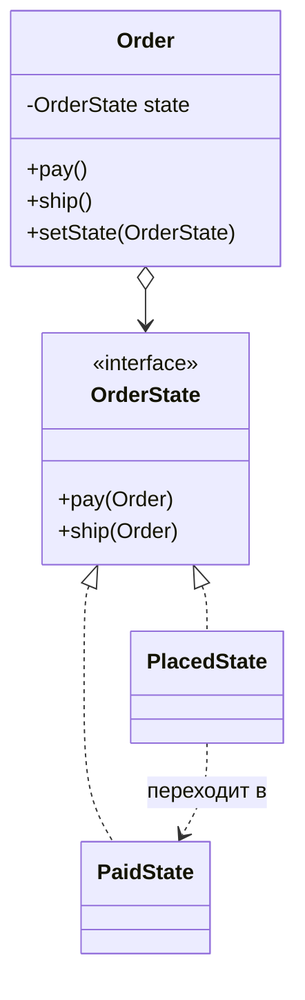

# Strategy против State

[Strategy](topic:strategy) и **State** — классические «близнецы» среди
поведенческих паттернов: их диаграммы классов выглядят почти одинаково —
*контекст* держит ссылку на объект за интерфейсом и делегирует ему работу. На
собеседовании спрашивают не «нарисуй UML», а «если форма одна и та же, в чём же
разница?». Ответ — в **замысле**, а не в структуре.

Из жизни: представь автомобиль. **Strategy** — это выбранный *режим езды*: Eco,
Sport, Comfort. Ты выбираешь один переключателем; машина едет так, как ты выбрал,
пока *ты* не сменишь режим. **State** — это *коробка передач*: с ростом скорости
трансмиссия сама переключает 1→2→3, и каждая передача решает, когда передать
эстафету следующей. Проводка «подключаемого поведения» одинаковая, а история о
том, *кто решает* и *когда меняется*, совершенно разная.

## Общая форма

Оба паттерна — это *композиция вместо наследования*: вместо одного класса с
большим `switch` ты выносишь каждый вариант в отдельный класс за общим
интерфейсом, и контекст делегирует. Это идея [Open/Closed](topic:solid-principles):
новый вариант добавляется новым классом, а не правкой контекста.

## Strategy: взаимозаменяемые алгоритмы, выбираемые снаружи

В **Strategy** каждая реализация — *другой способ сделать одну и ту же работу*:
отсортировать это, сжать то, посчитать цену корзины. Клиент выбирает один и
передаёт контексту; стратегии **не знают друг о друге** и **не переключают сами
себя**. Обычно выбор делается один раз и остаётся неизменным.

Из жизни: выбор **маршрута на работу** — пешком, на машине или на электричке. Ты
взвешиваешь варианты и берёшь один на поездку; пеший маршрут ничего не «думает»
про электричку и никогда сам не превратится в машину.

Ключевые черты:

- **Одна ось вариативности** — все стратегии суть альтернативы для *одного и того
  же* решения.
- **Задаётся снаружи** — клиент внедряет стратегию.
- **Не управляет переходами** — стратегия не говорит «дальше используй вон ту
  стратегию».

## State: поведение, меняющееся вместе с внутренним состоянием

В **State** реализации — это *стадии жизненного цикла*, и поведение объекта
меняется потому, что изменилось его **внутреннее состояние**. Один и тот же метод
(`next()`, `pay()`, `ship()`) делает разное в зависимости от того, какое состояние
активно, — и сами состояния **управляют переходами**: текущее состояние решает,
какое будет следующим.

Из жизни: **светофор**. Один и тот же «тик» переводит его Red→Green, затем
Green→Yellow, затем Yellow→Red. Каждый цвет знает своего преемника; светофор не
спрашивает у водителя, какой цвет показать дальше, — он переключается сам.

Ещё пример из жизни: **жизненный цикл заказа** — `Placed → Paid → Shipped →
Delivered`. Вызов `cancel()` разрешён, пока заказ `Placed`, но отклоняется после
`Shipped`; вызов `pay()` осмыслен только в `Placed`. Поведение каждого метода
зависит от текущего состояния, а оплата *переводит* заказ в следующее состояние.

Обрати внимание на лишнее ребро, которое есть у диаграммы State и которого никогда
нет у Strategy: `PlacedState ..> PaidState`. Состояния **ссылаются друг на друга**
(или вызывают `context.setState(...)`), чтобы продвинуть автомат. Этот
само-переход — отпечаток пальца State.

## Различия, которые действительно важны

| | Strategy | State |
|---|---|---|
| **Замысел** | подменить, *как* делается работа | смоделировать, *что* объект сейчас есть |
| **Варианты — это** | альтернативные алгоритмы | стадии жизненного цикла |
| **Кто переключает** | клиент, снаружи | состояния/контекст, внутри |
| **Как часто** | обычно один раз, затем стабильно | многократно, в течение жизни объекта |
| **Знают ли варианты друг о друге?** | нет | да — они задают переходы |
| **Ментальная модель** | плагин | конечный автомат |

Из жизни одной строкой: **Strategy — это рукоятка, которую ты выставляешь; State —
машина, которая крутит рукоятку сама.**

## Ответ на собеседовании (за 60 секунд)

> У Strategy и State почти одинаковая структура — контекст делегирует объекту за
> общим интерфейсом, — но замысел разный. **Strategy** делает семейство алгоритмов
> взаимозаменяемыми: клиент выбирает один снаружи, стратегии — независимые
> альтернативы для одной задачи, и выбор обычно фиксирован на время жизни объекта.
> **State** реализует конечный автомат: поведение объекта меняется потому, что
> изменилось его внутреннее состояние, и сами состояния управляют переходами к
> следующему состоянию. Признаки-подсказки: *кто переключает* (клиент или сам
> объект), *ссылаются ли варианты друг на друга* (Strategy — нет, State — да) и *как
> часто меняется* (Strategy редко, State постоянно). Strategy — это «выбери
> алгоритм»; State — это «я веду себя по-разному в зависимости от того, что я сейчас
> есть».

## Частые заблуждения

- ❌ «Одинаковая UML — значит, это один и тот же паттерн.» — Структура совпадает,
  а *замысел* и *переходы* различны. У State есть само-переходы; у Strategy — нет.
- ❌ «State — это просто Strategy, которую часто меняют.» — Частая смена стратегии
  не делает её State. State определяется тем, что **поведение объекта задано его
  состоянием**, а состояния **инкапсулируют правила переходов**.
- ❌ «Поведение всегда задаёт клиент.» — Верно для Strategy, но не для State. В
  State текущее состояние (или контекст) решает, каким будет следующее; клиент лишь
  инициирует события.
- ❌ «Обязательно нужны полиморфные объекты-состояния.» — Маленький автомат часто
  нормально живёт как `enum` + `switch`; полноценный паттерн State уместен, когда
  поведение в каждом состоянии богатое, а переходы стоит инкапсулировать. Это та же
  оценка, что и для любого [паттерна](topic:design-patterns-overview), — не добавляй
  косвенность, которая не окупается.
