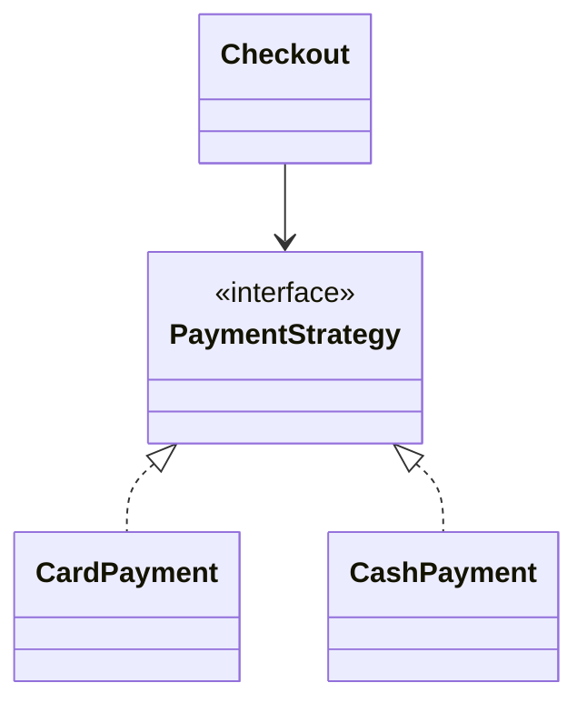

# Strategy Pattern

> **Practice mode.** This is a *structural* topic: there is no "Run". You build the
> pattern as real classes in the file tree on the left, press **Analyze**, and the
> app compiles your code, draws the **class diagram** from it, and checks the
> missions against the relationships it finds.

## The idea

**Strategy** turns a family of interchangeable algorithms into objects behind a
common interface, so the code that *uses* an algorithm doesn't depend on *which*
one. Instead of a growing `if/else` that picks behaviour by type, you:

1. declare an **interface** for the operation (the "strategy"),
2. write a **concrete class per algorithm** that implements it,
3. give a **context** a field of the interface type and let it **delegate** to
   whatever strategy it currently holds.

The context can be handed a different strategy at construction or at runtime —
without changing the context's own code. That is the whole point: **behaviour
varies independently of the code that uses it** (open/closed principle).

## The target shape

You'll build a checkout that pays through swappable `PaymentStrategy`
implementations:

- `PaymentStrategy` — the strategy interface (given to you).
- `CardPayment`, `CashPayment` — concrete strategies you add (`implements PaymentStrategy`).
- `Checkout` — the context: it **holds a `PaymentStrategy` field** and calls
  `pay(...)` on it, never caring which implementation it is.

The missions on the right pass when the diagram shows exactly this: an interface
with ≥2 implementations, and a class that composes it.

## 60-second interview answer

> Strategy defines a family of algorithms behind one interface and makes them
> interchangeable. A context holds a reference to the interface and delegates to
> it, so you can swap the concrete algorithm — at construction or at runtime —
> without touching the context. It replaces type-switching `if/else` chains with
> polymorphism, follows open/closed (add a new strategy = a new class, no edits to
> the context), and keeps each algorithm in its own single-responsibility class.
> Classic uses: payment methods, sorting/comparison policies, compression or
> pricing rules.

## Common misconceptions

- ❌ "Strategy is the same as State." — Both compose an interface and delegate, but
  **Strategy** is usually chosen by the *client* and stays fixed for a call;
  **State** transitions *itself* between states as the object's internal state
  changes. See the [State vs Strategy question](catalog:design-patterns-9).
- ❌ "Strategy needs inheritance." — It uses **composition** (the context *has-a*
  strategy) plus interface implementation, not subclassing the context.
- ❌ "You always pick the strategy with `new` inside the context." — That couples
  the context to concrete classes; inject the strategy from outside instead.
- ❌ "It's overkill for two options." — Often a simple `if` is fine; reach for
  Strategy when the set of behaviours grows or must be swappable/configurable.
