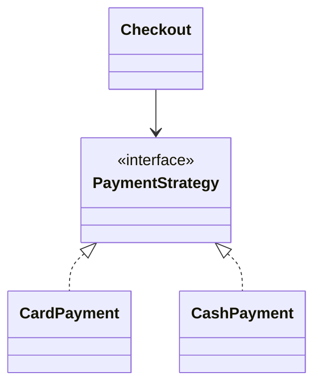

# Паттерн Strategy

> **Режим практики.** Это *структурная* тема: кнопки «Запустить» нет. Вы строите
> паттерн настоящими классами в дереве файлов слева, нажимаете **«Проанализировать»**,
> и приложение компилирует ваш код, рисует по нему **диаграмму классов** и проверяет
> миссии по найденным связям.

## Идея

**Strategy** превращает семейство взаимозаменяемых алгоритмов в объекты за общим
интерфейсом, чтобы код, который *использует* алгоритм, не зависел от того, *какой*
именно. Вместо разрастающегося `if/else`, выбирающего поведение по типу, вы:

1. объявляете **интерфейс** операции (саму «стратегию»),
2. пишете **по классу на каждый алгоритм**, реализующий этот интерфейс,
3. даёте **контексту** поле типа интерфейса и заставляете его **делегировать** той
   стратегии, которую он сейчас держит.

Контексту можно передать другую стратегию при создании или во время выполнения — не
меняя код самого контекста. В этом весь смысл: **поведение меняется независимо от
кода, который его использует** (принцип open/closed).

## Целевая структура

Вы соберёте оформление заказа, которое платит через взаимозаменяемые реализации
`PaymentStrategy`:

- `PaymentStrategy` — интерфейс стратегии (дан вам).
- `CardPayment`, `CashPayment` — конкретные стратегии, которые вы добавляете
  (`implements PaymentStrategy`).
- `Checkout` — контекст: он **хранит поле `PaymentStrategy`** и вызывает у него
  `pay(...)`, не зная, какая это реализация.

Миссии справа засчитываются, когда диаграмма показывает ровно это: интерфейс с ≥2
реализациями и класс, который его композирует.

## Ответ на собеседовании (за 60 секунд)

> Strategy задаёт семейство алгоритмов за одним интерфейсом и делает их
> взаимозаменяемыми. Контекст хранит ссылку на интерфейс и делегирует ему, поэтому
> конкретный алгоритм можно подменить — при создании или во время выполнения — не
> трогая контекст. Он заменяет цепочки `if/else` по типу полиморфизмом, следует
> open/closed (новая стратегия = новый класс без правок контекста) и держит каждый
> алгоритм в своём классе с единой ответственностью. Классика: способы оплаты,
> политики сортировки/сравнения, правила сжатия или ценообразования.

## Частые заблуждения

- ❌ «Strategy — это то же, что State.» — Оба композируют интерфейс и делегируют, но
  **Strategy** обычно выбирает *клиент*, и она фиксирована на время вызова; **State**
  переключает *сам себя* между состояниями по мере изменения внутреннего состояния
  объекта. См. [вопрос State vs Strategy](catalog:design-patterns-9).
- ❌ «Strategy требует наследования.» — Он использует **композицию** (контекст
  *содержит* стратегию) плюс реализацию интерфейса, а не наследование контекста.
- ❌ «Стратегию всегда создают через `new` внутри контекста.» — Это связывает контекст
  с конкретными классами; лучше внедрять стратегию извне.
- ❌ «Для двух вариантов это перебор.» — Часто простого `if` достаточно; Strategy нужен,
  когда набор поведений растёт или должен быть сменяемым/настраиваемым.
