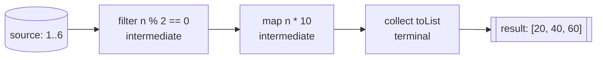
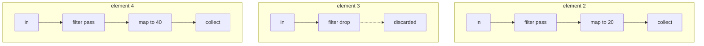

# Terminal vs Intermediate Stream Operations

## The intuition

A `Stream` is a **conveyor belt in a parcel-sorting depot**. The packages on the
belt are your elements; the workstations along the belt are operations. There are
two kinds of workstation, and telling them apart is the whole question.

- **Intermediate (pipeline) operations** — `filter`, `map`, `sorted`, `distinct`,
  `peek`, `limit` — are workstations *along* the belt. Each one inspects or
  reshapes a package and **hands it to the next station**, so it returns another
  `Stream`. They are **lazy**: bolting a workstation onto the belt doesn't move
  anything. The belt stays still until someone at the very end asks for output.

- **Terminal operations** — `collect`, `forEach`, `count`, `reduce`, `anyMatch`,
  `findFirst`, `toList` — are the **loading dock at the end**. A terminal is what
  flips the belt's power switch on. It pulls the packages through, and it hands
  you a **finished result that is not a stream** (a `List`, a number, a boolean,
  an `Optional`, or just a side effect). After it runs, the belt is **switched off
  for good**.



So the quick test in an interview: **does the method return another `Stream`?**
If yes, it's intermediate (another workstation). If it returns a `List`, a count,
an `Optional`, a boolean, or `void`, it's terminal (the loading dock).

## Laziness: the belt doesn't move until the dock asks

Building a pipeline of intermediate operations does **no work**. It is like
installing workstations overnight while the depot is closed — the machinery is
wired up, but no parcel has moved.

```java
Stream<Integer> s = list.stream()
    .filter(n -> n % 2 == 0)   // nothing runs
    .map(n -> n * 10);         // still nothing runs
// the moment a terminal appears, the belt powers on:
List<Integer> result = s.collect(Collectors.toList());
```

This is why a `peek(System.out::println)` with no terminal prints nothing at all —
the worker is standing at the belt, but the belt never moved.

## Processing is vertical, not horizontal

A common mental-model mistake: people imagine `filter` running over the *whole*
collection, then `map` running over the *whole* result. That is **not** how it
works. The belt feeds **one package at a time**, and that single package travels
through **every** workstation before the next one is released from the source.

It's like a depot that processes a parcel end-to-end — sort it, label it, load it —
before reaching for the next parcel, rather than sorting all parcels, then
labelling all parcels. This **fusion** of stages into one pass is what makes
short-circuiting possible and avoids building throwaway intermediate collections.



## Short-circuiting: stop the belt once the truck is full

Some operations let the pipeline **quit early** instead of draining the whole
source — the depot stops the belt the moment the delivery truck is full.

- **Short-circuiting terminals**: `findFirst`, `findAny`, `anyMatch`, `allMatch`,
  `noneMatch`. `findFirst` grabs the first package that reaches the dock and
  **switches the belt off immediately** — the rest of the source is never read.
- **Short-circuiting intermediate**: `limit(n)`. Still lazy, but once it has
  waved `n` packages through, it signals upstream to **stop sending more**.

This is why a short-circuiting stream can run over an *infinite* source
(`Stream.iterate(...).limit(5)`) and still finish.

## The 60-second interview answer

> Stream operations are either intermediate or terminal. **Intermediate**
> operations (`filter`, `map`, `sorted`, `distinct`, `peek`, `limit`) return a new
> `Stream`, so they chain, and they are **lazy** — they only describe the pipeline
> and run nothing on their own. A **terminal** operation (`collect`, `forEach`,
> `count`, `reduce`, `anyMatch`, `findFirst`) returns a **non-stream** result (or a
> side effect) and is what actually **triggers execution**. When a terminal runs,
> each element is pushed through the whole pipeline one at a time, not stage by
> stage over the collection. Some operations **short-circuit**: terminals like
> `findFirst`/`anyMatch` and the intermediate `limit` let the stream stop before
> consuming everything. A stream is **single-use**: after a terminal runs the
> stream is consumed, and touching it again throws `IllegalStateException`. A
> pipeline with no terminal does nothing at all.

## Production relevance

- **Performance.** Laziness + fusion means `filter().map().findFirst()` over a
  million records can stop after the first match instead of materialising a
  million mapped values.
- **Bugs from missing terminals.** A pipeline written for its side effects but
  with no terminal silently does nothing — a real and confusing production bug.
- **`peek` is for debugging, not work.** Using `peek` to mutate state is a trap:
  it may not run for elements a later `count()` optimises away, and side effects in
  streams fight the functional model. Building a stream out of lambdas is the same
  "behaviour as a value" idea as a [Lambda as a Method Parameter](topic:lambda-as-method-parameter).

## Common traps and misconceptions

- **"Intermediate operations execute immediately."** No — they are lazy; only the
  terminal triggers work.
- **"Each stage runs over the whole collection."** No — processing is vertical,
  one element through the full pipeline at a time.
- **"I can reuse a stream."** No — it is single-use; reuse throws
  `IllegalStateException`. Reuse the *source* collection or build a new stream.
- **"`forEach` and `peek` are interchangeable."** `forEach` is a terminal that
  ends the pipeline; `peek` is an intermediate meant for observation only.
- **"More operations means more passes."** No — intermediate stages are fused into
  a single pass over the data.
- **`Collectors` vs the stream.** `collect(Collectors.toList())` is the terminal;
  the [Java Collections Overview](topic:java-collections-overview) covers what you
  collect *into*.
