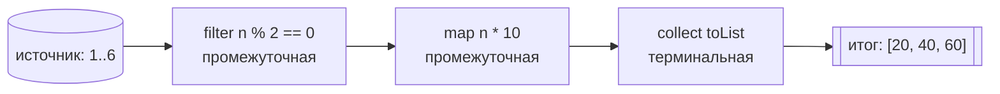
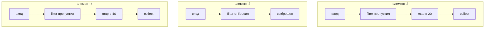

# Терминальные и промежуточные операции Stream

## Интуиция

`Stream` — это **конвейерная лента на сортировочном складе посылок**. Посылки на
ленте — это ваши элементы; рабочие станции вдоль ленты — это операции. Станций два
вида, и умение их различать — и есть весь вопрос.

- **Промежуточные (конвейерные) операции** — `filter`, `map`, `sorted`,
  `distinct`, `peek`, `limit` — это станции *вдоль* ленты. Каждая осматривает или
  преобразует посылку и **передаёт её следующей станции**, поэтому возвращает
  другой `Stream`. Они **ленивы**: прикрутить станцию к ленте — ещё не значит
  что-то сдвинуть. Лента стоит, пока кто-то в самом конце не попросит результат.

- **Терминальные операции** — `collect`, `forEach`, `count`, `reduce`, `anyMatch`,
  `findFirst`, `toList` — это **погрузочный док в конце**. Терминал — это то, что
  щёлкает выключателем питания ленты. Он протягивает посылки через неё и выдаёт вам
  **готовый результат, который не является стримом** (`List`, число, boolean,
  `Optional` или просто побочный эффект). После его работы лента **выключается
  насовсем**.



Поэтому быстрая проверка на собеседовании: **возвращает ли метод другой `Stream`?**
Если да — операция промежуточная (ещё одна станция). Если она возвращает `List`,
счётчик, `Optional`, boolean или `void` — она терминальная (погрузочный док).

## Ленивость: лента не движется, пока док не попросит

Построение конвейера из промежуточных операций **не делает работы**. Это как
установить станции ночью, пока склад закрыт, — оборудование подключено, но ни одна
посылка не сдвинулась.

```java
Stream<Integer> s = list.stream()
    .filter(n -> n % 2 == 0)   // ничего не выполняется
    .map(n -> n * 10);         // по-прежнему ничего не выполняется
// как только появляется терминал, лента включается:
List<Integer> result = s.collect(Collectors.toList());
```

Поэтому `peek(System.out::println)` без терминала не печатает вообще ничего —
рабочий стоит у ленты, но лента так и не двинулась.

## Обработка вертикальная, а не горизонтальная

Частая ошибка в модели мышления: люди представляют, что `filter` пробегает по
*всей* коллекции, затем `map` пробегает по *всему* результату. Это **не так**.
Лента подаёт **по одной посылке за раз**, и эта единственная посылка проходит
**все** станции прежде, чем из источника отпустят следующую.

Это как склад, который обрабатывает посылку от начала до конца — отсортировал,
наклеил ярлык, погрузил — прежде чем взяться за следующую, а не сортирует все
посылки, потом наклеивает ярлыки на все. Именно это **слияние** стадий в один
проход делает возможным замыкание и избавляет от ненужных промежуточных коллекций.



## Замыкание: остановить ленту, как только грузовик полон

Некоторые операции позволяют конвейеру **завершиться досрочно**, а не вычерпывать
весь источник, — склад останавливает ленту в тот момент, когда грузовик доставки
заполнен.

- **Замыкающие терминалы**: `findFirst`, `findAny`, `anyMatch`, `allMatch`,
  `noneMatch`. `findFirst` хватает первую посылку, дошедшую до дока, и
  **немедленно выключает ленту** — остаток источника не читается.
- **Замыкающая промежуточная**: `limit(n)`. По-прежнему ленива, но, пропустив `n`
  посылок, она сигналит вверх по конвейеру **прекратить подачу**.

Поэтому замыкающий стрим может работать над *бесконечным* источником
(`Stream.iterate(...).limit(5)`) и всё равно завершиться.

## Ответ за 60 секунд

> Операции Stream бывают промежуточными или терминальными. **Промежуточные**
> операции (`filter`, `map`, `sorted`, `distinct`, `peek`, `limit`) возвращают
> новый `Stream`, поэтому соединяются в цепочку, и они **ленивы** — лишь описывают
> конвейер и сами по себе ничего не выполняют. **Терминальная** операция
> (`collect`, `forEach`, `count`, `reduce`, `anyMatch`, `findFirst`) возвращает
> **не-стримовый** результат (или побочный эффект) и именно она **запускает
> выполнение**. Когда срабатывает терминал, каждый элемент проталкивается через
> весь конвейер по одному, а не стадия за стадией по коллекции. Некоторые операции
> **замыкают**: терминалы вроде `findFirst`/`anyMatch` и промежуточная `limit`
> позволяют стриму остановиться, не потребив всё. Стрим **одноразовый**: после
> терминала он потреблён, и обращение к нему снова бросит `IllegalStateException`.
> Конвейер без терминала не делает вообще ничего.

## Значение на практике

- **Производительность.** Ленивость и слияние означают, что
  `filter().map().findFirst()` по миллиону записей может остановиться после первого
  совпадения, а не материализовать миллион преобразованных значений.
- **Баги из-за отсутствия терминала.** Конвейер, написанный ради побочных
  эффектов, но без терминала, молча ничего не делает — реальный и сбивающий с толку
  баг в продакшене.
- **`peek` — для отладки, а не для работы.** Использовать `peek` для изменения
  состояния — ловушка: он может не выполниться для элементов, которые более поздний
  `count()` оптимизирует, а побочные эффекты в стримах противоречат функциональной
  модели. Построение стрима из лямбд — та же идея «поведение как значение», что и
  [Лямбда как параметр метода](topic:lambda-as-method-parameter).

## Частые ловушки и заблуждения

- **«Промежуточные операции выполняются сразу».** Нет — они ленивы; работу
  запускает только терминал.
- **«Каждая стадия пробегает по всей коллекции».** Нет — обработка вертикальная,
  по одному элементу через весь конвейер за раз.
- **«Стрим можно использовать повторно».** Нет — он одноразовый; повторное
  использование бросает `IllegalStateException`. Переиспользуйте *коллекцию*-источник
  или постройте новый стрим.
- **«`forEach` и `peek` взаимозаменяемы».** `forEach` — терминал, завершающий
  конвейер; `peek` — промежуточная операция только для наблюдения.
- **«Больше операций — больше проходов».** Нет — промежуточные стадии сливаются в
  один проход по данным.
- **`Collectors` против стрима.** `collect(Collectors.toList())` — это терминал; во
  что именно собирать, описывает [Обзор коллекций Java](topic:java-collections-overview).
