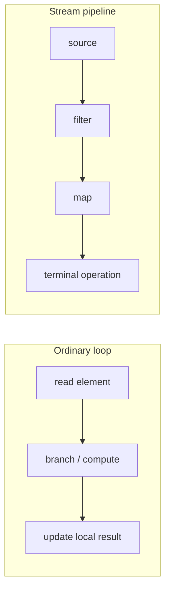
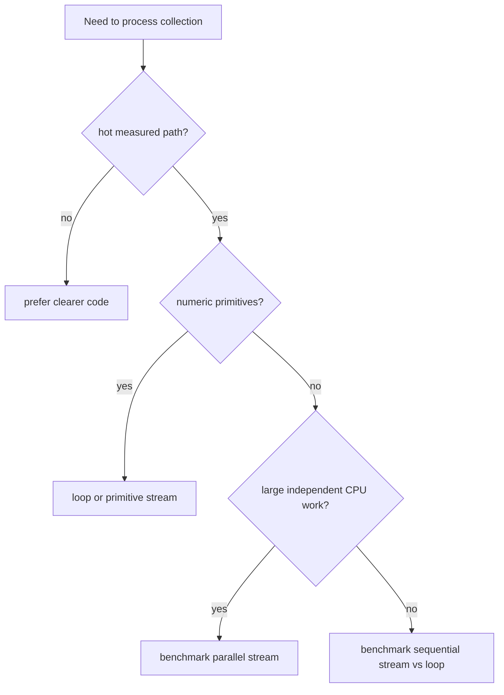

# Streams vs Loops Performance

The short answer: using Java Streams instead of ordinary loops does not
automatically improve performance. Streams are mainly an API for expressing data
processing: filter this, transform that, collect the result. A loop is usually a
more direct set of instructions. Think of a loop as carrying plates from one
kitchen shelf to another yourself; a Stream is a small service counter where each
plate can pass through named stations. The counter is clearer when there are
several stations, but the counter itself is not free.

For many business operations over ordinary collections, the performance
difference is too small to matter compared with database calls, HTTP calls,
serialization, logging, or allocation elsewhere. In a hot inner loop over many
numbers, the difference can matter. That is the same as choosing between a
handwritten shopping list and a printed postal form: the form is easier to
standardize, but if you stamp millions of tiny envelopes, the form handling cost
starts to show.

## What Actually Runs

A loop runs the body for each element. The JIT compiler can often see the local
variables, branches, and primitive operations clearly. See [how JIT compilation
works](topic:java-jit-compilation) for the bigger picture. In kitchen terms, the
cook keeps the pan, spoon, and ingredients on one table, so there is little
coordination overhead.

A Stream pipeline has a source, intermediate operations such as `filter` and
`map`, and a terminal operation such as `sum`, `collect`, or `findFirst`. The
pipeline is lazy: intermediate operations do not run until the terminal operation
pulls elements. It is like a post office conveyor belt that stays still until the
clerk at the final window asks for the next parcel.

Streams often improve readability when a pipeline expresses one data
transformation. They also fit naturally with [lambdas passed as method
parameters](topic:lambda-as-method-parameter). That is like labeling each station
on a sorting table: "reject damaged parcels", "add sticker", "put in outgoing
bag". The labels make the work easier to discuss.

## Where Stream Overhead Comes From

Sequential Streams can add extra method calls, lambda dispatch, iterator or
spliterator traversal, and sometimes additional objects. Modern JVMs can inline
and remove some of this, but not always. A loop is not magically faster either;
bad loop code can allocate, branch poorly, or call slow methods. The practical
rule is: use the clearer form first, then measure hot code. Like traffic lights,
the extra signals help organize traffic, but on an empty road they may only slow
you down.

Boxing is a common trap. `Stream<Integer>` moves `Integer` objects, while
`IntStream`, `LongStream`, and `DoubleStream` work with primitive values. For hot
numeric code, primitive streams or loops avoid repeated boxing and unboxing. See
[primitive type sizes](topic:java-primitive-sizes) if the primitive/object
difference is still fuzzy. In a kitchen analogy, primitive values are loose
potatoes in a basket; boxed values are potatoes wrapped one by one before every
step.

Short-circuiting can make Streams do less work. Operations such as `findFirst`,
`anyMatch`, and `limit` may stop as soon as the answer is known. A loop can do
the same with `break`, but Streams make the intent visible in the terminal
operation. It is like stopping the mail search when the first matching letter is
found instead of checking every mailbox.

Parallel Streams are not a free speed button. They split input, schedule work on
the common ForkJoinPool, and merge partial results. They can help for large,
CPU-heavy, independent tasks with low coordination cost. They can hurt for small
lists, blocking I/O, shared mutable state, poor splitting, or code already
running inside another concurrent workload. The split and merge work is like
opening extra checkout lanes: useful for a big crowd with full carts, wasteful
for three customers buying one item each. The cost can include scheduling and
[context switching](topic:context-switch).

## 60-Second Interview Answer

No, Java Streams do not automatically improve performance over loops. A normal
loop is often the lowest-overhead option, especially in hot numeric code. A
sequential Stream may add lambda, pipeline, traversal, and boxing overhead,
although the JIT can optimize some of it. Streams often win in readability and
can avoid work through laziness and short-circuiting. Primitive streams such as
`IntStream` are better than `Stream<Integer>` for hot numeric operations.
Parallel streams can be faster only for large, CPU-bound, independent work with
cheap splitting and merging; they can be slower for small tasks, blocking I/O, or
shared mutable state. The correct answer is to choose clarity first and benchmark
the real hot path with a proper tool such as JMH before changing style for speed.

## Production Relevance

In production, Streams are excellent for readable transformations of request
DTOs, collections from repositories, validation lists, and simple aggregations.
The analogy is a tidy post-office counter: each named station makes routine work
easy to audit.

Avoid assuming that replacing every loop with a Stream is a performance project.
Most service latency often sits outside the loop: database indexes, network
calls, JSON processing, locks, or memory pressure. A faster spoon does not help
if the restaurant queue is waiting for the oven.

When code is truly hot, measure the exact path. Use JMH for microbenchmarks,
warm up the JVM, consume results so the optimizer cannot delete work, and test
with realistic data sizes. A stopwatch on one run is like judging road traffic
from one glance out the window.

Also consider source data. Traversing an [ArrayList](topic:arraylist-internals)
is cache-friendly compared with pointer-heavy structures, and that can dominate
the Stream versus loop choice. The route of the delivery truck matters as much as
the worker carrying the boxes.

## Common Misconceptions

- "Streams are always faster." They are an API, not a performance guarantee.
  They are like a labeled sorting counter: organized, but not automatically
  quicker.
- "Loops are always faster." JVM optimizations, short-circuiting, primitive
  streams, and clearer algorithms can make a Stream competitive or better. A
  direct road still loses if it goes to the wrong address.
- "parallelStream is the obvious upgrade." Parallel work has split, scheduling,
  merge, and contention costs. Extra checkout lanes help only when there is
  enough work to fill them.
- "A quick `System.nanoTime()` test is enough." JVM warmup, dead-code
  elimination, allocation, GC, and data shape can distort the result. One kitchen
  ticket does not prove the whole lunch rush is fast.
- "`Stream<Integer>` is the same as `IntStream`." `Stream<Integer>` may box and
  unbox values; `IntStream` keeps primitive `int` values. Wrapped ingredients
  cost time to unwrap.
