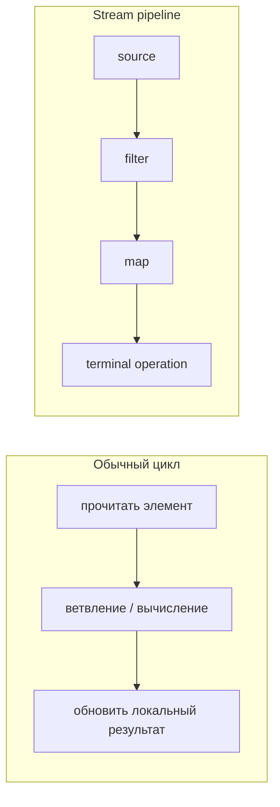
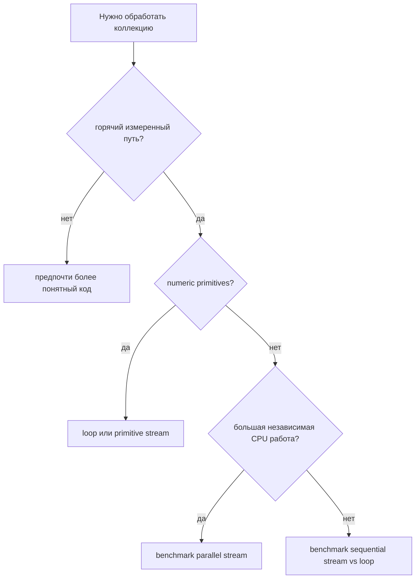

# Производительность Streams и циклов

Короткий ответ: использование Java Streams вместо обычных циклов не улучшает
производительность автоматически. Streams - это в первую очередь API для
описания обработки данных: отфильтровать это, преобразовать то, собрать
результат. Цикл обычно является более прямым набором инструкций. Представь
цикл как перенос тарелок с одной кухонной полки на другую своими руками; Stream
- как небольшой сервисный стол, где каждая тарелка проходит через подписанные
станции. Стол понятнее, когда станций несколько, но сам стол не бесплатный.

Для многих бизнес-операций над обычными коллекциями разница в производительности
слишком мала по сравнению с запросами к базе данных, HTTP calls, сериализацией,
логированием или allocation в других местах. В горячем внутреннем цикле над
большим количеством чисел разница может стать важной. Это как выбор между
рукописным списком покупок и печатной почтовой формой: форму легче
стандартизировать, но если штамповать миллионы маленьких конвертов, стоимость
обработки формы станет заметной.

## Что реально выполняется

Цикл выполняет тело для каждого элемента. JIT compiler часто может хорошо видеть
локальные переменные, ветвления и primitive operations. См. [как работает JIT
compilation](topic:java-jit-compilation) для общей картины. В кухонных терминах
повар держит сковороду, ложку и ингредиенты на одном столе, поэтому coordination
overhead мал.

Stream pipeline имеет source, intermediate operations вроде `filter` и `map`, и
terminal operation вроде `sum`, `collect` или `findFirst`. Pipeline ленивый:
intermediate operations не выполняются, пока terminal operation не начнёт
запрашивать элементы. Это как почтовый конвейер, который стоит на месте, пока
клерк у финального окна не попросит следующую посылку.

Streams часто улучшают читаемость, когда pipeline выражает одно преобразование
данных. Они также естественно сочетаются с [lambda как параметром
метода](topic:lambda-as-method-parameter). Это похоже на подписи на сортировочном
столе: «отклонить повреждённые посылки», «наклеить стикер», «положить в исходящий
мешок». Подписи упрощают обсуждение работы.

## Откуда берётся overhead у Stream

Sequential Streams могут добавить дополнительные method calls, lambda dispatch,
обход через iterator или spliterator, а иногда и дополнительные objects.
Современные JVM могут inline и удалить часть этого, но не всегда. Цикл тоже не
магически быстрее: плохой loop code может allocate, плохо ветвиться или вызывать
медленные методы. Практическое правило: сначала выбирай более понятную форму, а
затем измеряй горячий код. Как светофоры, дополнительные сигналы помогают
организовать движение, но на пустой дороге могут только замедлить.

Boxing - частая ловушка. `Stream<Integer>` переносит объекты `Integer`, а
`IntStream`, `LongStream` и `DoubleStream` работают с primitive values. Для
горячего числового кода primitive streams или циклы избегают повторного boxing и
unboxing. См. [размеры primitive types](topic:java-primitive-sizes), если разница
между primitive и object ещё не закрепилась. В кухонной аналогии primitive values
- это картошка россыпью в корзине; boxed values - картошка, завёрнутая по одной
перед каждым шагом.

Short-circuiting может заставить Streams выполнить меньше работы. Операции вроде
`findFirst`, `anyMatch` и `limit` могут остановиться, как только ответ известен.
Цикл может сделать то же самое через `break`, но Streams показывают намерение в
terminal operation. Это как остановить поиск письма, когда первое совпадение уже
найдено, вместо проверки каждого почтового ящика.

Parallel Streams - не бесплатная кнопка ускорения. Они делят input, планируют
работу в common ForkJoinPool и объединяют partial results. Они могут помочь для
больших, CPU-heavy, независимых задач с низкой стоимостью coordination. Они могут
навредить для маленьких списков, blocking I/O, shared mutable state, плохого
splitting или кода, который уже выполняется внутри другой concurrent workload.
Split и merge похожи на открытие дополнительных касс: полезно для большой толпы с
полными тележками, расточительно для трёх покупателей с одним товаром. Стоимость
может включать scheduling и [context switching](topic:context-switch).

## Ответ за 60 секунд

Нет, Java Streams не улучшают производительность по сравнению с циклами
автоматически. Обычный цикл часто имеет минимальный overhead, особенно в горячем
числовом коде. Sequential Stream может добавить overhead от lambda, pipeline,
traversal и boxing, хотя JIT может оптимизировать часть этого. Streams часто
выигрывают в читаемости и могут избегать лишней работы за счёт laziness и
short-circuiting. Primitive streams вроде `IntStream` лучше, чем
`Stream<Integer>`, для горячих числовых операций. Parallel streams могут быть
быстрее только для больших, CPU-bound, независимых задач с дешёвым splitting и
merging; они могут быть медленнее для маленьких задач, blocking I/O или shared
mutable state. Правильный ответ: сначала выбрать читаемость, а затем benchmark
реального горячего пути нормальным инструментом вроде JMH, прежде чем менять
стиль ради скорости.

## Значение в production

В production Streams отлично подходят для читаемых преобразований request DTOs,
коллекций из repositories, списков validation и простых aggregations. Аналогия -
аккуратная стойка на почте: каждая подписанная станция упрощает проверку
рутинной работы.

Не стоит считать, что замена каждого цикла на Stream - это performance project.
Большая часть service latency часто находится вне цикла: database indexes,
network calls, JSON processing, locks или memory pressure. Более быстрая ложка не
поможет, если очередь в ресторане ждёт духовку.

Когда код действительно горячий, измеряй именно этот путь. Используй JMH для
microbenchmarks, прогревай JVM, потребляй результаты, чтобы optimizer не удалил
работу, и тестируй на реалистичных размерах данных. Секундомер на одном запуске
похож на оценку дорожного трафика по одному взгляду из окна.

Также учитывай source data. Обход [ArrayList](topic:arraylist-internals)
cache-friendly по сравнению со структурами с большим количеством указателей, и
это может оказаться важнее выбора Stream или loop. Маршрут грузовика доставки
так же важен, как работник, который несёт коробки.

## Частые заблуждения

- «Streams всегда быстрее». Это API, а не гарантия производительности. Они похожи
  на подписанный сортировочный стол: организованно, но не автоматически быстрее.
- «Циклы всегда быстрее». JVM optimizations, short-circuiting, primitive streams
  и более ясные algorithms могут сделать Stream конкурентным или лучшим. Прямая
  дорога всё равно проигрывает, если ведёт не по адресу.
- «parallelStream - очевидное улучшение». У parallel work есть costs на split,
  scheduling, merge и contention. Дополнительные кассы помогают только тогда,
  когда есть достаточно работы, чтобы их загрузить.
- «Быстрого теста через `System.nanoTime()` достаточно». JVM warmup,
  dead-code elimination, allocation, GC и форма данных могут исказить результат.
  Один кухонный заказ не доказывает, что весь обеденный час быстрый.
- «`Stream<Integer>` - то же самое, что `IntStream`». `Stream<Integer>` может
  box и unbox значения; `IntStream` держит primitive `int` values. Завёрнутые
  ингредиенты требуют времени на распаковку.
