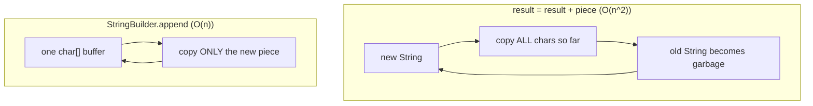
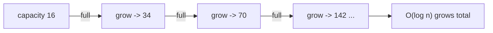

# Concatenating a Million Strings

## The intuition

Imagine you are writing one long guest list, one name at a time. With Java's `+`
operator in a loop, it is as if every time you add a name you grab a **fresh sheet
of paper, recopy every name already on the list, then add the new one** — and toss
the old sheet in the bin. By the thousandth name you are recopying a thousand-line
list just to add one word. The bin overflows with discarded sheets.

That is exactly what `result = result + piece` does. Because a Java `String` is
[immutable](topic:string-immutability), it can never be edited in place. Each `+`
allocates a **brand-new** `String`, copies **all** the characters accumulated so
far, appends the new piece, and leaves the previous `String` as garbage. Adding
piece number *k* copies roughly *k* characters, so building *n* pieces costs
`1 + 2 + … + n ≈ n²/2` character copies. For a million pieces that is on the order
of **half a trillion** copies and a million dead objects — the memory trap the
question is about.

A `StringBuilder` is the **whiteboard** version: one writable surface you keep
extending. Each `append` writes only the new piece onto the **same** board — no
recopying, no discarded sheets. The work is proportional to the final length:
O(n), not O(n²).

## How StringBuilder actually works

A `StringBuilder` wraps a single mutable `char[]` buffer with a default
**capacity** of 16. `append` copies the new characters into the free space of that
buffer — like writing in the empty part of the whiteboard. When the buffer fills
up, it **grows**: a bigger array is allocated (`(capacity << 1) + 2` in the JDK —
roughly doubling), the existing characters are copied across once, and the old
array is dropped. This is the same amortized-doubling trick an
[ArrayList](topic:arraylist-internals) uses.

Doubling matters: a buffer that doubles reaches a million characters in about 20
growth steps, and the total of all the copy-on-grow work is still only ~2n. It is
like buying a whiteboard twice as big each time you run out — you only switch
boards a handful of times, not on every name.

If you can estimate the final size, **pre-size** the buffer with
`new StringBuilder(expectedSize)`. Then the array is allocated once, big enough for
everything, and it **never grows** — zero reallocations, zero garbage buffers. It
is like booking a hall the right size for the wedding instead of moving everyone to
a bigger room three times during dinner.

## The 60-second interview answer

> Never build a big string with `+` (or `+=`) in a loop. Because `String` is
> immutable, each `+` creates a new `String` and copies every character so far, so
> the loop is O(n²) in time and churns O(n) garbage objects — that is the memory
> problem with concatenating a million strings. Use a `StringBuilder` (or
> `StringBuffer` if you need thread safety): it keeps one mutable `char[]` buffer,
> `append` copies only the new piece, and the buffer grows by doubling, so the
> whole thing is O(n). If I know the rough final size I pre-size it with
> `new StringBuilder(capacity)` to avoid even the resize copies. For joining a
> known collection I'd reach for `String.join` or
> `Collectors.joining`, which use a `StringBuilder` underneath.

## Production relevance

- Building CSV/JSON/SQL/log lines in a loop is the classic place this bites; the
  difference between `+` and `StringBuilder` for large inputs is the difference
  between seconds and milliseconds, and between heavy GC pressure and almost none.
- The discarded `String` objects pile up in the young generation and force frequent
  minor collections — see [JVM heap generations](topic:heap-generations). Less
  garbage means fewer GC pauses.
- Pre-sizing buffers (and collections) is a cheap, high-leverage optimization on
  hot paths where you can estimate the size.

## Common misconceptions and traps

- **"`+` is always bad."** No. A single expression like `a + b + c` is fine — the
  **compiler** turns it into one `StringBuilder` for you. The trap is `+` **inside
  a loop**, where each iteration is a separate expression and gets its own new
  `String`. The compiler cannot hoist the builder out of the loop for you.
- **"`StringBuilder` and `StringBuffer` are the same."** `StringBuffer` is the
  older, synchronized (thread-safe) version and is slightly slower; use
  `StringBuilder` unless a single builder is genuinely shared across threads.
- **"Pre-sizing barely helps."** On large inputs it removes every grow-and-copy
  step and the intermediate garbage arrays — measurable on hot paths.
- **"Concatenating in a loop just looks ugly."** It is not merely style: it changes
  the complexity from O(n) to O(n²). At a million pieces that is the difference
  between finishing and effectively hanging.
- **`String.format` is not a fast loop tool** either — it parses a format string
  every call. For repeated appends, a `StringBuilder` wins.
