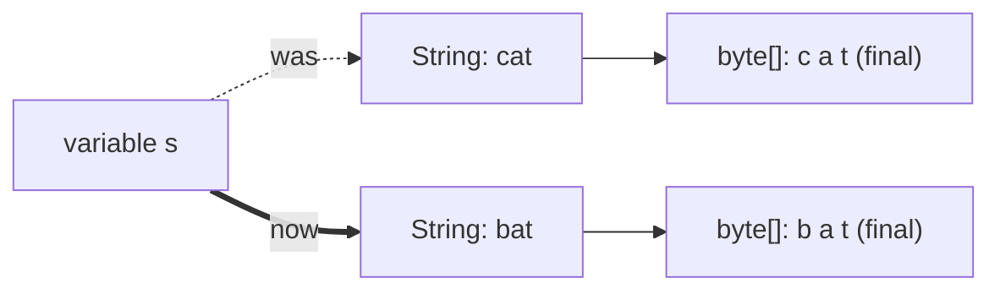
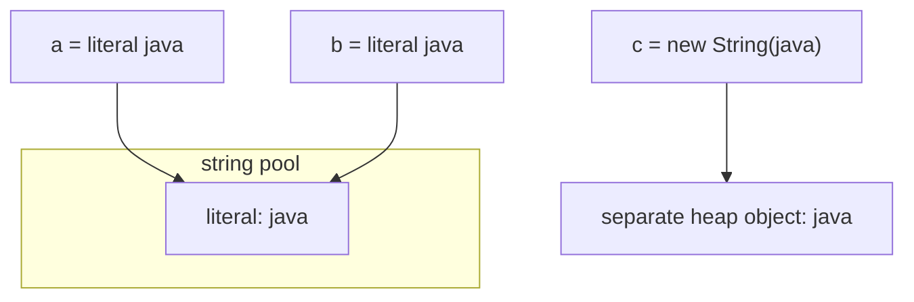
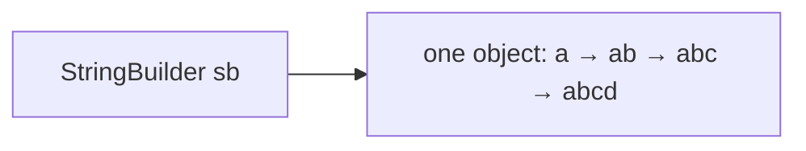

# String Immutability

> **Teaching model.** The runnable code uses `VisualString`, a learning model
> that reproduces what an interviewer asks about — immutability, the backing
> array, the string pool, `intern()`, `==` vs `equals()`, and the mutable
> `StringBuilder` — and emits trace events the panel on the right replays. It is
> **not** the JDK `String` (no compile-time literal folding, no real GC timing).
> The *behaviour you reason about* is the same.

## The short answer

**Java strings are immutable.** A `String` object's contents are fixed the
moment it is created and can never change. The class is `final`, and its backing
array (`byte[]` since Java 9, `char[]` before) is `private final` and never
exposed. There is simply **no method that edits a `String` in place** — every
"mutating" method returns a *new* `String`.

## What happens in memory when you "change a character"

You can't, directly. Consider:

```java
String s = "cat";
s = s.replace('c', 'b'); // looks like an edit
```

At the memory level, `replace` does **not** touch the `'c'`/`'a'`/`'t'` bytes of
the original object. It **allocates a brand-new `String`** ("bat") with a
**brand-new backing array**, and the variable `s` is re-pointed to it. The old
`"cat"` object is unchanged; it lives on as **garbage** until the garbage
collector reclaims it (a literal like `"cat"` also stays alive in the pool).



A variable is just a reference. "Changing the string" only changes **which
object the reference points at** — never the object itself.

## The string pool

String **literals** are interned: the JVM keeps one shared copy in the **string
constant pool**, so equal literals are the *same object*. `new String("...")`
deliberately forces a *separate* heap object with equal content.



This is why:

- `a == b` is **true** — both point at the pooled object.
- `a == c` is **false** — `c` is a different object…
- …but `a.equals(c)` is **true** — same content.

> **Rule of thumb:** compare string *content* with `equals()`, never with `==`.

`String.intern()` returns the canonical pooled instance for a string's content,
so a runtime-built string can be made `==` to the matching literal. Use it
sparingly — it trades CPU and pool space for cheaper later comparisons.

## Why immutable? (the benefits)

- **Safe sharing & caching** — the pool only works because strings can't change
  under another reference's feet.
- **Thread-safety for free** — immutable objects need no synchronization.
- **Safe hash key** — the hash is cached and stable, so a `String` is a perfect
  `HashMap` key (a *mutable* key would silently break lookups).
- **Security** — file paths, URLs and credentials passed as strings can't be
  mutated after a security check.

## StringBuilder — the mutable contrast

`String + String` allocates a new object every time, so concatenating in a loop
is `O(n²)` in copying. `StringBuilder` (and the synchronized `StringBuffer`) is
**mutable**: `append()` changes the *same* object in place, growing its internal
array only when needed.



So to [build a huge string](catalog:java-core-15), loop over a single
`StringBuilder` instead of `+`. (Note: a single `a + b + c` expression is fine —
the compiler already turns it into one `StringBuilder`.)

This also ties back to [how variables hold references](catalog:java-core-9): the
variable is a reference on the stack; the `String`/`StringBuilder` object and its
array live on the heap.

## Interview answer (60 seconds)

> Java strings are immutable: `String` is `final` and its backing array is
> `private final`, so a `String` object never changes after construction. Any
> "mutating" call — `concat`, `replace`, `substring`, `toUpperCase` — returns a
> brand-new `String` with a new backing array and leaves the original alone; your
> variable just points at the new object, and the old one becomes garbage.
> Immutability buys safe sharing (the string pool), thread-safety, and stable
> hash codes, which is why `String` is the ideal `HashMap` key. Equal literals
> are the same pooled object, so compare content with `equals()`, not `==`. When
> you genuinely need to mutate text — e.g. concatenating in a loop — use
> `StringBuilder`, which edits one object in place.

## Common misconceptions

- ❌ "`s += "x"` modifies the string." — No; it creates a new `String` and
  re-points `s`.
- ❌ "`==` compares string content." — No; `==` compares references. Use `equals()`.
- ❌ "All equal strings are the same object." — Only *literals* are pooled;
  `new String("x")` is a distinct object.
- ❌ "Immutable means stored in a constant, read-only memory region." — No; it
  means no API mutates it. New strings are ordinary heap objects.
- ❌ "Immutable strings waste memory." — Sharing via the pool and `intern()`
  often *saves* memory; use `StringBuilder` only when you actually churn text.
