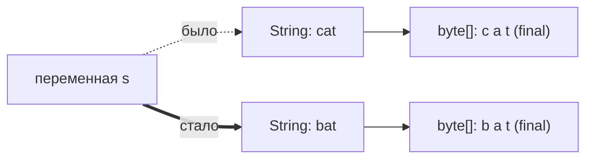
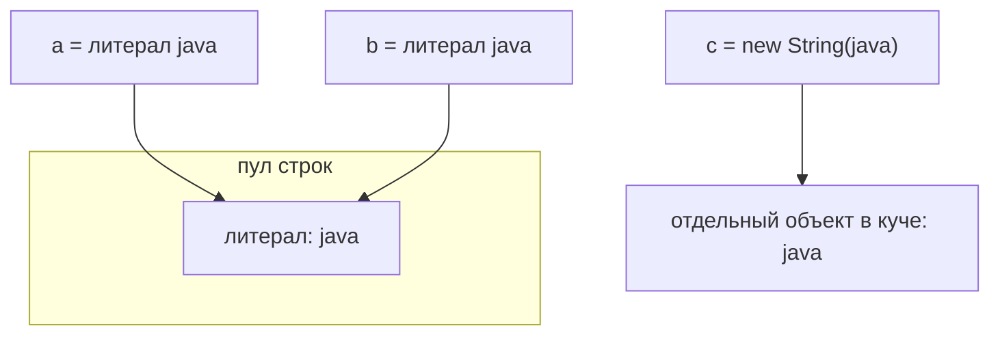
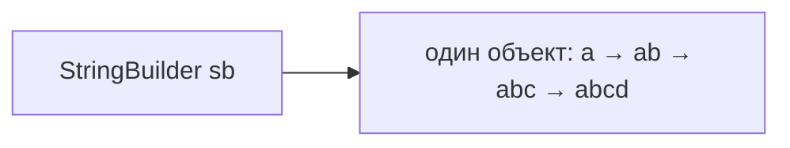

# Иммутабельность строк

> **Обучающая модель.** Запускаемый код использует `VisualString` — учебную
> модель, которая воспроизводит то, о чём спрашивают на собеседовании:
> иммутабельность, внутренний массив, пул строк, `intern()`, `==` против
> `equals()` и изменяемый `StringBuilder` — и эмитит трейс-события, которые
> воспроизводит панель справа. Это **не** JDK-класс `String` (нет свёртки
> литералов на этапе компиляции, нет реального тайминга GC). *Поведение, о
> котором вы рассуждаете*, такое же.

## Короткий ответ

**Строки в Java иммутабельны.** Содержимое объекта `String` фиксируется в момент
создания и больше никогда не меняется. Класс `final`, а его внутренний массив
(`byte[]` начиная с Java 9, `char[]` до неё) — `private final` и наружу не
отдаётся. Просто **нет метода, который редактирует `String` на месте** — каждый
«изменяющий» метод возвращает *новую* строку.

## Что происходит в памяти, когда вы «меняете символ»

Напрямую — никак. Рассмотрим:

```java
String s = "cat";
s = s.replace('c', 'b'); // выглядит как редактирование
```

На уровне памяти `replace` **не** трогает байты `'c'`/`'a'`/`'t'` исходного
объекта. Он **выделяет совершенно новую строку** («bat») с **совершенно новым
внутренним массивом**, а переменная `s` переуказывается на неё. Старый объект
`"cat"` не меняется; он остаётся **мусором**, пока его не соберёт сборщик мусора
(а литерал `"cat"` к тому же остаётся жить в пуле).



Переменная — это всего лишь ссылка. «Изменение строки» меняет лишь то, **на какой
объект указывает ссылка**, но не сам объект.

## Пул строк

Строковые **литералы** интернируются: JVM держит одну общую копию в **пуле
строковых констант**, поэтому одинаковые литералы — это *один и тот же объект*.
`new String("...")` намеренно создаёт *отдельный* объект в куче с тем же
содержимым.



Поэтому:

- `a == b` — **true**: обе ссылки указывают на объект из пула.
- `a == c` — **false**: `c` — другой объект…
- …но `a.equals(c)` — **true**: содержимое одинаковое.

> **Правило:** сравнивайте *содержимое* строк через `equals()`, а не через `==`.

`String.intern()` возвращает канонический объект из пула для содержимого строки,
поэтому собранную в рантайме строку можно сделать `==` соответствующему литералу.
Применяйте умеренно — это меняет CPU и место в пуле на более дешёвые сравнения
потом.

## Зачем иммутабельность? (плюсы)

- **Безопасный шеринг и кэширование** — пул работает только потому, что строки не
  меняются «из-под» другой ссылки.
- **Потокобезопасность даром** — иммутабельным объектам не нужна синхронизация.
- **Надёжный ключ хэша** — хэш кэшируется и стабилен, поэтому `String` — идеальный
  ключ `HashMap` (*изменяемый* ключ молча сломал бы поиск).
- **Безопасность** — пути к файлам, URL и учётные данные, переданные строкой,
  нельзя изменить после проверки безопасности.

## StringBuilder — изменяемый контраст

`String + String` каждый раз выделяет новый объект, поэтому конкатенация в цикле
по копированию даёт `O(n²)`. `StringBuilder` (и синхронизированный `StringBuffer`)
**изменяемый**: `append()` меняет *тот же* объект на месте, расширяя внутренний
массив только при необходимости.



Поэтому чтобы [собрать огромную строку](catalog:java-core-15), проходите циклом по
одному `StringBuilder`, а не через `+`. (Замечание: одно выражение `a + b + c` —
норма: компилятор сам превращает его в один `StringBuilder`.)

Это связано и с тем, [как переменные хранят ссылки](catalog:java-core-9):
переменная — это ссылка в стеке; объект `String`/`StringBuilder` и его массив
живут в куче.

## Ответ на собеседовании (60 секунд)

> Строки в Java иммутабельны: `String` — `final`, а его внутренний массив —
> `private final`, поэтому объект `String` не меняется после создания. Любой
> «изменяющий» вызов — `concat`, `replace`, `substring`, `toUpperCase` — возвращает
> совершенно новую строку с новым внутренним массивом, оставляя исходную нетронутой;
> переменная просто указывает на новый объект, а старый становится мусором.
> Иммутабельность даёт безопасный шеринг (пул строк), потокобезопасность и
> стабильные хэш-коды — поэтому `String` идеален как ключ `HashMap`. Одинаковые
> литералы — это один объект из пула, так что сравнивайте содержимое через
> `equals()`, а не `==`. Когда действительно нужно менять текст — например,
> конкатенация в цикле — используйте `StringBuilder`, который правит один объект на
> месте.

## Частые заблуждения

- ❌ «`s += "x"` меняет строку.» — Нет; создаётся новая строка и `s`
  переуказывается.
- ❌ «`==` сравнивает содержимое строк.» — Нет; `==` сравнивает ссылки. Используйте
  `equals()`.
- ❌ «Все одинаковые строки — это один объект.» — В пуле только *литералы*;
  `new String("x")` — отдельный объект.
- ❌ «Иммутабельность значит хранение в константной, доступной только для чтения
  области памяти.» — Нет; это значит, что нет API, который её меняет. Новые строки —
  обычные объекты в куче.
- ❌ «Иммутабельные строки тратят память.» — Шеринг через пул и `intern()` часто,
  наоборот, *экономит* память; берите `StringBuilder` только когда реально часто
  меняете текст.
