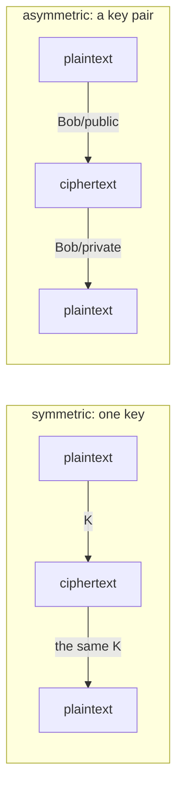
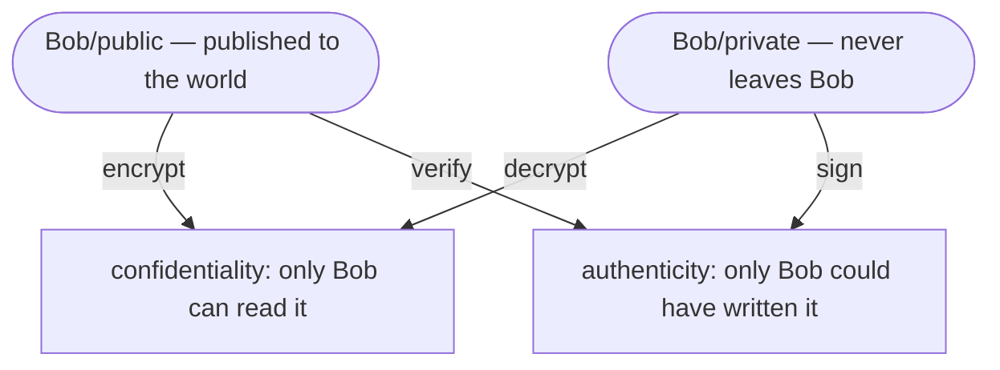
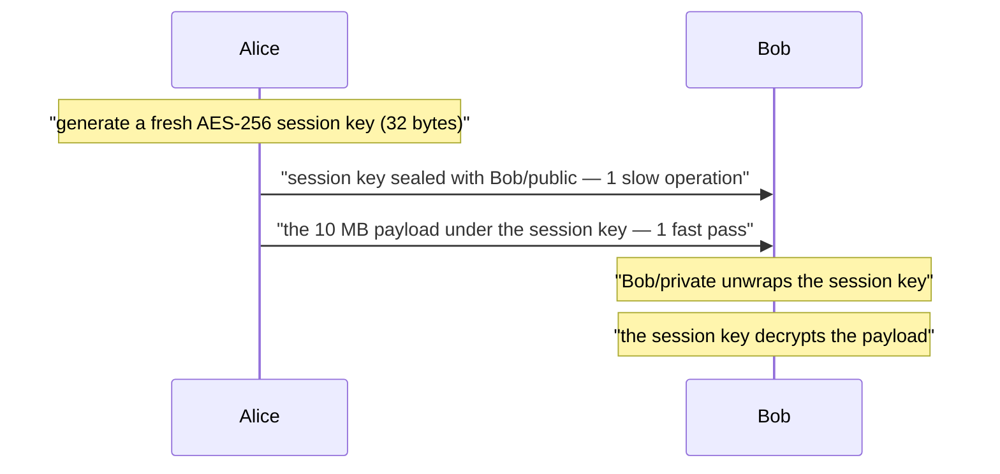

# Symmetric vs Asymmetric Encryption

The difference is one number: **how many keys**, and therefore **whether any of them may
be published**.

- **Symmetric** — one key. The same secret encrypts and decrypts, so everyone who needs to
  read must already have those exact bytes. AES-256-GCM, ChaCha20-Poly1305.
- **Asymmetric** (public-key) — a linked **pair**. What one half does, only the other half
  undoes, and the private half cannot be computed from the public one — so one of them can
  be handed to complete strangers. RSA, ECDSA, X25519.

Everything else people list — speed, message size, key management, signatures — follows
from that one difference. Neither is "more secure"; they solve different problems, and the
interesting question is always *which key has to stay secret*.

## Symmetric: fast, unlimited, and unable to start itself

A symmetric cipher is a stream of cheap block operations with hardware support (AES-NI), so
cost grows with the **amount of data**, not with the key: a megabyte takes well under a
millisecond, and there is no size limit at all. That is why every protocol ends up carrying
its payload this way.

It has exactly two weaknesses, and both are about keys rather than about the cipher.

**1. Key distribution.** Before Bob can read anything, he needs the key. Sending it over the
channel you were trying to protect defeats the point; meeting in person does not scale.
Symmetric cryptography protects messages beautifully and has no way to bootstrap itself.

**2. Key count.** Every pair that needs a private conversation needs its own key —
`n(n-1)/2` of them. Two parties: one key. Fifty parties: **1225 keys**, each generated,
delivered, stored and rotated. Adding one party means 49 new key exchanges. With key pairs
it is `n` — fifty pairs, and every public half can simply be published.

There is a third, quieter limitation: a shared key **cannot prove authorship**. Every holder
can also forge with it, so the most it ever shows is "somebody in this group wrote it". That
gap is why signatures have to be asymmetric.

## Asymmetric: two keys, two directions, two guarantees

The pair is used in both directions, and which half you start with decides what you get:

| | encrypt / decrypt | sign / verify |
|---|---|---|
| **produced with** | recipient's **public** key | signer's **private** key |
| **undone with** | recipient's **private** key | signer's **public** key |
| **who can do it** | anybody | only the key owner |
| **guarantee** | confidentiality | authenticity + integrity + non-repudiation |

Two consequences worth saying out loud in an interview:

- Publishing the public half is **not a leak** — it is the purpose. An attacker holding it
  gains the ability to *write* to you, never to read what was written. This is also why the
  sender cannot read their own encrypted message back.
- **A signature encrypts nothing.** The message travels in the clear next to it. A signed
  JWT is readable by anyone who copies it; the signature only means nobody changed it — see
  [JWT vs session token](topic:jwt-vs-session-token).

## Why not use only the pair?

Two hard reasons.

**Size.** RSA encrypts one number smaller than the modulus, so the key length *is* the
message length: a 2048-bit key is 256 bytes, and OAEP padding leaves **190 bytes** of
payload. Elliptic-curve keys do not do bulk encryption at all — they do key agreement and
signatures.

**Speed.** Asymmetric operations are modular exponentiation on huge numbers. Encrypting a
1 MiB file block by block would need ~5500 separate operations — thousands of times the cost
of a single symmetric pass over the same bytes. That is not a tuning difference you can
optimise away.

## Hybrid: what every real system actually does

Use the expensive algorithm **once, on a key**, and let the cheap one carry the data.

Two asymmetric operations and two symmetric ones — and that count does not change if the
payload grows a hundredfold. This is TLS, PGP, JWE, S/MIME, SSH, age, and encrypted backups
with a smart card. When an interviewer asks *"does HTTPS use symmetric or asymmetric
encryption?"*, the answer is **both, for different jobs**: asymmetric authenticates the
server and agrees on a key, symmetric carries every byte after that — the detail is in
[SSL/TLS certificates](topic:ssl-tls-certificate) and [HTTP vs HTTPS](topic:http-vs-https).

Modern TLS does not even wrap the key with RSA any more. It runs an **ephemeral
Diffie–Hellman** exchange: both sides send a public share, both combine it with a private
value they throw away afterwards, and both arrive at the same secret that never crossed the
wire. The certificate's key pair only *signs* that exchange. The gain is **forward
secrecy** — a private key leaking next year does not open traffic recorded today, because
no recorded session key was ever sealed to it.

## The 60-second interview answer

> Symmetric encryption uses one key for both directions. It is fast, has no size limit, and
> is what actually protects data at rest and in flight. Its problem is not the cipher but
> the key: both sides must already have the same bytes, so you have to distribute it
> somehow, and a group of n parties needs n(n-1)/2 of them. Asymmetric encryption uses a
> mathematically linked pair where the private half cannot be derived from the public one,
> so the public half can be published — that removes the distribution problem entirely.
> Encrypt with the public key and only the owner can decrypt; sign with the private key and
> anyone can verify, which gives authenticity rather than secrecy — something a shared key
> can never do, because every holder could forge. The catch is that asymmetric operations
> are thousands of times slower and bounded by the key size, about 190 bytes for RSA-2048,
> so nobody encrypts bulk data with them. Real systems are hybrid: one asymmetric operation
> establishes a fresh symmetric session key, and that key carries the payload. HTTPS is
> exactly this, except the key is agreed with ephemeral Diffie–Hellman instead of wrapped,
> which buys forward secrecy.

## Why it matters in production

- **Almost every "encryption" decision is a key-management decision.** Where does the key
  live, who can read it, how is it rotated, what happens when it leaks? The algorithm is the
  easy part; use a vault or a KMS, not a config file, and never a constant in the source.
- **Blast radius differs enormously.** A leaked shared secret exposes every message ever
  sent under it, in both directions, for everyone holding it. A leaked private key exposes
  everything addressed to it and lets the holder impersonate the owner. A "leaked" public
  key exposes nothing — it was already published.
- **Key sizes are not comparable across families.** 256 symmetric bits are far beyond
  2048 asymmetric ones; the numbers measure different mathematics. Roughly: AES-128 ≈
  RSA-3072 ≈ P-256.
- **In a Java service** you meet both constantly: TLS on every call
  ([inter-service communication](topic:inter-service-communication-options), the
  [API gateway](topic:api-gateway)), signed tokens in
  [OAuth 2.0 / OpenID Connect](topic:oauth-openid-connect) and
  [authentication](topic:authentication-flow), signed artifacts and commits, and symmetric
  encryption for database columns, backups and message payloads. `KeyPairGenerator`,
  `Cipher`, `Signature` and `KeyStore` are the JCA classes; prefer AES/GCM over the ECB and
  CBC examples that still circulate.
- **Passwords are not encrypted at all.** They are hashed with bcrypt/scrypt/Argon2 —
  deliberately slow and one-way. If a system can *decrypt* your password, that is the bug.
- **Elliptic curves have largely replaced RSA** for new work: much smaller keys and faster
  signatures at the same strength, which matters for handshake latency and for tokens.

## Common misconceptions

- **"Asymmetric encryption is more secure."** They protect different things. A 256-bit
  symmetric key is not weaker than a 2048-bit RSA key; it is stronger. What asymmetric
  cryptography buys is *not needing a pre-shared secret* and *being able to prove
  authorship*.
- **"You encrypt with the public key and decrypt with the public key."** Only the private
  half undoes what the public half did. If the same key could do both, publishing it would
  publish the plaintext.
- **"Signing is encrypting with the private key."** A convenient half-truth for RSA and
  simply false for ECDSA/EdDSA. Signing hashes the message and produces a proof; the message
  itself stays readable, and the operation is not reversible into ciphertext.
- **"A signed message is confidential."** It is not. Signing gives integrity and authorship;
  confidentiality is a separate operation you must add.
- **"HTTPS uses asymmetric encryption."** Only in the handshake, and in TLS 1.3 only to sign
  and to agree a key. Every byte of your request rides a symmetric AEAD cipher.
- **"The algorithm must be kept secret."** Kerckhoffs's principle: everything except the key
  is assumed public. A scheme whose security depends on hiding the method is a scheme nobody
  has been able to review.
- **"Encryption gives integrity."** Not by itself — classic modes let an attacker flip bits
  that decrypt to controlled changes. That is why modern practice is **AEAD** (AES-GCM,
  ChaCha20-Poly1305): one operation for confidentiality *and* an authentication tag.
- **"We use symmetric keys, so messages are authenticated."** They are authenticated as
  coming from *the group that holds the key*. If you need to know which member, you need
  signatures.
- **"Encrypted means safe."** It means unreadable to whoever lacks the key. It says nothing
  about authorization, injection or session handling — see [XSS](topic:xss),
  [CSRF](topic:csrf) and [endpoint security design](topic:endpoint-security-design).
- **"Bigger keys, better security."** Past a point the key stops being the weak link and the
  key *storage* becomes it. RSA-16384 protecting a key checked into git is not security.
- **"Quantum computers break encryption."** They break the asymmetric half — factoring and
  discrete logs. Symmetric ciphers lose roughly half their bit strength, which AES-256
  absorbs. This is why post-quantum work targets key exchange and signatures first, and why
  "harvest now, decrypt later" is a real concern for recorded TLS traffic.
