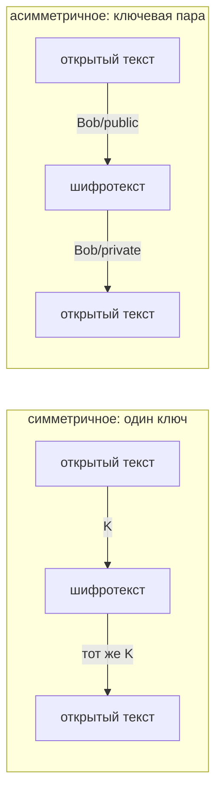
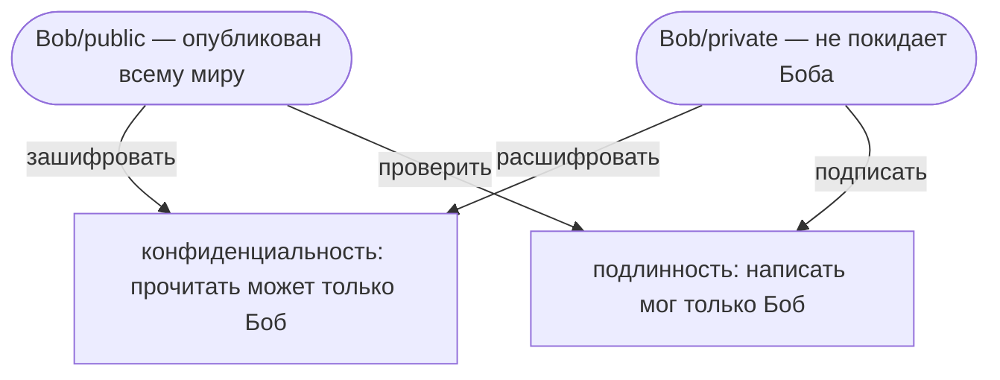
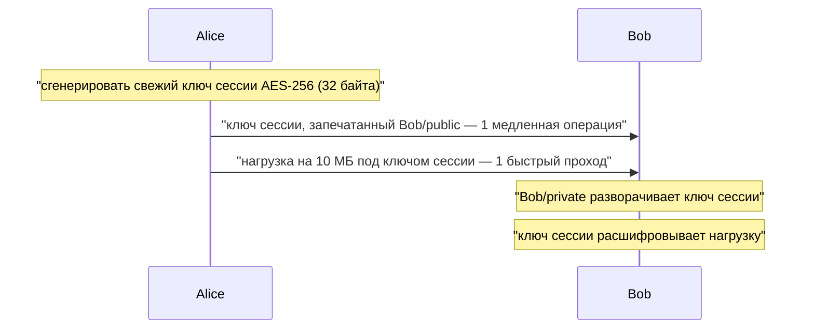

# Симметричное и асимметричное шифрование

Разница в одном числе: **сколько ключей** — и, следовательно, **можно ли хоть один из них
опубликовать**.

- **Симметричное** — один ключ. Один и тот же секрет шифрует и расшифровывает, поэтому у
  каждого, кому нужно читать, уже должны быть ровно эти байты. AES-256-GCM,
  ChaCha20-Poly1305.
- **Асимметричное** (с открытым ключом) — связанная **пара**. Сделанное одной половиной
  отменяет только другая, а приватную половину нельзя вычислить из публичной — поэтому одну
  из них можно отдать совершенно посторонним. RSA, ECDSA, X25519.

Всё остальное, что обычно перечисляют — скорость, размер сообщения, управление ключами,
подписи, — следует из этой единственной разницы. Ни одно из двух не «безопаснее»: они решают
разные задачи, а интересный вопрос всегда один — *какой ключ обязан остаться секретным*.

## Симметричное: быстрое, без ограничений и не умеющее запустить себя

Симметричный шифр — это поток дешёвых блочных операций с аппаратной поддержкой (AES-NI),
поэтому стоимость растёт от **объёма данных**, а не от ключа: мегабайт занимает заметно
меньше миллисекунды, а ограничения на размер нет вовсе. Поэтому любой протокол в итоге везёт
полезную нагрузку именно так.

Слабых мест у него ровно два, и оба про ключи, а не про шифр.

**1. Распространение ключей.** Прежде чем Боб что-то прочитает, ему нужен ключ. Отправить его
по каналу, который вы пытались защитить, — значит обесценить всю затею; встретиться лично —
не масштабируется. Симметричная криптография прекрасно защищает сообщения и совершенно не
умеет запускать саму себя.

**2. Количество ключей.** Каждой паре, которой нужен приватный разговор, нужен свой ключ —
`n(n-1)/2` штук. Двое участников — один ключ. Пятьдесят участников — **1225 ключей**, и
каждый нужно создать, доставить, хранить и ротировать. Добавить одного участника — это 49
новых обменов ключами. С ключевыми парами получается `n`: пятьдесят пар, и каждую публичную
половину можно просто опубликовать.

Есть и третье, менее заметное ограничение: общий ключ **не может доказать авторство**. Каждый
владелец может им же и подделать, поэтому максимум, что он показывает, — «написал кто-то из
этой группы». Из-за этого разрыва подписи и делают асимметричными.

## Асимметричное: два ключа, два направления, две гарантии

Пару используют в обе стороны, и то, с какой половины вы начинаете, решает, что вы получите:

| | шифрование / расшифровка | подпись / проверка |
|---|---|---|
| **создаётся** | **публичным** ключом получателя | **приватным** ключом подписанта |
| **отменяется** | **приватным** ключом получателя | **публичным** ключом подписанта |
| **кто может** | кто угодно | только владелец ключа |
| **гарантия** | конфиденциальность | подлинность + целостность + неотказуемость |

Два следствия, которые на собеседовании стоит проговорить вслух:

- Публикация публичной половины — **не утечка**, а её назначение. Злоумышленник, получивший
  её, приобретает возможность *писать* вам, но никогда — читать написанное. По этой же
  причине отправитель не может прочитать собственное зашифрованное сообщение обратно.
- **Подпись ничего не шифрует.** Сообщение едет рядом с ней открытым текстом. Подписанный JWT
  прочитает любой, кто его скопировал; подпись означает лишь, что его не меняли, — см.
  [JWT vs session token](topic:jwt-vs-session-token).

## Почему не обойтись одной парой?

Две жёсткие причины.

**Размер.** RSA шифрует одно число, меньшее модуля, поэтому длина ключа *и есть* длина
сообщения: 2048-битный ключ — это 256 байт, а набивка OAEP оставляет под нагрузку
**190 байт**. Ключи на эллиптических кривых массовым шифрованием не занимаются вовсе — они
делают согласование ключей и подписи.

**Скорость.** Асимметричные операции — это модульное возведение в степень над огромными
числами. Зашифровать файл в 1 МиБ поблочно потребовало бы ~5500 отдельных операций, то есть в
тысячи раз дороже одного симметричного прохода по тем же байтам. Это не разница в настройках,
которую можно оптимизировать.

## Гибрид: что на самом деле делает любая реальная система

Потратить дорогой алгоритм **один раз и на ключ**, а данные отдать дешёвому.

Две асимметричные операции и две симметричные — и это число не изменится, вырасти нагрузка
хоть в сто раз. Так устроены TLS, PGP, JWE, S/MIME, SSH, age и шифрованные бэкапы со
смарт-картой. Когда на собеседовании спрашивают, *«HTTPS использует симметричное шифрование
или асимметричное?»*, ответ — **оба, для разных задач**: асимметричное аутентифицирует сервер
и согласует ключ, симметричное везёт каждый последующий байт. Подробности — в
[SSL/TLS-сертификатах](topic:ssl-tls-certificate) и в [HTTP vs HTTPS](topic:http-vs-https).

Современный TLS даже ключ по RSA больше не оборачивает. Он выполняет **эфемерный обмен
Диффи–Хеллмана**: обе стороны присылают публичную долю, обе складывают её со своим приватным
значением, которое затем выбрасывают, и обе приходят к одному секрету, не пересекавшему
провод. Ключевая пара из сертификата этот обмен только *подписывает*. Выигрыш — **прямая
секретность**: утёкший через год приватный ключ не откроет записанный сегодня трафик, потому
что ни один записанный ключ сессии на него не запечатывали.

## Ответ на собеседовании за 60 секунд

> Симметричное шифрование использует один ключ в обе стороны. Оно быстрое, не ограничено по
> размеру и именно оно реально защищает данные в покое и в передаче. Проблема у него не в
> шифре, а в ключе: у обеих сторон уже должны быть одинаковые байты, значит, ключ надо как-то
> доставить, а группе из n участников их нужно n(n-1)/2. Асимметричное шифрование использует
> математически связанную пару, где приватную половину нельзя вывести из публичной, поэтому
> публичную можно опубликовать — и проблема распространения исчезает целиком. Зашифруете
> публичным ключом — расшифрует только владелец; подпишете приватным — проверить сможет кто
> угодно, и это даёт подлинность, а не секретность, чего общий ключ не умеет в принципе, ведь
> подделать может любой его владелец. Плата — асимметричные операции в тысячи раз медленнее и
> ограничены размером ключа, около 190 байт для RSA-2048, поэтому объёмные данные ими не
> шифруют. Реальные системы гибридны: одна асимметричная операция устанавливает свежий
> симметричный ключ сессии, и нагрузку везёт он. HTTPS устроен ровно так, только ключ не
> оборачивают, а согласуют эфемерным Диффи–Хеллманом, что даёт прямую секретность.

## Почему это важно в продакшене

- **Почти любое решение «про шифрование» — это решение про управление ключами.** Где живёт
  ключ, кто может его прочитать, как он ротируется, что происходит при утечке? Алгоритм —
  лёгкая часть; берите vault или KMS, а не конфиг-файл, и уж точно не константу в исходниках.
- **Масштаб последствий различается радикально.** Утёкший общий секрет раскрывает все
  когда-либо отправленные под ним сообщения, в обе стороны и для всех его владельцев. Утёкший
  приватный ключ раскрывает всё, что на него адресовали, и позволяет выдавать себя за
  владельца. «Утёкший» публичный ключ не раскрывает ничего — он и так был опубликован.
- **Длины ключей нельзя сравнивать между семействами.** 256 симметричных бит намного дальше
  2048 асимметричных: числа измеряют разную математику. Грубо: AES-128 ≈ RSA-3072 ≈ P-256.
- **В Java-сервисе** вы встречаете оба постоянно: TLS на каждом вызове
  ([взаимодействие сервисов](topic:inter-service-communication-options),
  [API-шлюз](topic:api-gateway)), подписанные токены в
  [OAuth 2.0 / OpenID Connect](topic:oauth-openid-connect) и в
  [аутентификации](topic:authentication-flow), подписанные артефакты и коммиты, а также
  симметричное шифрование колонок в базе, бэкапов и тел сообщений. Классы JCA —
  `KeyPairGenerator`, `Cipher`, `Signature`, `KeyStore`; предпочитайте AES/GCM примерам с ECB
  и CBC, которые всё ещё ходят по интернету.
- **Пароли не шифруют вообще.** Их хешируют bcrypt/scrypt/Argon2 — намеренно медленно и в одну
  сторону. Если система умеет *расшифровать* ваш пароль, это и есть баг.
- **Эллиптические кривые почти вытеснили RSA** в новых проектах: значительно меньшие ключи и
  более быстрые подписи при той же стойкости, что важно и для задержки рукопожатия, и для
  токенов.

## Частые заблуждения

- **«Асимметричное шифрование безопаснее».** Они защищают разное. 256-битный симметричный
  ключ не слабее 2048-битного RSA, он сильнее. Асимметричная криптография покупает другое: *не
  нужен заранее общий секрет* и *можно доказать авторство*.
- **«Шифруют публичным ключом и расшифровывают публичным».** Сделанное публичной половиной
  отменяет только приватная. Умей один и тот же ключ и то и другое, публикация ключа означала
  бы публикацию открытого текста.
- **«Подписать — значит зашифровать приватным ключом».** Удобная полуправда для RSA и просто
  неверно для ECDSA/EdDSA. Подпись хеширует сообщение и производит доказательство; само
  сообщение остаётся читаемым, а операция не разворачивается в шифротекст.
- **«Подписанное сообщение конфиденциально».** Нет. Подпись даёт целостность и авторство;
  конфиденциальность — отдельная операция, которую нужно добавить.
- **«HTTPS использует асимметричное шифрование».** Только в рукопожатии, а в TLS 1.3 — лишь
  чтобы подписать и согласовать ключ. Каждый байт вашего запроса едет на симметричном
  AEAD-шифре.
- **«Алгоритм надо держать в секрете».** Принцип Керкгоффса: публичным считается всё, кроме
  ключа. Схема, безопасность которой держится на сокрытии метода, — это схема, которую никто
  не смог отревьюить.
- **«Шифрование даёт целостность».** Само по себе — нет: классические режимы позволяют
  злоумышленнику перевернуть биты так, что расшифровка даст контролируемое изменение. Поэтому
  современная практика — **AEAD** (AES-GCM, ChaCha20-Poly1305): одна операция даёт и
  конфиденциальность, *и* тег аутентичности.
- **«У нас симметричные ключи, значит, сообщения аутентифицированы».** Аутентифицированы как
  пришедшие *от группы, владеющей ключом*. Если нужно знать, от какого именно участника, нужны
  подписи.
- **«Зашифровано — значит безопасно».** Значит «нечитаемо для того, у кого нет ключа». Про
  авторизацию, инъекции и работу с сессиями это не говорит ничего — см. [XSS](topic:xss),
  [CSRF](topic:csrf) и [проектирование безопасности эндпоинтов](topic:endpoint-security-design).
- **«Чем больше ключ, тем лучше».** С какого-то момента слабым звеном перестаёт быть ключ и
  становится его *хранение*. RSA-16384, защищающий ключ, закоммиченный в git, — это не
  безопасность.
- **«Квантовые компьютеры ломают шифрование».** Они ломают асимметричную половину —
  факторизацию и дискретные логарифмы. Симметричные шифры теряют примерно половину битовой
  стойкости, что AES-256 переживает. Поэтому постквантовые работы в первую очередь нацелены на
  обмен ключами и подписи, и поэтому «собрать сейчас, расшифровать потом» — реальная угроза
  для записанного TLS-трафика.
