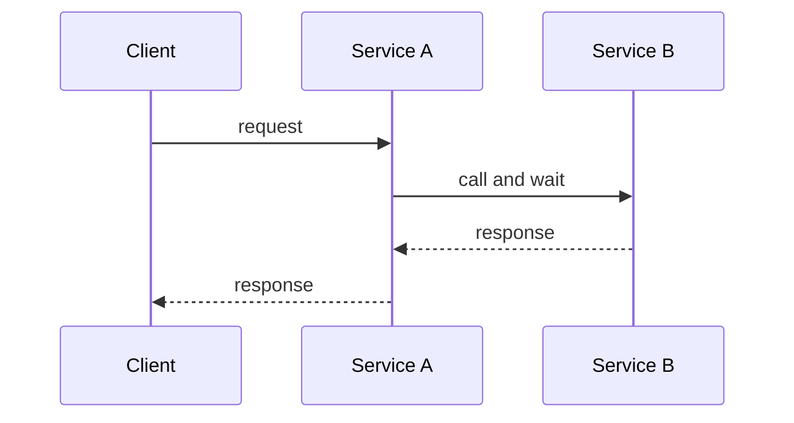
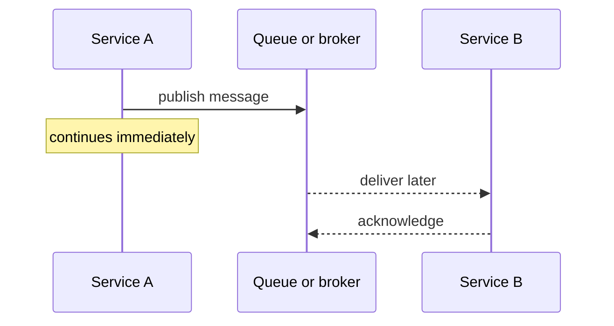
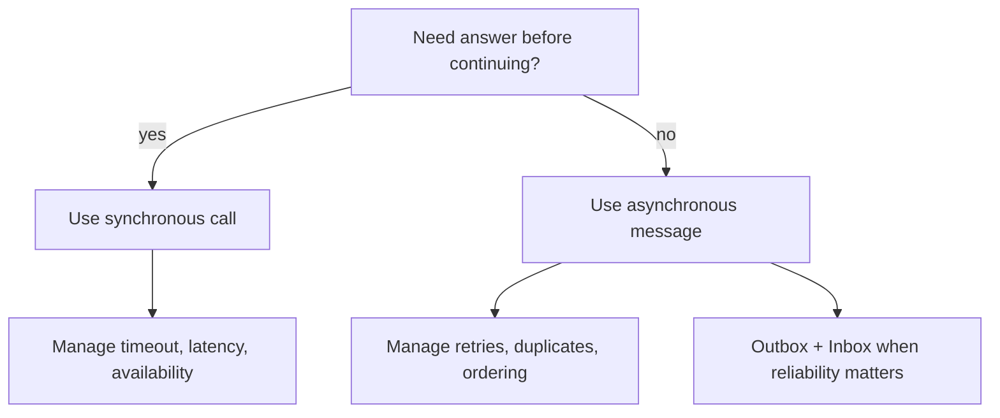

# Synchronous vs Asynchronous Communication

In microservices, communication style answers one practical question: does the caller need an answer before it can move on?

Synchronous communication is a direct request/response. Service A calls Service B, waits, and only then returns its own result. It is like standing at a kitchen counter until the cook hands you the meal: simple and immediate, but you are blocked while the kitchen works.

Asynchronous communication is handoff through a message, queue, event stream, callback, or background job. Service A publishes work and continues; Service B consumes it later. It is like dropping a parcel at the post office: you do not wait at the counter until the recipient opens it, but you now need tracking, retries, and a plan for delayed delivery.

## 60-second interview answer

Synchronous communication means the caller sends a request and waits for the response, for example an HTTP call from one service to another. It is good when the user or business flow needs an immediate result, but it couples the caller to the callee's latency and availability: if the callee is slow or down, the caller is affected too.

Asynchronous communication means the sender emits a message, command, event, or job and does not wait for the receiver to finish processing it. It is good for background work, integration between services, buffering traffic spikes, and reducing availability coupling. The tradeoff is that the result is not immediate, so the system must handle eventual consistency, retries, duplicate messages, ordering, monitoring, and failure recovery.

A good short answer is: sync is "ask and wait"; async is "send and continue." Choose sync for immediate answers and simple request flows; choose async when delayed processing is acceptable and decoupling or resilience matters.

## How to compare them

Response timing is the first difference. In sync calls, the answer is part of the same interaction; in async flows, completion happens later and may be observed through another event, status endpoint, notification, or polling. Think of a restaurant table: sync is asking the waiter and waiting for an answer now; async is leaving an order slip and checking the board later.

Coupling is the second difference. Sync services are coupled in time because both sides must be available at the same moment. Async services are less coupled in time because the broker can hold work while the consumer is busy or temporarily down. It is like a traffic light versus a mailbox: at a traffic light everyone must coordinate now, while a mailbox can hold letters until the carrier arrives.

Failure handling changes too. In sync communication, failures usually surface immediately as a timeout, error response, or circuit-breaker event. In async communication, failures are often handled by retries, dead-letter queues, idempotent consumers, and operational alerts. It is like a phone call that fails loudly versus a package that may need tracking and redelivery.

Consistency also changes. Sync flows often make it easier to return the latest answer to the caller. Async flows often produce eventual consistency: one service has accepted the work, but other services may catch up later. It is like a kitchen ticket board: the cashier has taken the order, but the dish is not ready at every station yet.

Complexity moves rather than disappears. Sync communication keeps the flow easy to read but needs timeouts, bulkheads, and fallback behavior. Async communication hides waiting from the caller but needs message contracts, correlation ids, tracing, retry policies, and duplicate protection. It is like choosing between a single checkout line and a parcel sorting room: the queue smooths the rush, but the sorting room needs labels and tracking.

## When to use each

Use synchronous communication when the caller cannot proceed without the answer: checking inventory before confirming an order, validating credentials, reading a profile for a page, or returning data directly to an API client. In real life, this is the cash register asking the card terminal whether payment was approved before handing over the receipt.

Use asynchronous communication when work can happen after the initial response: sending email, generating reports, indexing search data, processing media, charging a workflow step after a state change, or notifying other services about a domain event. This is the post office model: the sender hands off the envelope and the delivery network finishes the job later.

Use asynchronous messaging carefully for cross-service state changes. If a service changes its database and must publish an event reliably, the [Outbox pattern](topic:outbox-pattern) helps avoid losing the event. If a consumer may receive the same message more than once, the [Inbox pattern](topic:inbox-pattern) helps deduplicate it. These patterns are like writing a parcel into a dispatch ledger and checking a receiving ledger before processing it again.

For broker choice, delivery model, retention, and routing, compare systems like Kafka and RabbitMQ in [Kafka vs RabbitMQ](topic:kafka-vs-rabbitmq). In the post office analogy, this is choosing between a conveyor belt with replayable history and a routing desk that pushes tasks to workers.

## Production relevance

Synchronous chains can create cascading latency. If Service A waits for B, B waits for C, and C is slow, the user's request can time out even if A is healthy. It is like a kitchen where one missing ingredient stops every cook in the line.

Asynchronous queues can absorb traffic spikes. Producers can publish quickly while consumers process at a steady rate, but the queue depth becomes an important health signal. It is like a post office sorting bin: it protects the counter from rush hour, but a growing pile means delivery is falling behind.

Async systems need explicit operational design. You need message schemas, versioning, correlation ids, tracing, retry limits, dead-letter queues, and dashboards. It is like labeling every parcel with sender, recipient, tracking number, and return rules; without that, delayed work becomes hard to investigate.

Sync systems need strict boundaries. You need timeouts, retry budgets, circuit breakers, and clear fallback behavior. It is like deciding how long a customer waits at the counter before you offer a different option.

## Common misconceptions

"Asynchronous means faster" is false. Async can make the caller respond sooner, but the total work may finish later. It is like leaving laundry for pickup: you leave quickly, but the clothes are not cleaned instantly.

"Asynchronous means no errors" is false. Errors still happen; they just move to retries, dead-letter queues, monitoring, and compensation logic. It is like a parcel that fails delivery: nobody is standing there to hear "no," but the failure still needs handling.

"Synchronous means bad architecture" is false. For immediate reads and decisions, sync calls are often the cleanest design. It is like asking the cashier for today's price: making it a delayed letter would be strange.

"A queue gives exactly-once processing automatically" is false. Many systems provide at-least-once delivery, so consumers must tolerate duplicates. Reliable async flows often combine broker guarantees with idempotency, [Outbox pattern](topic:outbox-pattern), and [Inbox pattern](topic:inbox-pattern). It is like receiving two delivery slips for the same parcel and checking the ledger before charging twice.

"Async removes coupling completely" is false. It reduces time coupling, but services are still coupled by message schema, business meaning, ordering expectations, and operational contracts. It is like two offices using forms: they do not meet at the same counter, but both must understand the same form.
