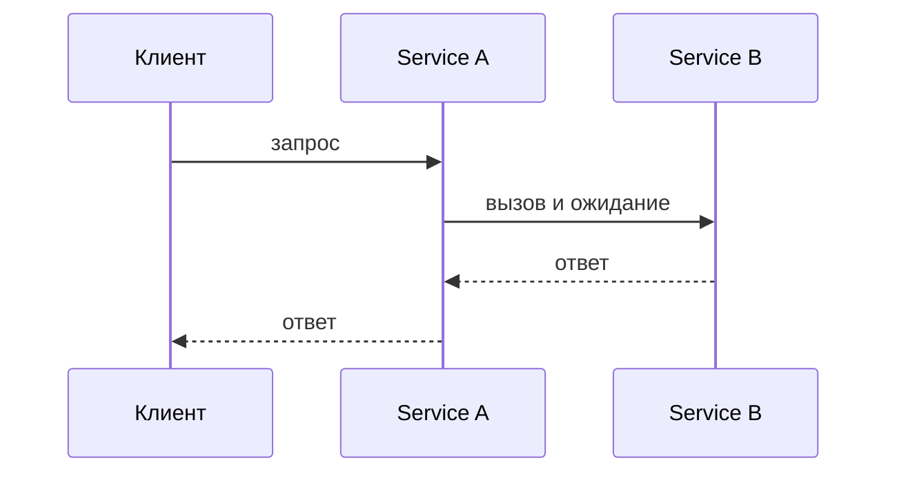
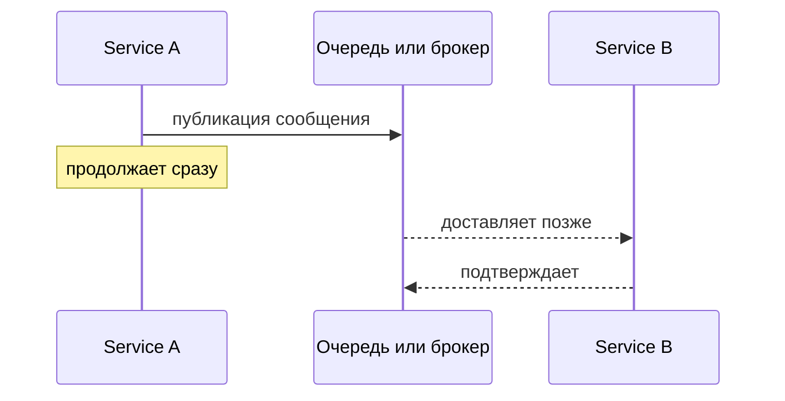
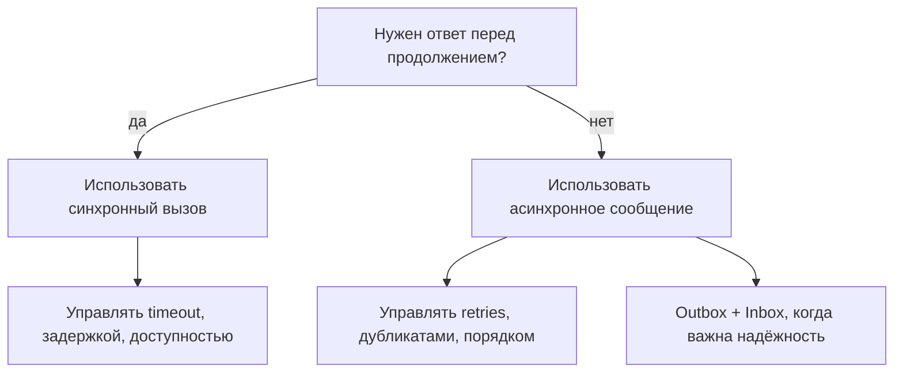

# Синхронная и асинхронная коммуникация

В микросервисах стиль коммуникации отвечает на один практический вопрос: нужен ли вызывающей стороне ответ, прежде чем она сможет продолжить работу?

Синхронная коммуникация — это прямой request/response. Service A вызывает Service B, ждёт и только после этого возвращает собственный результат. Это похоже на ожидание у стойки на кухне, пока повар отдаст блюдо: просто и результат сразу понятен, но вы заблокированы, пока кухня работает.

Асинхронная коммуникация — это передача через сообщение, очередь, event stream, callback или background job. Service A публикует работу и продолжает выполнение; Service B обрабатывает её позже. Это похоже на отправку посылки через почту: вы не ждёте у стойки, пока получатель откроет коробку, но теперь нужны трекинг, повторы и план на случай задержки доставки.

## Ответ на собеседовании за 60 секунд

Синхронная коммуникация означает, что вызывающая сторона отправляет запрос и ждёт ответ, например HTTP-вызов из одного сервиса в другой. Это подходит, когда пользователю или бизнес-процессу нужен немедленный результат, но связывает вызывающий сервис с задержкой и доступностью вызываемого: если тот медленный или недоступен, страдает и вызывающий сервис.

Асинхронная коммуникация означает, что отправитель публикует сообщение, команду, событие или job и не ждёт завершения обработки у получателя. Это подходит для фоновой работы, интеграции сервисов, сглаживания всплесков нагрузки и уменьшения зависимости от доступности другого сервиса. Цена — результат не мгновенный, поэтому система должна обрабатывать eventual consistency, повторы, дубликаты сообщений, порядок, мониторинг и восстановление после сбоев.

Короткий ответ: sync — это «спросить и ждать»; async — «отправить и продолжить». Выбирайте sync для немедленных ответов и простых request-flow; выбирайте async, когда задержанная обработка допустима, а развязка или устойчивость важнее.

## Как их сравнивать

Первое отличие — момент получения результата. В sync-вызовах ответ является частью того же взаимодействия; в async-потоках завершение происходит позже и может быть видно через другое событие, status endpoint, уведомление или polling. Представьте столик в ресторане: sync — спросить официанта и ждать ответ сейчас; async — оставить заказной лист и позже проверить табло.

Второе отличие — связанность. Sync-сервисы связаны во времени, потому что обе стороны должны быть доступны в один и тот же момент. Async-сервисы меньше связаны во времени, потому что брокер может удерживать работу, пока consumer занят или временно недоступен. Это как светофор и почтовый ящик: на светофоре все должны согласоваться прямо сейчас, а почтовый ящик хранит письма, пока не придёт почтальон.

Обработка сбоев тоже меняется. В sync-коммуникации сбои обычно видны сразу как timeout, error response или событие circuit breaker. В async-коммуникации сбои чаще обрабатываются через retries, dead-letter queues, idempotent consumers и операционные alerts. Это как телефонный звонок, который срывается явно, и посылка, для которой нужны трекинг и повторная доставка.

Consistency тоже меняется. Sync-потоки часто упрощают возврат самого свежего ответа вызывающей стороне. Async-потоки часто дают eventual consistency: один сервис уже принял работу, но другие сервисы догоняют позже. Это как доска заказов на кухне: кассир уже принял заказ, но блюдо ещё не готово на каждой станции.

Сложность не исчезает, а переезжает. Sync-коммуникация сохраняет поток простым для чтения, но требует timeouts, bulkheads и fallback behavior. Async-коммуникация прячет ожидание от вызывающей стороны, но требует message contracts, correlation ids, tracing, retry policies и защиты от дубликатов. Это как выбор между одной очередью на кассе и сортировочным залом посылок: очередь сглаживает наплыв, но сортировке нужны ярлыки и трекинг.

## Когда что использовать

Используйте синхронную коммуникацию, когда вызывающая сторона не может продолжить без ответа: проверка остатков перед подтверждением заказа, валидация credentials, чтение профиля для страницы или возврат данных напрямую API-клиенту. В жизни это касса, которая спрашивает платёжный терминал, одобрена ли оплата, прежде чем выдать чек.

Используйте асинхронную коммуникацию, когда работа может произойти после первого ответа: отправка email, генерация отчётов, индексация search data, обработка медиа, выполнение шага workflow после изменения состояния или уведомление других сервисов о domain event. Это почтовая модель: отправитель отдаёт конверт, а доставка завершается позже.

Осторожно используйте асинхронные сообщения для изменений состояния между сервисами. Если сервис меняет свою базу данных и должен надёжно опубликовать событие, [Outbox pattern](topic:outbox-pattern) помогает не потерять это событие. Если consumer может получить одно и то же сообщение больше одного раза, [Inbox pattern](topic:inbox-pattern) помогает дедуплицировать его. Эти паттерны похожи на запись посылки в журнал отправки и проверку журнала получения перед повторной обработкой.

Для выбора брокера, модели доставки, retention и routing сравните системы вроде Kafka и RabbitMQ в [Kafka vs RabbitMQ](topic:kafka-vs-rabbitmq). В почтовой аналогии это выбор между конвейером с воспроизводимой историей и распределительным столом, который отправляет задачи работникам.

## Значение в production

Синхронные цепочки могут создавать каскадную задержку. Если Service A ждёт B, B ждёт C, а C медленный, пользовательский запрос может уйти в timeout, даже если A исправен. Это как кухня, где один недостающий ингредиент останавливает всю линию поваров.

Асинхронные очереди могут поглощать всплески нагрузки. Producers быстро публикуют сообщения, а consumers обрабатывают их с устойчивой скоростью, но глубина очереди становится важным показателем здоровья. Это как сортировочная корзина на почте: она защищает стойку от часа пик, но растущая гора означает, что доставка отстаёт.

Async-системам нужен явный операционный дизайн. Нужны message schemas, versioning, correlation ids, tracing, retry limits, dead-letter queues и dashboards. Это как маркировать каждую посылку отправителем, получателем, номером отслеживания и правилами возврата; без этого задержанную работу трудно расследовать.

Sync-системам нужны строгие границы. Нужны timeouts, retry budgets, circuit breakers и понятное fallback behavior. Это как заранее решить, сколько клиент ждёт у стойки, прежде чем вы предложите другой вариант.

## Частые заблуждения

«Асинхронно значит быстрее» — неверно. Async может позволить вызывающей стороне ответить раньше, но вся работа может завершиться позже. Это как оставить бельё в прачечной: вы уходите быстро, но вещи не становятся чистыми мгновенно.

«Асинхронно значит без ошибок» — неверно. Ошибки всё равно происходят; они просто переезжают в retries, dead-letter queues, monitoring и compensation logic. Это как посылка с неудачной доставкой: рядом никто не слышит явное «нет», но сбой всё равно нужно обработать.

«Синхронно значит плохая архитектура» — неверно. Для немедленных чтений и решений sync-вызовы часто являются самым чистым дизайном. Это как спросить у кассира сегодняшнюю цену: превращать это в отложенное письмо было бы странно.

«Очередь автоматически даёт exactly-once processing» — неверно. Многие системы дают at-least-once delivery, поэтому consumers должны выдерживать дубликаты. Надёжные async-потоки часто комбинируют гарантии брокера с идемпотентностью, [Outbox pattern](topic:outbox-pattern) и [Inbox pattern](topic:inbox-pattern). Это как получить две квитанции доставки на одну посылку и проверить журнал, прежде чем списать деньги дважды.

«Async полностью убирает связанность» — неверно. Он уменьшает связанность во времени, но сервисы всё ещё связаны message schema, бизнес-смыслом, ожиданиями по порядку и операционными контрактами. Это как два офиса, которые работают по формам: они не встречаются у одной стойки, но оба должны понимать одну и ту же форму.
