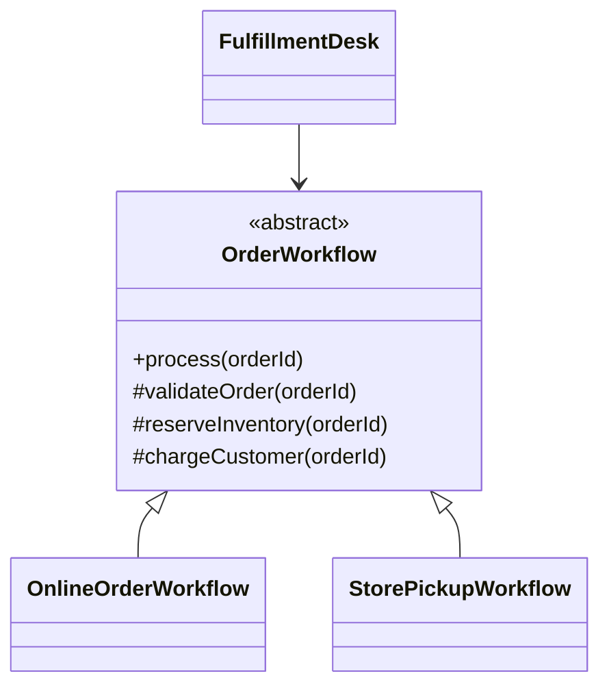
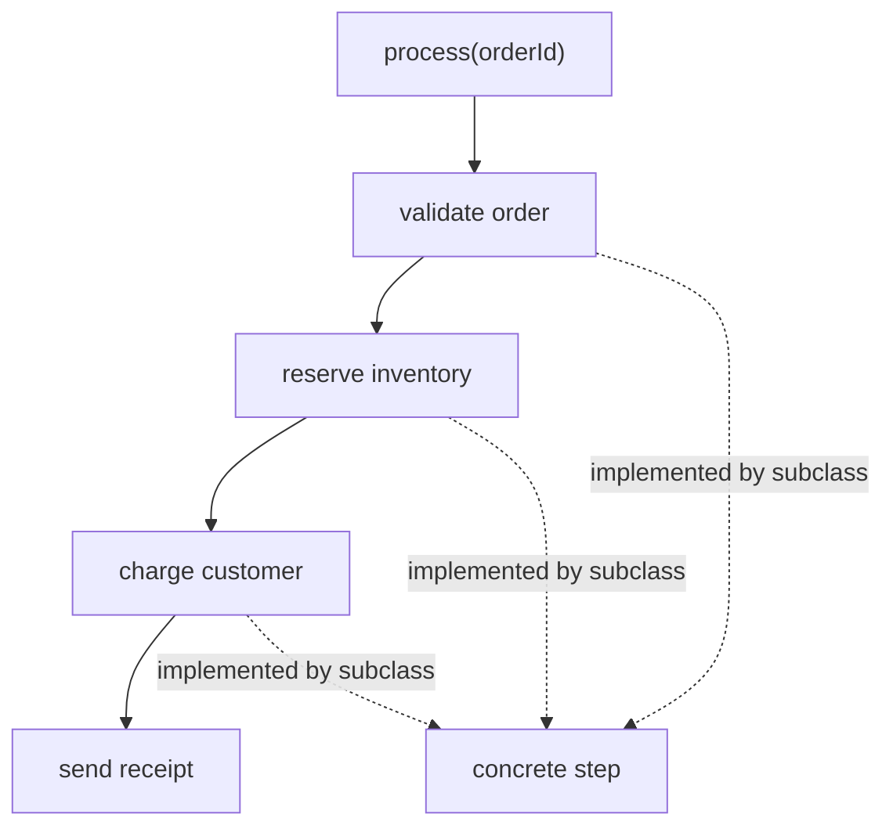

# Template Method Pattern

> **Practice mode.** This is a *structural* topic: there is no "Run". You build
> the pattern as real classes in the file tree on the left, press **Analyze**, and
> the app compiles your code, draws the **class diagram** from it, and checks the
> missions against the relationships it finds.

## The Problem It Solves

**Template Method** solves the problem of many algorithms having the same overall
order but different details. The abstract base class owns the stable recipe, and
subclasses provide the steps that vary. Like a post office checklist, every
parcel is weighed, labeled, paid for, and dispatched in the same order, even
though international and local parcels fill in different paperwork.

The key idea is inversion of control inside inheritance: the base class calls
methods implemented by subclasses, instead of each subclass rewriting the whole
algorithm. Like a kitchen head chef setting the order of stations, each cook owns
one station, but the service flow is not reinvented for every dish.

This pattern is related to [OOP Principles](topic:oop-principles) because it uses
inheritance and polymorphism, and it should still respect [SOLID Principles](topic:solid-principles):
the base class should capture a real invariant, not become a rigid superclass for
unrelated behavior. Like a traffic route with fixed checkpoints, the route helps
only when every vehicle genuinely needs those checkpoints.

## The Target Shape

You will build an order workflow. `OrderWorkflow` fixes the high-level
`process(...)` algorithm, concrete subclasses fill in the primitive steps, and
`FulfillmentDesk` depends on the abstract workflow type:

- `OrderWorkflow` is the abstract class with the template method. Like a printed
  kitchen ticket, it says which stations happen and in what order.
- `process(...)` is the template method. It is usually `final` so subclasses
  cannot reorder the algorithm. Like traffic lights, drivers can choose the car,
  but not the meaning of red, yellow, and green.
- `validateOrder(...)`, `reserveInventory(...)`, and `chargeCustomer(...)` are
  primitive operations. Subclasses implement them. Like a post office form with
  blank boxes, the layout is fixed, but each branch writes its own details.
- `sendReceipt(...)` can be a default step or a hook. A hook lets subclasses
  customize optional behavior without changing the algorithm order. Like a
  kitchen adding garnish only for some dishes, the main service still follows the
  same route.
- `FulfillmentDesk` should hold `OrderWorkflow`, not a concrete subclass. Like a
  counter clerk following the common checklist, it does not need to know whether
  the order is shipped or picked up.

## Algorithm Flow

The template method is the visible entry point. It calls the steps in a fixed
sequence, and dynamic dispatch sends each overridable step to the selected
subclass:

In code, the base class keeps the algorithm readable in one place. The subclasses
stay focused on details. Like a recipe card taped above a kitchen counter, the
sequence is easy to audit, while each cook still brings a specific technique.

## How To Build It

1. Keep `OrderWorkflow` abstract and keep `process(...)` as the single public
   entry point. Everyday analogy: the service counter has one queue, even if the
   back room has several specialists.
2. Add `OnlineOrderWorkflow extends OrderWorkflow` and implement the abstract
   steps for delivery. Everyday analogy: the delivery lane still follows the same
   traffic route, but it stops at the shipping desk.
3. Add `StorePickupWorkflow extends OrderWorkflow` and implement the same steps
   for pickup. Everyday analogy: the pickup lane uses the same road signs, but
   parks at a different window.
4. Give `FulfillmentDesk` a field of type `OrderWorkflow` and call
   `workflow.process(orderId)`. Everyday analogy: the clerk chooses the correct
   checklist and then follows it, instead of memorizing every branch procedure.

## 60-Second Interview Answer

> Template Method is a behavioral pattern where an abstract base class defines
> the fixed skeleton of an algorithm in a template method, often marked `final`,
> and delegates selected steps to abstract or overridable methods implemented by
> subclasses. It is useful when several variants share the same sequence but
> differ in individual steps. The benefit is reuse and a single place for the
> invariant workflow; the risk is tight coupling through inheritance. Compared
> with [Strategy](topic:strategy), Template Method varies behavior by subclassing
> parts of an algorithm, while Strategy varies a whole algorithm object through
> composition.

## Production Relevance

Template Method appears in frameworks and base classes that define a lifecycle:
parse then validate then handle, open resource then process then close, or start
transaction then execute then clean up. Like a restaurant opening checklist, the
sequence protects the business from skipped steps.

In Java, you can see the idea in classes that provide a fixed public operation
and protected extension methods. It is also close to [Factory Method vs Abstract Factory](topic:factory-method-vs-abstract-factory):
Factory Method is often a protected step inside a larger template. Like a kitchen
workflow choosing which pan to use at one station, object creation can be one
customizable step in the recipe.

Template Method is not a replacement for every conditional. If the variants are
selected at runtime and should be swappable independently, [Strategy](topic:strategy)
is often cleaner. Like choosing between two delivery companies at the counter,
composition is easier when the choice changes per order.

## Common Misconceptions

- **"Template Method is just an abstract class."** No. The pattern is the fixed
  algorithm calling overridable steps. Like a bus timetable, the value is the
  planned route, not merely the existence of buses.
- **"Every method should be overridable."** No. Only variation points should be
  abstract or protected hooks; the template method should protect the invariant
  order. Like a traffic system, too many optional turns destroy the route.
- **"Subclasses should call the steps themselves."** No. The base class should
  orchestrate the algorithm. Like a post office supervisor calling each counter
  in order, the clerk at one counter should not run the whole building.
- **"It is always better than Strategy."** No. Template Method uses inheritance;
  Strategy uses composition. Like a built-in kitchen layout versus swapping a
  portable appliance, each fits a different kind of change.
- **"Hooks are the same as required steps."** No. Required primitive operations
  must be implemented; hooks usually have a default no-op or optional behavior.
  Like optional gift wrapping at a checkout, it should not block the main sale.
