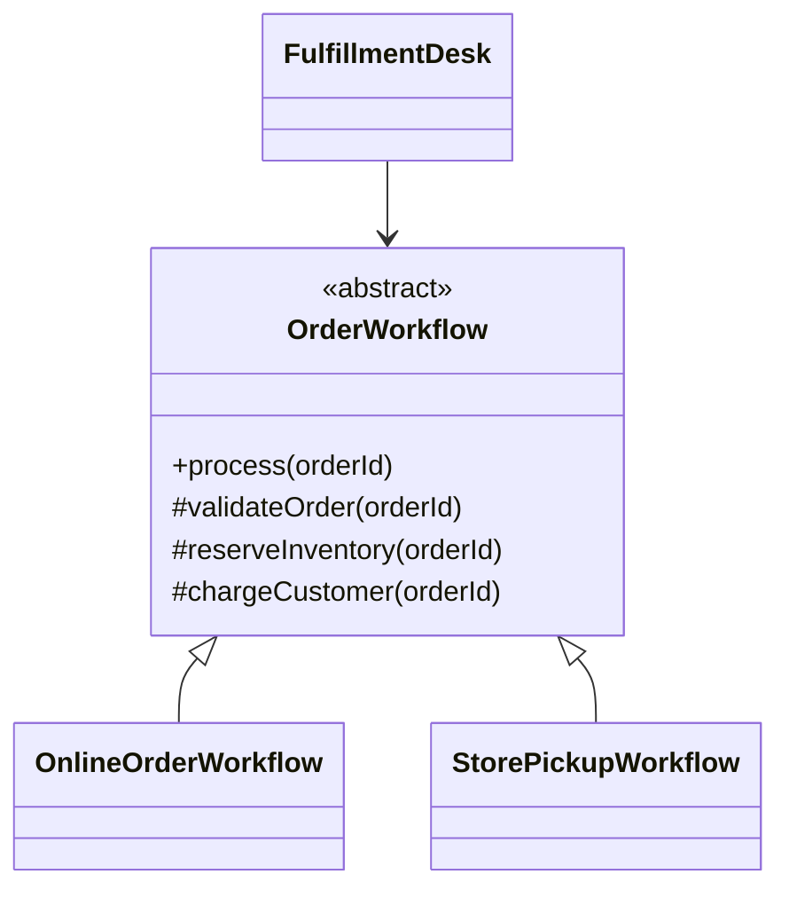
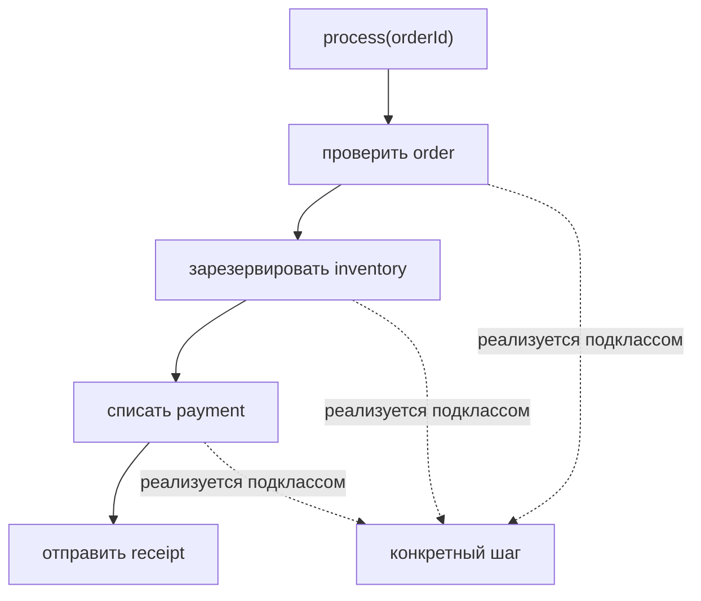

# Паттерн Template Method

> **Режим практики.** Это *структурная* тема: кнопки "Run" нет. Вы собираете
> паттерн как настоящие классы в дереве файлов слева, нажимаете **Analyze**, а
> приложение компилирует код, рисует **диаграмму классов** и проверяет миссии по
> найденным связям.

## Какую проблему он решает

**Template Method** решает проблему, когда у нескольких алгоритмов один и тот же
общий порядок, но разные детали. Абстрактный базовый класс владеет стабильным
рецептом, а подклассы предоставляют изменяемые шаги. Как контрольный список на
почте: каждую посылку взвешивают, маркируют, оплачивают и отправляют в одном
порядке, хотя международные и местные посылки заполняют разные документы.

Ключевая идея — inversion of control внутри наследования: базовый класс вызывает
методы, реализованные подклассами, вместо того чтобы каждый подкласс заново
переписывал весь алгоритм. Как шеф на кухне задаёт порядок станций: каждый повар
отвечает за свою станцию, но поток обслуживания не придумывается заново для
каждого блюда.

Этот паттерн связан с [OOP Principles](topic:oop-principles), потому что использует
наследование и полиморфизм, и всё равно должен уважать [SOLID Principles](topic:solid-principles):
базовый класс должен фиксировать настоящий инвариант, а не превращаться в жёсткий
superclass для несвязанного поведения. Как дорожный маршрут с фиксированными
контрольными точками: он помогает только тогда, когда каждой машине правда нужны
эти точки.

## Целевая форма

Вы построите workflow обработки заказа. `OrderWorkflow` фиксирует высокоуровневый
алгоритм `process(...)`, конкретные подклассы заполняют primitive steps, а
`FulfillmentDesk` зависит от абстрактного типа workflow:

- `OrderWorkflow` — абстрактный класс с template method. Как напечатанный талон
  на кухне: он говорит, какие станции идут и в каком порядке.
- `process(...)` — template method. Обычно его делают `final`, чтобы подклассы
  не могли переставить алгоритм. Как светофоры: водитель может выбрать машину,
  но не смысл красного, жёлтого и зелёного.
- `validateOrder(...)`, `reserveInventory(...)` и `chargeCustomer(...)` — primitive
  operations. Подклассы их реализуют. Как почтовая форма с пустыми полями:
  раскладка фиксирована, но каждое отделение вписывает свои детали.
- `sendReceipt(...)` может быть шагом по умолчанию или hook. Hook позволяет
  подклассам настроить необязательное поведение, не меняя порядок алгоритма. Как
  украшение блюда на кухне: оно добавляется только для некоторых блюд, но основной
  поток обслуживания остаётся тем же.
- `FulfillmentDesk` должен хранить `OrderWorkflow`, а не конкретный подкласс. Как
  сотрудник у стойки, который следует общему чеклисту и не обязан знать, заказ
  отправляют доставкой или выдают в магазине.

## Поток алгоритма

Template method — видимая точка входа. Он вызывает шаги в фиксированной
последовательности, а dynamic dispatch отправляет каждый переопределяемый шаг в
выбранный подкласс:

В коде базовый класс держит алгоритм читаемым в одном месте. Подклассы
сосредоточены на деталях. Как карточка рецепта над кухонной стойкой: порядок
легко проверить, а каждый повар всё равно применяет конкретную технику.

## Как собрать

1. Оставьте `OrderWorkflow` абстрактным и сохраните `process(...)` как единую
   публичную точку входа. Бытовая аналогия: у стойки обслуживания одна очередь,
   даже если в подсобке работает несколько специалистов.
2. Добавьте `OnlineOrderWorkflow extends OrderWorkflow` и реализуйте абстрактные
   шаги для доставки. Бытовая аналогия: линия доставки едет по тем же дорожным
   знакам, но заезжает к стойке отправки.
3. Добавьте `StorePickupWorkflow extends OrderWorkflow` и реализуйте те же шаги
   для самовывоза. Бытовая аналогия: линия самовывоза использует те же знаки, но
   паркуется у другого окна.
4. Дайте `FulfillmentDesk` поле типа `OrderWorkflow` и вызывайте
   `workflow.process(orderId)`. Бытовая аналогия: сотрудник выбирает правильный
   чеклист и следует ему, а не запоминает процедуру каждого филиала.

## Ответ за 60 секунд

> Template Method — это поведенческий паттерн, в котором абстрактный базовый класс
> задаёт фиксированный скелет алгоритма в template method, часто помеченном
> `final`, и делегирует отдельные шаги abstract или overridable методам,
> реализованным подклассами. Он полезен, когда несколько вариантов имеют одну и
> ту же последовательность, но отличаются отдельными шагами. Польза — reuse и
> единое место для инвариантного workflow; риск — сильная связность через
> наследование. По сравнению со [Strategy](topic:strategy), Template Method
> меняет поведение через подклассы частей алгоритма, а Strategy меняет целый
> объект алгоритма через композицию.

## Значение в production

Template Method встречается во фреймворках и базовых классах, которые задают
lifecycle: разобрать, затем проверить, затем обработать; открыть ресурс, затем
выполнить работу, затем закрыть; начать transaction, затем выполнить код, затем
почистить. Как чеклист открытия ресторана, последовательность защищает бизнес от
пропущенных шагов.

В Java эту идею можно увидеть в классах, где есть фиксированная публичная
операция и protected extension methods. Она также близка к [Factory Method vs Abstract Factory](topic:factory-method-vs-abstract-factory):
Factory Method часто является protected шагом внутри более крупного template. Как
кухонный workflow выбирает нужную сковороду на одной станции, создание объекта
может быть одним настраиваемым шагом рецепта.

Template Method не заменяет каждый conditional. Если варианты выбираются во время
выполнения и должны независимо подменяться, [Strategy](topic:strategy) часто чище.
Как выбор между двумя службами доставки у стойки: composition проще, когда выбор
меняется для каждого заказа.

## Частые заблуждения

- **"Template Method — это просто abstract class."** Нет. Паттерн — это
  фиксированный алгоритм, который вызывает переопределяемые шаги. Как расписание
  автобуса: ценность в маршруте, а не просто в существовании автобусов.
- **"Каждый метод должен быть overridable."** Нет. Abstract или protected hooks
  нужны только для точек вариативности; template method должен защищать
  инвариантный порядок. Как дорожная система: слишком много необязательных
  поворотов разрушает маршрут.
- **"Подклассы должны сами вызывать шаги."** Нет. Базовый класс должен
  оркестрировать алгоритм. Как начальник почты вызывает каждую стойку по порядку:
  сотрудник одной стойки не должен управлять всем зданием.
- **"Он всегда лучше Strategy."** Нет. Template Method использует inheritance;
  Strategy использует composition. Как встроенная планировка кухни и сменный
  переносной прибор: каждый вариант подходит для своего типа изменений.
- **"Hooks — то же самое, что обязательные шаги."** Нет. Обязательные primitive
  operations должны быть реализованы; hooks обычно имеют default no-op или
  необязательное поведение. Как подарочная упаковка на кассе: она не должна
  блокировать основную продажу.
