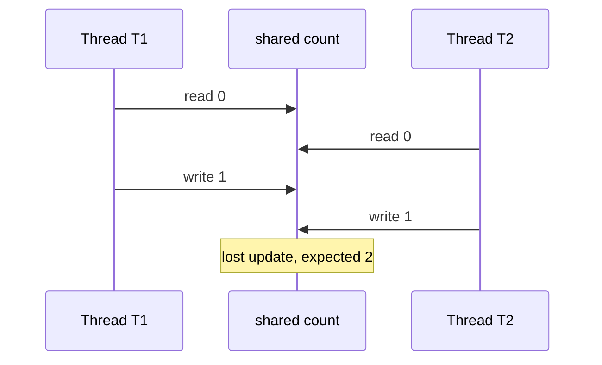
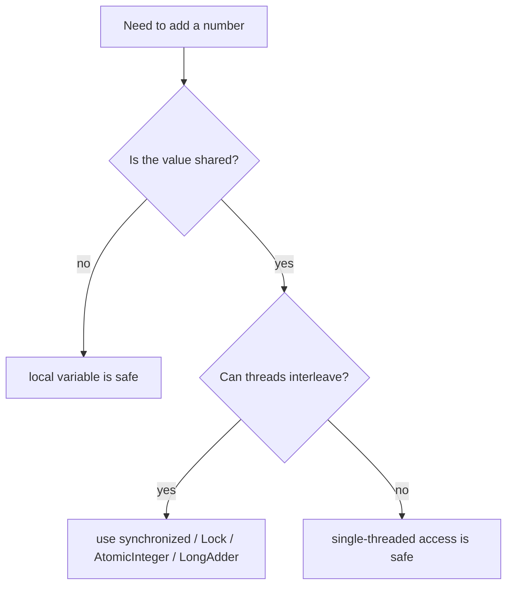

# Thread Safety of Numeric Addition

Numeric addition is not one question; it depends on where the number lives. If the value is local to one thread, the addition is safe because no other thread can touch that stack frame. Think of one cook adding salt to a private bowl: nobody else can reach into that bowl.

If the value is shared mutable state, `count = count + 1` is not automatically thread-safe. It is a read-modify-write sequence: read `count`, compute `count + 1`, write the result back. At a busy post office, two clerks can both read ticket number 10, both prepare ticket 11, and both stamp 11 unless the counter is coordinated.

The race is called a lost update. Both threads did real work, but one result overwrote the other. In traffic terms, two cars enter the same narrow lane because there is no traffic light; one car's turn effectively vanishes.

To make shared addition safe, protect the whole read-modify-write sequence with the same lock, use an atomic class such as `AtomicInteger`, or use `LongAdder` when many threads mostly add and later read a total. This is the same core idea as a [Critical Section](topic:critical-section): the shared counter is the kitchen stove, and only one cook should change the flame at a time.

`volatile` is a common trap. It gives visibility for reads and writes, but it does not combine read, add, and write into one atomic action. It is like a clear display board in a train station: everyone sees the latest number, but two workers can still update it in the wrong order if there is no rule for taking turns.

Real Java programs often mix this with broader [Java Multithreading](topic:java-multithreading) decisions. A counter in a singleton service, a metric registry, or a cache entry may be shared by many request threads. Collection APIs can also hide or expose compound races, which is why the distinction between [Concurrent and synchronized collections](topic:concurrent-synchronized-collections) matters.

## 60-second interview answer

Addition is thread-safe only when the data is not shared or when the whole update is made atomic. A local variable is safe because each thread has its own stack frame. A shared `int` field is different: `count++` or `count = count + 1` reads the old value, calculates a new value, and writes it back. Two threads can both read the same old value and overwrite each other, causing a lost update. `volatile` is not enough because it does not make the compound operation atomic. Use `synchronized`, `Lock`, `AtomicInteger`, or `LongAdder`, depending on whether you need a wider critical section, a single atomic counter, or high-throughput counters.

## Production Relevance

Counters look harmless, so they often appear in request counts, inventory reservations, retry statistics, and rate-limit state. A missing atomic update can undercount traffic or oversell inventory. In a warehouse analogy, two workers must not both remove "the last box" based on the same old shelf count.

The right tool depends on the surrounding operation. If updating the number must happen together with other shared state, use one critical section. If it is just a counter, `AtomicInteger` or `AtomicLong` is simpler. If many threads increment heavily and exact intermediate reads are less important, `LongAdder` can reduce contention. That is like choosing between one locked cash drawer, a single numbered ticket machine, or several collection jars counted at the end.

## Common Misconceptions

- "Addition is a CPU instruction, so it is atomic." Java expression semantics do not promise that `x = x + 1` becomes one atomic shared-memory action. The kitchen receipt still has separate read, calculate, and write moments.
- "`int` reads and writes are atomic, therefore `int++` is atomic." A single read or write can be atomic while the compound update is not. Reading one price tag is not the same as reserving, changing, and publishing the new price.
- "`volatile` fixes counters." `volatile` helps threads see changes, but it does not stop two threads from calculating from the same old value. The post office display is visible, but clerks still need a turn-taking rule.
- "It failed only under load, so the code is probably fine." Races are timing bugs. A quiet kitchen may hide two cooks reaching for the same pan, but the dinner rush exposes it.
- "Synchronize every method." Correctness comes first, but large locks can reduce throughput or create deadlock risk. Lock the smallest shared operation that must be consistent, like reserving the stove only while the pan is actually on it.
