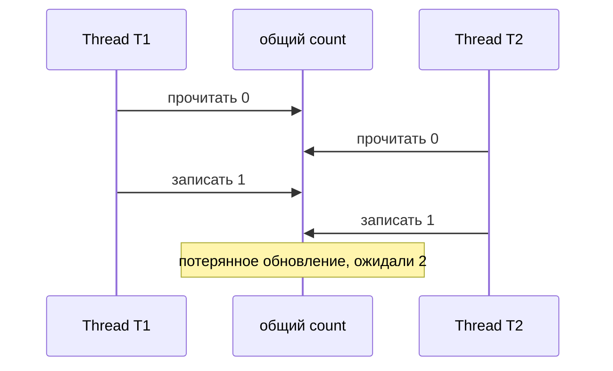
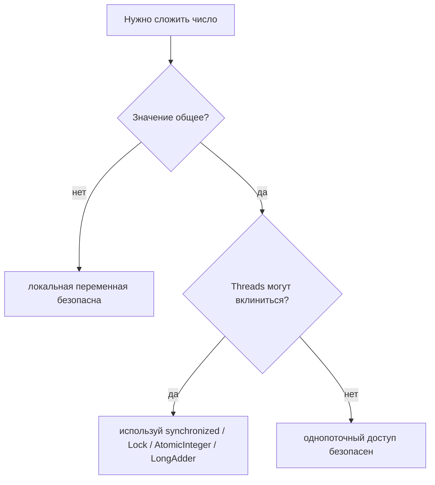

# Потокобезопасность сложения чисел

Сложение чисел нельзя оценивать одним ответом; важно, где живёт число. Если значение локально для одного thread, сложение безопасно, потому что другой thread не может трогать этот stack frame. Представь повара, который добавляет соль в свою личную миску: никто другой не может залезть в эту миску.

Если значение является общим изменяемым состоянием, `count = count + 1` не становится потокобезопасным автоматически. Это последовательность read-modify-write: прочитать `count`, вычислить `count + 1`, записать результат обратно. В загруженном почтовом отделении два оператора могут оба прочитать номер талона 10, оба подготовить талон 11 и оба поставить печать 11, если выдача не скоординирована.

Такая race называется lost update. Оба threads сделали реальную работу, но один результат перезаписал другой. Если представить дорогу, две машины въехали в одну узкую полосу без светофора; чей-то ход фактически исчез.

Чтобы сделать сложение общего значения безопасным, защити всю последовательность read-modify-write одним и тем же lock, используй атомарный класс вроде `AtomicInteger` или используй `LongAdder`, когда много threads в основном добавляют значения и позже читают итог. Это та же основная идея, что и [Critical Section](topic:critical-section): общий counter похож на кухонную плиту, и только один повар должен менять огонь в один момент.

`volatile` — частая ловушка. Он даёт visibility для чтений и записей, но не объединяет чтение, сложение и запись в одно атомарное действие. Это как понятное табло на вокзале: все видят последний номер, но два работника всё равно могут обновить его в неправильном порядке, если нет правила очередности.

В реальных Java программах это часто связано с более широкими решениями по [Java Multithreading](topic:java-multithreading). Counter в singleton service, registry метрик или entry кеша может быть общим для множества request threads. API коллекций тоже могут скрывать или открывать compound races, поэтому важна разница между [Concurrent и synchronized collections](topic:concurrent-synchronized-collections).

## Ответ за 60 секунд

Сложение потокобезопасно только когда данные не являются общими или когда всё обновление сделано атомарным. Локальная переменная безопасна, потому что у каждого thread свой stack frame. Общий field типа `int` — другое дело: `count++` или `count = count + 1` читает старое значение, вычисляет новое и записывает его обратно. Два threads могут оба прочитать одно и то же старое значение и перезаписать друг друга, вызвав lost update. `volatile` недостаточно, потому что он не делает compound operation атомарной. Используй `synchronized`, `Lock`, `AtomicInteger` или `LongAdder` в зависимости от того, нужна ли более широкая critical section, один атомарный counter или counters с высокой пропускной способностью.

## Зачем это в production

Counters выглядят безобидно, поэтому часто встречаются в подсчёте requests, резервировании товаров, статистике retry и state для rate limit. Пропущенное атомарное обновление может занизить трафик или продать товара больше, чем есть. В аналогии со складом два работника не должны оба забрать «последнюю коробку», опираясь на один и тот же старый остаток на полке.

Правильный инструмент зависит от окружающей операции. Если обновление числа должно происходить вместе с другим общим состоянием, используй одну critical section. Если это просто counter, `AtomicInteger` или `AtomicLong` проще. Если много threads активно делают increment, а точные промежуточные чтения менее важны, `LongAdder` может снизить contention. Это похоже на выбор между одной кассой под lock, одним автоматом с номерками или несколькими банками для сбора денег, которые считают в конце.

## Частые заблуждения

- «Сложение — это CPU instruction, значит оно атомарно». Семантика Java expression не обещает, что `x = x + 1` станет одним атомарным действием с общей памятью. В кухонном чеке всё равно есть отдельные моменты чтения, вычисления и записи.
- «Чтение и запись `int` атомарны, значит `int++` атомарен». Одно чтение или одна запись могут быть атомарными, но compound update — нет. Прочитать один ценник не то же самое, что зарезервировать товар, изменить цену и опубликовать новую.
- «`volatile` чинит counters». `volatile` помогает threads видеть изменения, но не мешает двум threads вычислить новое значение из одного и того же старого. Табло на почте видно всем, но операторам всё равно нужно правило очередности.
- «Ошибка проявилась только под нагрузкой, значит код скорее нормальный». Races зависят от timing. В тихой кухне можно не заметить, как два повара тянутся к одной сковороде, но вечерний наплыв это проявит.
- «Нужно синхронизировать каждый метод». Корректность важнее всего, но большие locks могут снизить throughput или создать риск deadlock. Блокируй минимальную общую операцию, которая должна быть согласованной, как занимать плиту только пока сковорода действительно на ней.
