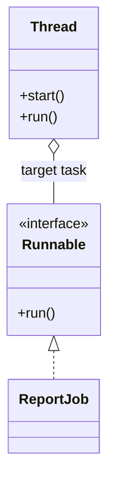
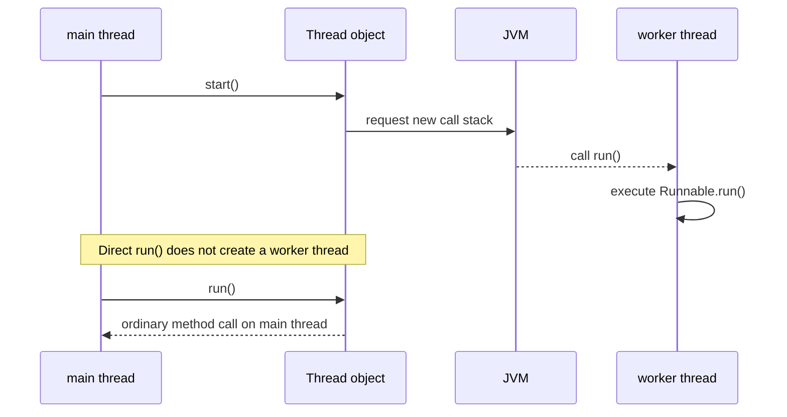

# Thread vs Runnable

## Intuition

`Runnable` is a task: it says, "here is code that can be run" through one method, `run()`. `Thread` is an execution object: it represents a Java thread that the JVM can schedule. In a kitchen analogy, `Runnable` is the order ticket and `Thread` is the cook assigned to the ticket.

When you pass a `Runnable` to a `Thread`, you separate the work from the worker. The same work can later be run by another `Thread`, by an `ExecutorService`, or by a framework. Like a post office form, the delivery instruction can be handed to one courier today and another courier tomorrow without rewriting the instruction.

When you extend `Thread`, the worker and the work are fused into one class. That can run, but it is usually less flexible because Java classes can extend only one superclass. Like painting the recipe directly on one pan, it works for that pan but is awkward to reuse in another kitchen.

## What start() actually changes

`start()` asks the JVM to create a separate call stack and execute the thread's `run()` method there. Calling `run()` directly does not start a new thread; it is just a normal method call on the current thread. In traffic terms, `start()` opens a new lane, while `run()` directly keeps driving in the same lane.

## 60-second interview answer

`Runnable` is an interface that represents a unit of work with a `run()` method. `Thread` is a class that represents an actual Java thread of execution. You can pass a `Runnable` into a `Thread` constructor and call `start()` on the `Thread`; the JVM then runs the `Runnable` on a separate thread. Calling `run()` directly does not create a new thread. In most code, prefer `Runnable` or higher-level executors because it separates task logic from thread management, supports reuse, and avoids wasting the one superclass slot on `Thread`.

## Production relevance

Modern production code rarely creates raw `Thread` objects for every unit of work. It usually submits `Runnable` or `Callable` tasks to an executor, scheduler, or framework. The reason is operational: executors can limit thread counts, reuse worker threads, name them, shut them down, and report failures more consistently. Like a restaurant shift manager, an executor assigns many tickets to a controlled team instead of hiring a new cook for every sandwich.

`Runnable` has no return value and cannot throw checked exceptions from `run()`. If you need a result or checked failure handling, use `Callable` with `Future` or a higher-level async API. Like a delivery slip with no "return receipt" box, `Runnable` is enough for fire-and-forget work but not for collecting a result.

If the same `Runnable` instance is used by two `Thread` objects, its fields are shared between those executions. That is sometimes intentional, but mutable shared state must be protected, as in a [critical section](topic:critical-section). Like two cooks using the same prep bowl, they need a rule for who can stir and when.

## Common misconceptions

- "`Runnable` is a thread." No. It is only the task contract. A ticket is not the courier.
- "Calling `run()` starts a new thread." No. Only `start()` asks the JVM to create separate execution. Calling `run()` is like reading the ticket yourself at the counter.
- "Extending `Thread` is the normal approach." It is valid but usually not the best design. Implement `Runnable` when you want to separate work from execution. It is like keeping the recipe separate from the oven.
- "One `Runnable` means one execution." Not necessarily. The same instance can be attached to multiple `Thread` objects or submitted more than once. Like reusing the same checklist, make sure any mutable fields are safe.
- "`Thread` and `Runnable` solve synchronization." They do not. They only define how work is represented and started. Shared data still needs locks, concurrent collections, or another safe coordination mechanism.
