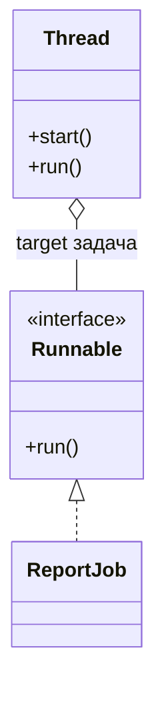
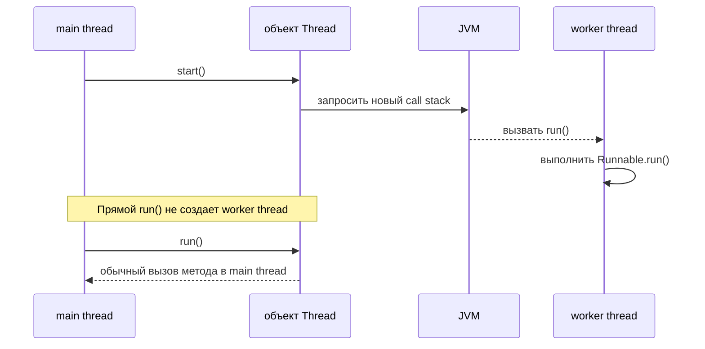

# Thread vs Runnable

## Интуиция

`Runnable` - это задача: она говорит, «вот код, который можно выполнить», через один метод `run()`. `Thread` - это объект выполнения: он представляет Java thread, который JVM может запланировать. В аналогии с кухней `Runnable` - это заказ, а `Thread` - повар, которому назначили этот заказ.

Когда ты передаешь `Runnable` в `Thread`, ты разделяешь работу и worker. Ту же работу позже можно выполнить другим `Thread`, через `ExecutorService` или через framework. Как бланк на почте, инструкция доставки может попасть одному курьеру сегодня и другому завтра без переписывания инструкции.

Когда ты наследуешься от `Thread`, worker и работа сливаются в один класс. Это может выполняться, но обычно менее гибко, потому что Java-класс может наследоваться только от одного superclass. Как если написать рецепт прямо на одной сковороде: для этой сковороды работает, но в другой кухне переиспользовать неудобно.

## Что меняет start()

`start()` просит JVM создать отдельный call stack и выполнить метод `run()` этого thread там. Прямой вызов `run()` не запускает новый thread; это обычный вызов метода в текущем thread. В терминах дорожного движения `start()` открывает новую полосу, а прямой `run()` продолжает ехать по той же полосе.

## Ответ за 60 секунд

`Runnable` - это интерфейс, который представляет единицу работы с методом `run()`. `Thread` - это класс, который представляет настоящий Java thread выполнения. Можно передать `Runnable` в конструктор `Thread` и вызвать `start()` у `Thread`; тогда JVM выполнит `Runnable` в отдельном thread. Прямой вызов `run()` не создает новый thread. В большинстве кода лучше предпочитать `Runnable` или более высокоуровневые executors, потому что это отделяет логику задачи от управления threads, поддерживает переиспользование и не тратит единственную возможность наследования на `Thread`.

## Практическая важность

В современном production-коде редко создают сырой объект `Thread` для каждой единицы работы. Обычно `Runnable` или `Callable` отправляют в executor, scheduler или framework. Причина операционная: executors могут ограничивать число threads, переиспользовать worker threads, задавать им имена, корректно завершаться и стабильнее сообщать об ошибках. Как менеджер смены в ресторане, executor распределяет много заказов по контролируемой команде, а не нанимает нового повара для каждого сэндвича.

У `Runnable` нет возвращаемого значения, и `run()` не может выбрасывать checked exceptions. Если нужен результат или обработка checked failure, используй `Callable` с `Future` или более высокоуровневый async API. Как квитанция доставки без поля «подтверждение возврата», `Runnable` подходит для fire-and-forget работы, но не для получения результата.

Если один и тот же экземпляр `Runnable` используется двумя объектами `Thread`, его поля общие для этих выполнений. Иногда это намеренно, но изменяемое общее состояние нужно защищать, как в [critical section](topic:critical-section). Как два повара с одной миской для заготовок, им нужно правило, кто и когда может мешать.

## Частые заблуждения

- «`Runnable` - это thread». Нет. Это только контракт задачи. Заказ не является курьером.
- «Вызов `run()` запускает новый thread». Нет. Только `start()` просит JVM создать отдельное выполнение. Вызвать `run()` - все равно что самому прочитать заказ у стойки.
- «Наследование от `Thread` - обычный подход». Это допустимо, но обычно не лучший дизайн. Реализуй `Runnable`, когда нужно отделить работу от выполнения. Это как держать рецепт отдельно от печи.
- «Один `Runnable` означает одно выполнение». Не обязательно. Один и тот же экземпляр можно привязать к нескольким объектам `Thread` или отправить несколько раз. Как при переиспользовании одного checklist, убедись, что изменяемые поля безопасны.
- «`Thread` и `Runnable` решают синхронизацию». Нет. Они только определяют, как работа представлена и запущена. Для общих данных все равно нужны locks, concurrent collections или другой безопасный механизм координации.
