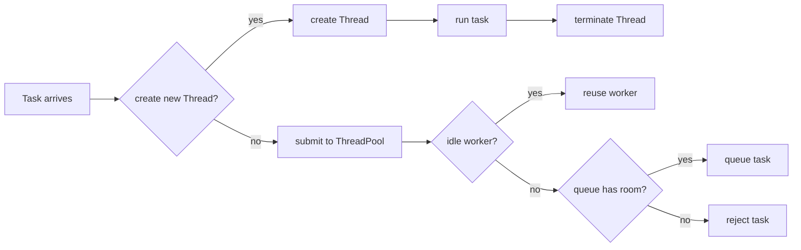
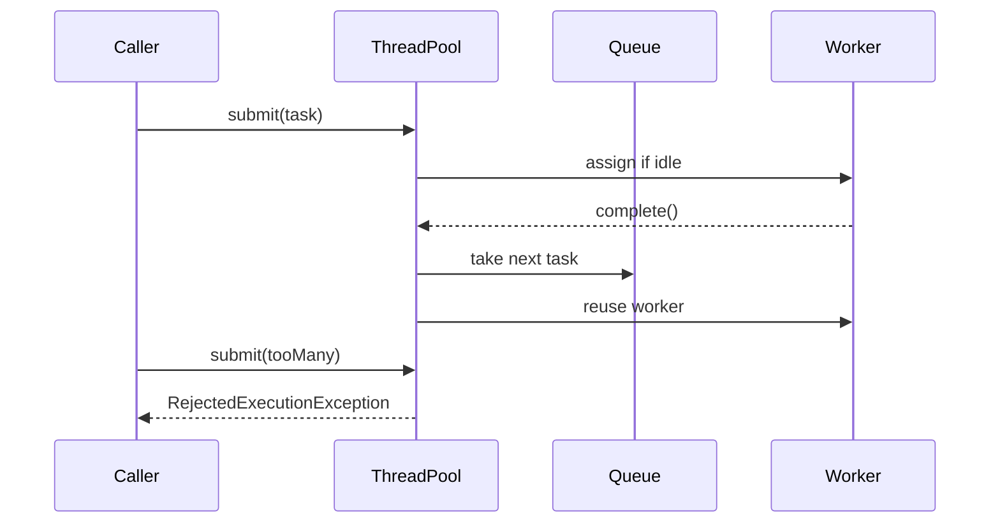

# Thread vs ThreadPool

## Intuition

Creating a `Thread` directly means one task gets one new Java thread, with its
own startup cost, stack, lifecycle, and termination. In a post office analogy,
this is like hiring a new clerk for every parcel and sending that clerk home
right after the parcel is handled.

A `ThreadPool` keeps a limited set of reusable worker threads. You submit
`Runnable` or `Callable` tasks, an idle worker takes one, and extra tasks wait in
a queue or get rejected when the pool is saturated. Like a real post office, the
number of counters is fixed, people form a line, and the building does not grow
new counters forever.

This topic builds on [Java Multithreading](topic:java-multithreading) and the
separation between task and worker from [Thread vs Runnable](topic:thread-vs-runnable).
If several pool tasks modify the same state, the rules from
[Critical Section](topic:critical-section) still apply.

## 60-second interview answer

`Thread` is the low-level execution object. If I create a new `Thread` for every
task, I pay thread creation cost each time, consume stack memory, and can easily
create too many concurrent threads under load. A `ThreadPool`, usually through
`ExecutorService` or `ThreadPoolExecutor`, owns a bounded set of reusable worker
threads. Tasks are submitted to the pool; workers take them, completed workers
are reused, and excess work is queued or rejected depending on configuration.
Direct `Thread` creation is acceptable for very small, rare, clearly controlled
background work. In production services, a pool is usually better because it
limits concurrency, amortizes thread creation cost, provides queueing and
shutdown control, and makes overload behavior explicit.

## What changes in practice

- Creation cost and lifetime. A direct `Thread` is born for one task and then
  dies. A pool worker lives across many tasks. Post office memory hook: do not
  hire a new clerk for every envelope when the same counter can handle the next
  customer.
- Concurrency limit. Direct creation can accidentally start hundreds or
  thousands of threads. A pool has a configured size. Post office memory hook:
  fixed counters prevent the lobby from turning into an uncontrolled crowd.
- Queueing and backpressure. A pool can keep accepted work in a queue while
  workers are busy. With a bounded queue, overload becomes visible through
  rejection. Post office memory hook: once the line reaches the door, new
  customers must be asked to come later.
- Reuse and task separation. The pool owns workers; your code usually submits
  `Runnable` or `Callable` tasks. Post office memory hook: the parcel is the
  task, the clerk is the worker, and the same clerk can handle many parcels.
- Shutdown. Pools must be shut down when the application no longer needs them,
  otherwise non-daemon workers can keep the JVM alive. Post office memory hook:
  closing time means no new customers, but clerks can finish the people already
  in line.

## Production relevance

Thread pools appear in web servers, async job executors, scheduled jobs,
database clients, message consumers, and Spring async execution such as
[@Async and Self-Invocation](topic:spring-async-self-invocation). The important
production question is not only "Thread or ThreadPool?", but also "how large is
the pool, how large is the queue, and what happens when the queue is full?" In a
post office, the manager chooses the number of counters, the line length, and
the policy for closing the door.

For CPU-bound work, pool size is usually close to the number of available CPU
cores. For I/O-bound work, a larger pool can make sense because many workers wait
on external systems. The analogy is traffic: one-lane CPU work cannot move more
cars by adding unlimited drivers, but I/O work often has drivers waiting at red
lights.

## Common misconceptions and traps

- "ThreadPool always makes code faster." Not always. It reduces creation cost
  and controls concurrency, but too many workers can increase context switching.
  Like opening too many counters in a tiny post office, workers start blocking
  each other.
- "A pool removes the need for synchronization." No. If pool tasks share mutable
  state, you still need proper locking, atomics, immutability, or confinement.
  Reusing clerks does not make two clerks safe to write the same form at once.
- "`Executors.newCachedThreadPool()` is always safe." It can create many threads
  under load. In post office terms, it keeps hiring clerks while the line grows,
  which can exhaust the building.
- "A huge queue is harmless." It may hide overload and increase latency until
  users time out. A very long line looks calm from the counter, but customers at
  the end are still waiting too long.
- "shutdown() kills running tasks immediately." `shutdown()` stops accepting new
  tasks and lets accepted tasks finish; `shutdownNow()` attempts interruption.
  Closing the door is different from throwing everyone out.
- "`ThreadLocal` is automatically clean in a pool." Pool workers are reused, so
  forgotten `ThreadLocal` values can leak into later tasks. It is like leaving
  the previous customer's papers on the clerk's desk.
