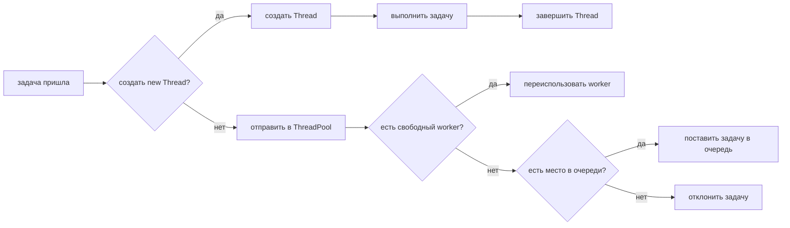
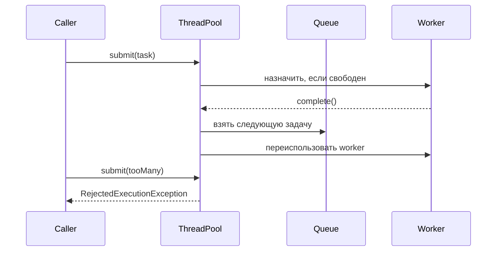

# Thread и ThreadPool

## Интуиция

Создание `Thread` напрямую означает, что одна задача получает один новый Java
thread со своей ценой запуска, stack, жизненным циклом и завершением. Аналогия с
почтой: это как нанимать нового сотрудника для каждой посылки и отпускать его
сразу после обработки этой посылки.

`ThreadPool` держит ограниченный набор переиспользуемых worker threads. Вы
отправляете задачи `Runnable` или `Callable`, свободный worker берет одну, а
лишние задачи ждут в очереди или отклоняются, когда pool перегружен. Как в
реальном почтовом отделении: число окон ограничено, люди встают в очередь, и
здание не достраивает бесконечные новые окна.

Эта тема опирается на [Java Multithreading](topic:java-multithreading) и
разделение задачи и worker из [Thread vs Runnable](topic:thread-vs-runnable).
Если несколько задач pool изменяют одно и то же состояние, правила из
[Critical Section](topic:critical-section) все еще действуют.

## Ответ за 60 секунд

`Thread` - это низкоуровневый объект выполнения. Если я создаю новый `Thread`
для каждой задачи, я каждый раз плачу цену создания thread, расходую stack memory
и под нагрузкой легко могу создать слишком много конкурентных threads.
`ThreadPool`, обычно через `ExecutorService` или `ThreadPoolExecutor`, владеет
ограниченным набором переиспользуемых worker threads. Задачи отправляются в
pool; workers берут их, завершившиеся workers переиспользуются, а лишняя работа
попадает в очередь или отклоняется в зависимости от настройки. Прямое создание
`Thread` допустимо для очень маленькой, редкой и строго контролируемой фоновой
работы. В production-сервисах обычно лучше pool, потому что он ограничивает
конкурентность, распределяет цену создания threads на много задач, дает очередь,
контроль shutdown и явное поведение при перегрузке.

## Что меняется на практике

- Цена создания и жизненный цикл. Прямой `Thread` рождается для одной задачи и
  затем умирает. Worker в pool живет через много задач. Подсказка с почтой: не
  нужно нанимать нового сотрудника для каждого конверта, если то же окно может
  принять следующего клиента.
- Ограничение конкурентности. Прямое создание может случайно запустить сотни или
  тысячи threads. У pool есть настроенный размер. Подсказка с почтой:
  фиксированные окна не дают залу превратиться в неконтролируемую толпу.
- Очередь и backpressure. Pool может держать принятую работу в очереди, пока
  workers заняты. С ограниченной очередью перегрузка становится видимой через
  отклонение. Подсказка с почтой: когда очередь дошла до двери, новых клиентов
  нужно попросить прийти позже.
- Переиспользование и разделение задачи. Pool владеет workers; ваш код обычно
  отправляет задачи `Runnable` или `Callable`. Подсказка с почтой: посылка - это
  задача, сотрудник - worker, и один сотрудник может обработать много посылок.
- Shutdown. Pools нужно останавливать, когда приложение больше в них не
  нуждается, иначе non-daemon workers могут удерживать JVM живой. Подсказка с
  почтой: время закрытия означает, что новых клиентов уже не принимают, но
  сотрудники могут закончить людей, которые уже стоят в очереди.

## Значение в production

Thread pools встречаются в web servers, async job executors, scheduled jobs,
database clients, message consumers и Spring async execution, например в
[@Async and Self-Invocation](topic:spring-async-self-invocation). Важный
production-вопрос не только "Thread или ThreadPool?", но и "какой размер pool,
какой размер очереди и что происходит, когда очередь заполнена?" На почте
руководитель выбирает число окон, длину очереди и правило закрытия двери.

Для CPU-bound работы размер pool обычно близок к числу доступных CPU cores. Для
I/O-bound работы больший pool может быть разумным, потому что многие workers
ждут внешние системы. Аналогия с дорогой: однополосная CPU-работа не поедет
быстрее от бесконечного числа водителей, а I/O-работа часто похожа на водителей,
которые стоят на красном свете.

## Частые заблуждения и ловушки

- "ThreadPool всегда ускоряет код." Не всегда. Он снижает цену создания и
  контролирует конкурентность, но слишком много workers увеличивают context
  switching. Как слишком много окон в маленьком отделении: сотрудники начинают
  мешать друг другу.
- "Pool убирает необходимость в синхронизации." Нет. Если задачи pool делят
  изменяемое состояние, все еще нужны lock, atomics, immutability или
  confinement. Переиспользование сотрудников не делает безопасной ситуацию,
  когда два сотрудника одновременно пишут в один бланк.
- "`Executors.newCachedThreadPool()` всегда безопасен." Под нагрузкой он может
  создать много threads. В терминах почты он продолжает нанимать сотрудников,
  пока очередь растет, и может исчерпать все помещение.
- "Огромная очередь безвредна." Она может скрывать перегрузку и увеличивать
  latency, пока пользователи не начнут получать timeouts. Очень длинная очередь
  выглядит спокойно у окна, но люди в конце все равно ждут слишком долго.
- "shutdown() сразу убивает running tasks." `shutdown()` прекращает прием новых
  задач и дает принятым задачам завершиться; `shutdownNow()` пытается выполнить
  interruption. Закрыть дверь - не то же самое, что выгнать всех наружу.
- "`ThreadLocal` автоматически чистый в pool." Workers в pool переиспользуются,
  поэтому забытые значения `ThreadLocal` могут утечь в следующие задачи. Это как
  оставить документы предыдущего клиента на столе сотрудника.
