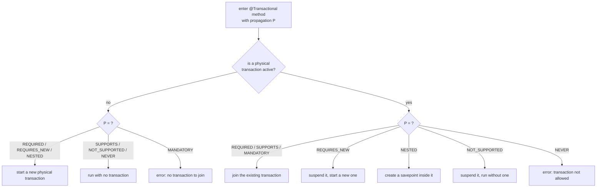
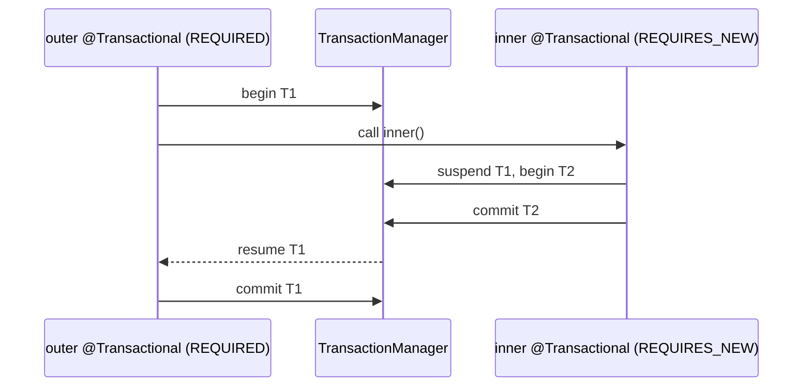

# Transaction Propagation

Transaction propagation answers one question: when a `@Transactional` method calls
another `@Transactional` method, **do they share one database transaction, or does
the inner one get its own?** Propagation is the setting on the inner method that
decides.

The key is to separate two things that beginners blur together:

- A **logical transaction** is a `@Transactional` boundary — a method Spring wraps
  with begin/commit logic.
- A **physical transaction** is the real database transaction on a connection.

Several logical boundaries can ride on **one** physical transaction. Think of a
restaurant bar tab: the *physical transaction* is the open tab on the till, and
each *logical boundary* is a waiter who walks up and adds drinks to it. Ten
waiters, one bill — until someone decides to open a separate tab.

## The Seven Propagation Types

**REQUIRED** (the default). Join the current transaction if one exists, otherwise
start a new one. This is the bar tab everyone shares: walk up, add your drinks to
whatever tab is open, and only open a new one if there isn't one yet.

**REQUIRES_NEW**. Always run in a brand-new physical transaction. If one is
already active, Spring **suspends** it first, does the inner work on a second
connection, commits or rolls that back independently, then **resumes** the outer
one. This is asking the bartender to start a *separate* tab for one round: whatever
happens to that round, the main tab is untouched. Because it holds two connections
at once, overusing it can exhaust the connection pool.

**NESTED**. Reuse the *same* physical transaction but drop a **savepoint** first.
If the inner block fails, only the work since the savepoint is undone; the outer
transaction keeps everything before it and can still commit. It is a pencil line
drawn on the shared bill: erase back to the line without tearing up the whole
receipt. NESTED needs JDBC savepoint support and typically only works with the
`DataSourceTransactionManager` (plain JDBC), not JPA.

**SUPPORTS**. Join a transaction if one is active, but run happily without one if
not. Like a waiter who adds to the tab when it exists and otherwise just takes cash
on the spot — no tab required.

**NOT_SUPPORTED**. Suspend any active transaction and run the method
non-transactionally. "Put the tab aside; this errand is off the books." Useful for
long read-only work you do not want holding a transaction and its locks open.

**MANDATORY**. There *must* already be a transaction to join; if there is none,
Spring throws immediately. "You can only add to an existing tab — I refuse to open
one for you."

**NEVER**. The opposite: there must be *no* transaction; if one is active, Spring
throws. "Cash only. If a tab is open, I won't serve this."

## The Classic Trap: an Inner REQUIRED Rollback "Poisons" the Outer

The most-asked follow-up. An inner `REQUIRED` method throws, you **catch** the
exception in the outer method and continue as if nothing happened — yet the outer
commit blows up with `UnexpectedRollbackException`.

Why? The inner method shared the *same* physical transaction. When it failed,
Spring marked that transaction **rollback-only**. Catching the Java exception does
not un-mark it. When the outer boundary tries to commit, the transaction manager
sees the rollback-only flag and refuses — a transaction can only end one way. It is
one shared bill: once a waiter voids it, no amount of "but I still want to pay"
changes that the bill is dead.

If you genuinely need the inner failure to be isolated, make the inner method
`REQUIRES_NEW` (its own bill) or `NESTED` (a savepoint), so its rollback does not
touch the outer transaction. This behaviour builds on
[@Transactional Rollback Rules](topic:spring-transactional-rollback).

## 60-Second Interview Answer

Propagation controls what happens when a transactional method is called while
another transaction may already be running. The default is `REQUIRED`: join the
existing transaction, or start one if none exists — so a chain of `REQUIRED`
methods all share a single physical transaction that commits once at the outer
boundary. `REQUIRES_NEW` suspends the current transaction and runs in a completely
separate one that commits or rolls back on its own — useful for things like audit
logs that must persist even if the main work fails. `NESTED` uses one physical
transaction but a savepoint, so an inner failure rolls back only to the savepoint.
`SUPPORTS` runs with a transaction if one exists and without one otherwise;
`NOT_SUPPORTED` suspends any transaction and runs non-transactionally; `MANDATORY`
requires an existing transaction and throws if there is none; `NEVER` throws if a
transaction is active. The classic gotcha: an inner `REQUIRED` method that throws
marks the shared transaction rollback-only, so even if the caller catches the
exception, the outer commit fails with `UnexpectedRollbackException`.

## Production Relevance

The most common real-world use is `REQUIRES_NEW` for audit or event records: you
want the audit row committed even when the business transaction rolls back — a
separate tab that stays paid. The opposite is also common: using `NOT_SUPPORTED`
or read-only handling so a slow report does not hold a write transaction and its
locks open, which ties into [PostgreSQL Isolation Levels](topic:postgresql-isolation-levels)
and [Optimistic vs Pessimistic Locking](topic:optimistic-vs-pessimistic-locking).

Propagation is enforced by the same proxy mechanism as everything `@Transactional`
— see [How @Transactional Works](topic:spring-transactional-proxy). That has a sharp
edge: if a method calls another method **on the same bean** (`this.inner()`), the
call does not go through the proxy, so the inner propagation setting is **silently
ignored**. This is the self-invocation problem detailed in
[@Transactional Self-Invocation](topic:spring-transactional-self-invocation): your
`REQUIRES_NEW` quietly runs in the caller's transaction, and no separate tab is
ever opened.

## Common Misconceptions

"`REQUIRES_NEW` and `NESTED` are the same." False. `REQUIRES_NEW` is a second,
independent physical transaction on a second connection; `NESTED` is one connection
with a savepoint. The inner commit of `REQUIRES_NEW` is durable even if the outer
rolls back; a `NESTED` block is thrown away with the outer if the outer rolls back.

"Catching the inner exception saves the outer transaction." False. Once a shared
`REQUIRED` transaction is marked rollback-only, catching the Java exception changes
nothing; the outer commit still throws `UnexpectedRollbackException`.

"Propagation always applies." False. Because it works through a proxy, a
same-class self-call skips it entirely.

"`NESTED` works everywhere." False. It relies on JDBC savepoints and the
`DataSourceTransactionManager`; it is not supported by the JPA transaction manager.

"More `REQUIRES_NEW` is safer." False. Each one holds an extra connection while the
outer is suspended, so nesting them can drain the connection pool and even
deadlock.
