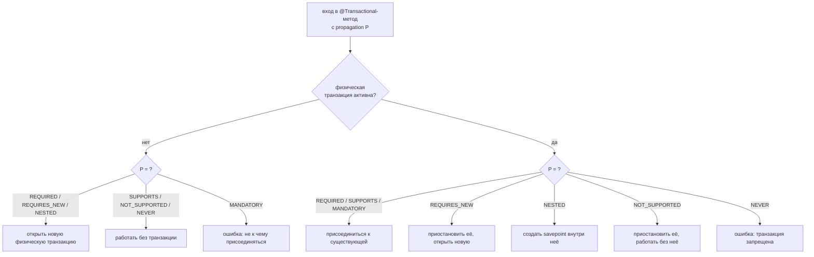
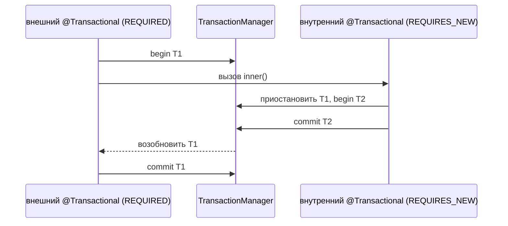

# Распространение транзакций (Transaction Propagation)

Распространение транзакций отвечает на один вопрос: когда `@Transactional`-метод
вызывает другой `@Transactional`-метод, **делят ли они одну транзакцию БД или
внутренний получает свою собственную?** Propagation — это настройка на внутреннем
методе, которая решает это.

Главное — разделять две вещи, которые новички путают:

- **Логическая транзакция** — это граница `@Transactional`, метод, который Spring
  оборачивает логикой begin/commit.
- **Физическая транзакция** — это настоящая транзакция БД на соединении.

Несколько логических границ могут ехать на **одной** физической транзакции.
Представьте барный счёт (tab) в ресторане: *физическая транзакция* — это открытый
счёт на кассе, а каждая *логическая граница* — официант, который подходит и
добавляет в него напитки. Десять официантов, один счёт — пока кто-то не решит
открыть отдельный счёт.

## Семь типов распространения

**REQUIRED** (по умолчанию). Присоединиться к текущей транзакции, если она есть,
иначе открыть новую. Это общий барный счёт: подходишь, добавляешь напитки к тому
счёту, что открыт, и открываешь новый только если его ещё нет.

**REQUIRES_NEW**. Всегда работать в совершенно новой физической транзакции. Если
одна уже активна, Spring сначала **приостанавливает** её, делает внутреннюю работу
на втором соединении, коммитит или откатывает её независимо, затем
**возобновляет** внешнюю. Это как попросить бармена открыть *отдельный* счёт на
один заказ: что бы ни случилось с этим заказом, основной счёт не тронут. Поскольку
удерживаются сразу два соединения, злоупотребление может исчерпать пул соединений.

**NESTED**. Использует *ту же* физическую транзакцию, но сначала ставит
**savepoint**. Если внутренний блок падает, отменяется только работа после
savepoint; внешняя транзакция сохраняет всё, что было до него, и всё ещё может
закоммититься. Это карандашная черта на общем счёте: стереть до черты, не разрывая
весь чек. NESTED требует поддержки JDBC savepoint и обычно работает только с
`DataSourceTransactionManager` (чистый JDBC), а не с JPA.

**SUPPORTS**. Присоединиться к транзакции, если она активна, но спокойно работать
и без неё. Как официант, который добавляет в счёт, когда он есть, а иначе просто
берёт наличные на месте — счёт не обязателен.

**NOT_SUPPORTED**. Приостановить любую активную транзакцию и выполнить метод
нетранзакционно. «Отложи счёт в сторону; это дело мимо кассы.» Полезно для долгой
работы только на чтение, которую вы не хотите держать вместе с транзакцией и её
блокировками.

**MANDATORY**. Транзакция *обязана* уже существовать, чтобы к ней присоединиться;
если её нет, Spring сразу бросает исключение. «Можно только добавить в открытый
счёт — открывать новый я откажусь.»

**NEVER**. Наоборот: транзакции быть *не должно*; если она активна, Spring бросает
исключение. «Только наличные. Если счёт открыт, я это не приму.»

## Классическая ловушка: откат внутреннего REQUIRED «отравляет» внешний

Самый частый уточняющий вопрос. Внутренний `REQUIRED`-метод бросает исключение, вы
**ловите** его во внешнем методе и продолжаете как ни в чём не бывало — а внешний
коммит падает с `UnexpectedRollbackException`.

Почему? Внутренний метод разделял *ту же* физическую транзакцию. Когда он упал,
Spring пометил эту транзакцию как **rollback-only**. Перехват Java-исключения не
снимает эту метку. Когда внешняя граница пытается закоммитить, менеджер транзакций
видит флаг rollback-only и отказывается — транзакция может завершиться только
одним способом. Это один общий счёт: как только официант его аннулировал, никакие
«но я всё равно хочу оплатить» не изменят того, что счёт мёртв.

Если внутренний сбой действительно нужно изолировать, сделайте внутренний метод
`REQUIRES_NEW` (свой счёт) или `NESTED` (savepoint), чтобы его откат не касался
внешней транзакции. Это поведение опирается на
[Правила отката @Transactional](topic:spring-transactional-rollback).

## Ответ за 60 секунд

Propagation управляет тем, что происходит, когда транзакционный метод вызывается,
пока, возможно, уже выполняется другая транзакция. По умолчанию — `REQUIRED`:
присоединиться к существующей транзакции или открыть новую, если её нет, — поэтому
цепочка `REQUIRED`-методов делит одну физическую транзакцию, которая коммитится
один раз на внешней границе. `REQUIRES_NEW` приостанавливает текущую транзакцию и
работает в полностью отдельной, которая коммитится или откатывается сама — полезно
для вещей вроде аудит-логов, которые должны сохраниться, даже если основная работа
упадёт. `NESTED` использует одну физическую транзакцию, но savepoint, поэтому
внутренний сбой откатывается только до savepoint. `SUPPORTS` работает с
транзакцией, если она есть, и без неё в противном случае; `NOT_SUPPORTED`
приостанавливает любую транзакцию и работает нетранзакционно; `MANDATORY` требует
существующую транзакцию и бросает исключение, если её нет; `NEVER` бросает
исключение, если транзакция активна. Классическая ловушка: внутренний
`REQUIRED`-метод, бросивший исключение, помечает общую транзакцию как
rollback-only, поэтому даже если вызывающий поймает исключение, внешний коммит
упадёт с `UnexpectedRollbackException`.

## Значение на практике

Самое частое реальное применение — `REQUIRES_NEW` для аудита или записей событий:
вы хотите, чтобы строка аудита закоммитилась, даже когда бизнес-транзакция
откатывается, — отдельный счёт, который остаётся оплаченным. Обратное тоже часто:
использование `NOT_SUPPORTED` или обработки только на чтение, чтобы медленный отчёт
не держал транзакцию записи и её блокировки открытыми; это связано с
[Уровнями изоляции PostgreSQL](topic:postgresql-isolation-levels) и
[Оптимистичной и пессимистичной блокировкой](topic:optimistic-vs-pessimistic-locking).

Propagation обеспечивается тем же прокси-механизмом, что и всё `@Transactional`, —
см. [Как работает @Transactional](topic:spring-transactional-proxy). У этого есть
острый угол: если метод вызывает другой метод **того же бина** (`this.inner()`),
вызов не проходит через прокси, поэтому настройка propagation внутреннего метода
**молча игнорируется**. Это проблема self-invocation, подробно разобранная в
[Self-Invocation и @Transactional](topic:spring-transactional-self-invocation): ваш
`REQUIRES_NEW` тихо выполняется в транзакции вызывающего, и отдельный счёт так и не
открывается.

## Частые заблуждения

«`REQUIRES_NEW` и `NESTED` — это одно и то же». Неверно. `REQUIRES_NEW` — вторая,
независимая физическая транзакция на втором соединении; `NESTED` — одно соединение
с savepoint. Коммит внутренней `REQUIRES_NEW` устойчив, даже если внешняя
откатится; блок `NESTED` выбрасывается вместе с внешней, если внешняя откатывается.

«Перехват внутреннего исключения спасёт внешнюю транзакцию». Неверно. Как только
общая `REQUIRED`-транзакция помечена rollback-only, перехват Java-исключения ничего
не меняет; внешний коммит всё равно бросит `UnexpectedRollbackException`.

«Propagation работает всегда». Неверно. Поскольку он работает через прокси,
self-вызов внутри одного класса полностью его пропускает.

«`NESTED` работает везде». Неверно. Он опирается на JDBC savepoint и
`DataSourceTransactionManager`; менеджер транзакций JPA его не поддерживает.

«Больше `REQUIRES_NEW` — безопаснее». Неверно. Каждый из них удерживает
дополнительное соединение, пока внешняя приостановлена, поэтому вложение их может
осушить пул соединений и даже привести к дедлоку.
