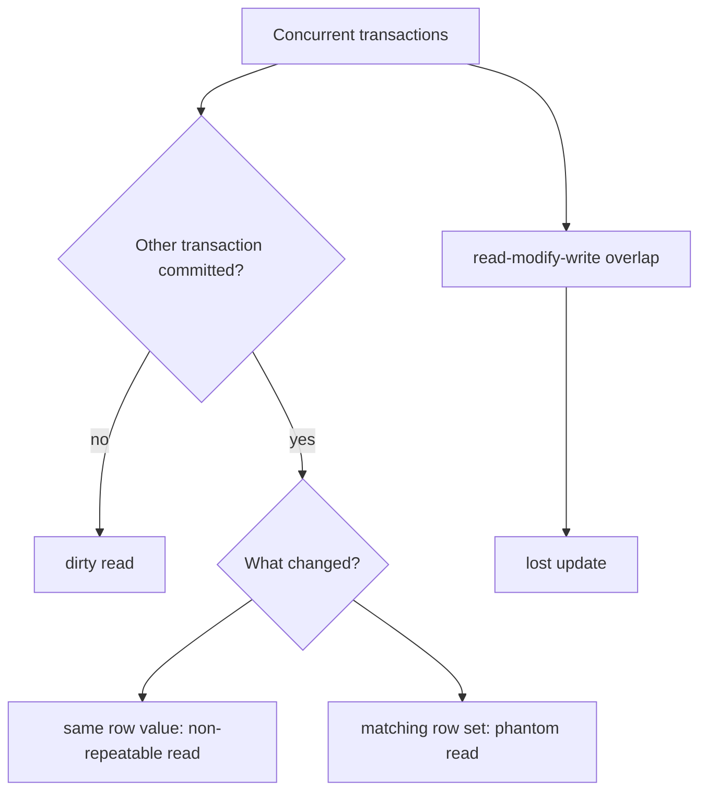
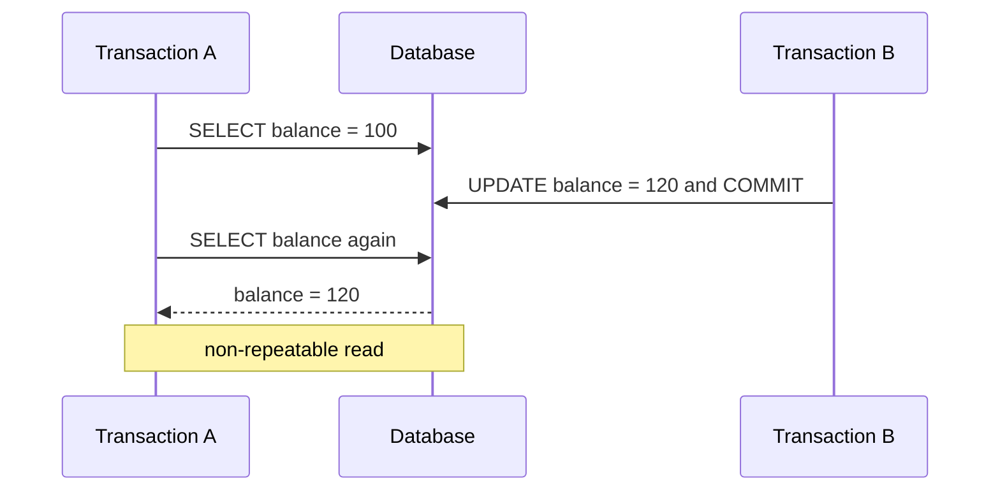

# Transaction Read Anomalies and Lost Update

These four names describe ways concurrent transactions can observe or overwrite
each other in unsafe ways. They are part of the isolation story in
[ACID](topic:acid-principles), and they are the vocabulary behind practical
[PostgreSQL isolation levels](topic:postgresql-isolation-levels). A good memory
hook is a busy kitchen: several cooks share the same order board, and each
isolation rule decides whether a cook sees draft tickets, fresh tickets, or a
stable photo of the board.

## Quick Map

| Anomaly | What goes wrong | Everyday hook |
| --- | --- | --- |
| `dirty read` | A transaction reads data written by another transaction that has not committed yet. | A cook starts cooking from a pencil note that may be erased. |
| `non-repeatable read` | The same row is read twice in one transaction, and a committed update changes the second result. | A clerk checks the same parcel label twice and sees that another clerk corrected it between checks. |
| `phantom read` | The same predicate query is run twice, and committed inserts or deletes change which rows match. | You count orders for table 7 twice, and a new ticket appears on the board between counts. |
| `lost update` | Two transactions read the same value, both calculate a new value, and the later write overwrites the earlier write. | Two people edit the same whiteboard square; the second marker stroke covers the first. |

## Dirty Read

A `dirty read` happens when transaction A reads a value that transaction B wrote
but has not committed. If B rolls back, A has made a decision using data that
never officially existed. In the kitchen analogy, A cooks from a draft order
ticket, then the waiter throws that ticket away.

Example timeline:

1. Transaction B updates `account.balance` from `100` to `50`, but does not commit.
2. Transaction A reads `50`.
3. Transaction B rolls back.
4. Transaction A has observed a balance that is not part of committed history.

This is why many databases avoid dirty reads even at common default isolation
levels. PostgreSQL has an important interview detail: `READ UNCOMMITTED` is
accepted, but it behaves like `READ COMMITTED`, so dirty reads are still not
exposed. It is like a post office refusing to show a half-written address label,
even if someone asks to peek early.

## Non-Repeatable Read

A `non-repeatable read` happens when one transaction reads the same row twice and
gets different values because another transaction committed an update in between.
The first read was not dirty; it saw committed data. The problem is that the
transaction did not get a stable view of that row. Think of checking the same
shelf label twice during a store shift: another worker legally updated the label
between your two checks.

The key distinction from dirty read is commit status. In a non-repeatable read,
the second value is committed and real; it simply changes while A is still
running. In a kitchen, this is not a fake ticket; it is a valid updated ticket
that appeared while one cook was still using the earlier version.

## Phantom Read

A `phantom read` is about a set of rows, not one row's value. Transaction A runs a
predicate query such as `WHERE status = 'PENDING'`, transaction B commits an
insert or delete that changes which rows match, and transaction A runs the same
query again. The second result has an extra row or a missing row. At a post
office counter, you count all parcels for one route, then another clerk adds a
new parcel to that route before your second count.

The difference from non-repeatable read is the shape of the change:

- Non-repeatable read: the same existing row has a different value.
- Phantom read: the set of rows matching a condition changes.

That distinction matters because databases can prevent them with different
techniques. A row lock can protect one known row, but a predicate like "all open
orders over $100" may need predicate locking, range locking, serializable checks,
or a stable snapshot. It is like locking one mailbox versus guarding the whole
mail route so no new matching parcel slips in unnoticed.

## Lost Update

`lost update` is a write-write problem. Two transactions read the same old value,
both compute a new value, and both write back. The later write wins, so one
transaction's work disappears. This is the database version of a classic
[race condition](topic:race-condition-avoidance): two clerks copy the same stock
number from a clipboard, each subtracts one item, and the last clerk writes a
result that ignores the other sale.

Example with `stock = 10`:

1. Transaction A reads `10` and plans to write `9`.
2. Transaction B reads `10` and also plans to write `9`.
3. A writes `9` and commits.
4. B writes `9` and commits.
5. Two items were sold, but the database shows only one decrement.

Lost update is not the same thing as dirty read. It can happen even when every
read sees committed data, because the bug is the gap between read, calculation,
and write. In everyday terms, both clerks used real clipboard data, but they used
the same old copy.

## How Databases Prevent Them

Isolation levels define which anomalies the database promises to prevent. The
exact behavior is database-specific, so interview answers should separate the SQL
standard names from a real implementation such as
[PostgreSQL isolation levels](topic:postgresql-isolation-levels). A restaurant may
call two processes "priority service", but the actual kitchen rules decide what
servers can see.

Common prevention tools:

- `READ COMMITTED` prevents dirty reads by showing only committed data. The clerk
  sees only finalized forms.
- Stable transaction snapshots, often called `REPEATABLE READ` or snapshot
  isolation, prevent ordinary non-repeatable reads. The cook works from one photo
  of the board.
- `SERIALIZABLE` tries to make concurrent transactions behave like some safe
  serial order. The traffic controller lets cars move, but rejects an unsafe
  crossing pattern.
- `SELECT ... FOR UPDATE`, optimistic locking with a version column, atomic
  `UPDATE account SET balance = balance - 10`, constraints, and retry logic can
  prevent lost updates or detect conflicts. This is like reserving the clipboard,
  checking the form version, or asking a clerk to redo the whole form when the
  queue changed.

## 60-Second Interview Answer

`dirty read` means reading another transaction's uncommitted data. If that other
transaction rolls back, the reader used a value that never became real.
`non-repeatable read` means reading the same row twice inside one transaction and
seeing different committed values because another transaction updated it between
reads. `phantom read` means repeating the same predicate query and getting a
different set of rows because another transaction inserted or deleted matching
rows. `lost update` means two transactions read the same old value, both compute a
new value, and one write overwrites the other. Isolation levels, row locks,
predicate or range locks, optimistic version checks, atomic updates, constraints,
and transaction retries are the usual tools to prevent or handle these anomalies.

## Production Relevance

These anomalies are not just textbook labels. They explain real bugs in balances,
inventory, bookings, quotas, and reporting. A checkout system can lose inventory
updates; a reporting job can count a moving set of rows; a workflow can make a
decision from a value that changed halfway through. In everyday terms, the kitchen
can oversell meals, the post office can route parcels from an outdated list, and
traffic can let two cars claim the same lane.

The practical fix is not always "use the strongest isolation". Stronger isolation
can increase waiting, aborts, deadlocks, and retry work. Often the best design is
to protect the specific invariant: use a unique constraint for "only one active
booking", an atomic update for counters, `SELECT ... FOR UPDATE` for a known row,
or optimistic locking for edit screens. It is like choosing between locking one
drawer, assigning a queue number, or closing the whole counter; each solves a
different coordination problem.

## Common Misconceptions

- "Dirty read means any stale read." No. A dirty read is specifically uncommitted
  data. A shelf label from five minutes ago may be stale, but it is not dirty if
  it was finalized.
- "Non-repeatable read and phantom read are the same." They are related but not
  identical. One changes a row's value; the other changes which rows match. One
  parcel label changed versus a new parcel appearing in the route.
- "Lost update is only a Java thread problem." It also happens in databases when
  transactions perform read-modify-write without conflict control. The same
  clipboard mistake can happen in memory or in SQL.
- "`READ COMMITTED` solves everything important." It prevents dirty reads, but it
  usually still allows non-repeatable reads and phantoms, and lost update depends
  on how updates are written. The kitchen serves only finalized tickets, but the
  board can still change between two looks.
- "Higher isolation is free." It buys safety with more blocking, aborts, retries,
  or snapshot maintenance. A stricter traffic controller prevents crashes, but
  some cars will have to wait or loop around.
